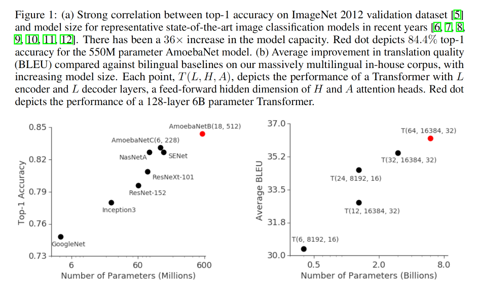

# GPipe: Efficient Training of Giant Neural Networks using Pipeline Parallelism

# 摘要

已知扩展深度神经网络的容量是提高多种机器学习任务模型质量的有效途径。在许多情况下，超出单个加速器内存限制的模型容量的提高需要开发特殊的算法或基础设施。这些解决方案往往是特定于架构的，并且无法转移到其他任务中。为了满足高效且与任务无关的模型并行性的需求，我们引入了 GPipe，这是一个管道并行库，它可以扩展可以表达为一系列层的任何网络。通过在不同的加速器上流水线化不同的层子序列，GPipe 能够灵活高效地扩展各种不同的网络到巨大的规模。此外，GPipe 利用一种新的批分割流水线算法，使得当一个模型跨多个加速器进行分区时，几乎能实现线性的加速。我们通过在两个具有不同网络架构的任务上训练大规模神经网络来展示 GPipe 的优势：(i) 图像分类：我们训练了一个拥有 5.57 亿参数的 AmoebaNet 模型，并在 ImageNet-2012 上达到了 84.4% 的 top-1 准确率；(ii) 多语言神经机器翻译：我们在涵盖 100 多种语言的语料库上训练了一个单一的、拥有 60 亿参数、128 层的 Transformer 模型，并实现了比所有双语模型更好的质量。

# 1. 引言

深度学习在过去的十年中取得了巨大的进步，部分归功于那些促进扩展神经网络有效容量的方法的开发。这种趋势在图像分类中最为显著，如随着模型容量的增加，ImageNet 上的准确性提高 (图 1a)。在自然语言处理的背景下也可以观察到类似的现象 (图 1b)，其中简单的浅层句子表示模型 [1, 2] 被它们更深更大的对应模型 [3, 4] 超越。

尽管更大的模型为几个领域带来了显著的质量改善，但扩展神经网络带来了重大的实践挑战。硬件限制，包括加速器 (GPU 或 TPU) 上的内存限制和通信带宽，迫使用户将更大的模型划分为各个部分，并将不同的部分分配给不同的加速器。然而，高效的模型并行算法极难设计和实施，这往往需要从扩展容量、灵活性 (或对特定任务和架构的特异性) 和训练效率中做出艰难的选择。因此，大多数高效的模型并行算法都是特定于架构和任务的。随着深度学习应用数量的增加，对于可靠且灵活的基础设施的需求也在不断增长，这种基础设施可以让研究人员轻松地扩展用于大量机器学习任务的神经网络。

为了解决这些挑战，我们引入了 GPipe，一个灵活的库，能够有效地训练大型神经网络。GPipe 允许通过将模型划分到不同的加速器上，并在每个加速器上支持重新实化 [13, 14]，来扩展任意的深度神经网络架构，超越单个加速器的内存限制。使用 GPipe，每个模型都可以被指定为一系列的层，连续的层组可以被划分为单元。然后将每个单元放置在一个单独的加速器上。基于这种分区设置，我们提出了一个新的带有批次分割的流水线并行算法。我们首先将训练样例的小批量划分为更小的微批次，然后在各单元上流水线执行每组微批次。我们采用同步小批量梯度下降进行训练，其中梯度在一个小批量的所有微批次中累积，并在小批量结束时应用。因此，使用 GPipe 的梯度更新与分区数量无关，使研究人员能够通过部署更多的加速器，轻松地训练越来越大的模型。GPipe 还可以与数据并行性结合，进一步扩展训练。

我们在图像分类和机器翻译上展示了 GPipe 的灵活性和效率。对于图像分类，我们在 ImageNet 2012 数据集的 480 × 480 输入上训练 AmoebaNet 模型。通过增加模型的宽度，我们将参数数量增加到 5.57 亿，并达到了 84.4% 的 top-1 验证精度。在机器翻译方面，我们训练了一个单一的、拥有 60 亿参数的 128 层多语言 Transformer 模型，覆盖了 103 种语言（102 种语言到英语）。我们展示了这个模型能够胜过单独训练的 3.5 亿参数的双语 Transformer Big [15] 模型，在所有 102 个语言对上都表现出色。

# 2 GPipe 库
我们现在将描述 GPipe 的接口和主要设计特性。这个开源库是在 Lingvo [16] 框架下实现的。GPipe 的核心设计特性普遍适用，并可以用于其他框架 [17, 18, 19]。

## 2.1 接口
任何深度神经网络都可以被定义为一系列 L 层。每层 $L_i$ 都由一个向前计算函数 $f_i$，以及一个相应的参数集 $w_i$ 组成。GPipe 还允许用户指定一个可选的计算成本估计函数 $c_i$。给定一定数量的分区 K，L 层的序列可以被划分为 K 个复合层，或者单元。设 $p_k$ 由层 i 和 j 之间的连续层组成。对应于 $p_k$ 的参数集等同于 $w_i, w_{i+1}, . . . , w_j$ 的并集，其向前函数将为 $F_k = f_j ◦. . .◦f_{i+1} ◦f_i$。相应的反向传播函数 $B_k$ 可以使用自动符号微分从 $F_k$ 计算出来。成本估计器 $C_k$ 设置为 $\Sigma_{l=i}^j c_l$。

GPipe 的接口非常简单直观，需要用户指定：(i) 模型分区的数量 K，(ii) 微批次的数量 M，以及 (iii) 定义模型的 L 层的序列和定义。请参考补充材料查看示例。

## 2.2 算法
一旦用户根据模型参数 $w_i$，向前计算函数 $f_i$，和成本估计函数 $c_i$ 定义了他们网络中的层序列，GPipe 就会将网络划分为 K 个单元，并将第 k 个单元放置在第 k 个加速器上。在分区边界自动插入通信原语，以允许数据在相邻分区间传输。分区算法使所有单元的预估成本的方差最小化，以便通过同步所有分区的计算时间来最大化流水线的效率。

在向前传播过程中，GPipe 首先将每个大小为 N 的小批次划分为 M 个等大小的微批次，这些微批次通过 K 个加速器进行流水线处理。在向后传播过程中，根据用于向前传播的相同模型参数计算每个微批次的梯度。在每个小批次结束时，所有 M 个微批次的梯度都被累积起来，并应用于更新所有加速器上的模型参数。这个操作序列在图 2c 中有所说明。

如果网络中使用了批次规范化 [20]，则在训练期间计算输入的充分统计量，这些统计量在每个微批次和在必要时的复制品 [21] 上。我们也跟踪整个小批次的充分统计量的移动平均值，以便在评估时使用。

## 2.3 性能优化

为了降低激活内存的需求，GPipe 支持重新计算 [14]。在向前计算过程中，每个加速器只在分区边界存储输出激活。在向后传递过程中，第 k 个加速器重新计算复合向前函数 $F_k$。因此，峰值激活内存需求降低至 $O(N + L_K × NM)$，其中 $NM$ 是微批量大小，$L_K$ 是每个分区的层数。相比之下，没有重新计算和分区的内存需求会是 $O(N × L)$，因为计算梯度 $b_i$ 需要上一层梯度 $b_{i+1}$ 和缓存的激活 $f_i(x)$。如图 2c 所示，分区引入了每个加速器的一些空闲时间，我们将其称为泡沫开销。这个泡沫时间在微步数 $M$ 上均摊是 $O(\frac{K-1}{M+K-1})$。在我们的实验中，我们发现当 $M ≥ 4 × K$ 时，泡沫开销可以忽略不计。这也部分是因为在向后传递过程中的重新计算可以更早安排，无需等待来自更早层的梯度。

GPipe 也引入了低通信开销，因为我们只需要在加速器之间的分区边界传递激活张量。因此，即使在没有高速互连的加速器上，我们也可以实现有效的扩展性能。

图 2c 假设分区是均匀平衡的。然而，不同层的内存需求和计算 flops 通常是非常不平衡的。在这样的情况下，不完美的分区算法可能导致负载不平衡。更好的分区算法可能可以提高我们的启发式方法的性能。

# 3 性能分析
我们使用两种非常不同类型的模型架构评估 GPipe 的性能：一种是 AmoebaNet [12] 卷积模型，另一种是 Transformer [15] 序列到序列模型。我们进行了实验，研究他们的可扩展性、效率和通信成本。
我们预计重新计算和管道并行处理都将有利于内存利用，从而使适应巨大模型成为可能。我们在表 1 中报告了 GPipe 在合理的大输入大小下可以支持的最大模型大小。对于 AmoebaNet，我们在带有每个加速器 8GB 内存的 Cloud TPUv2s 上进行了实验。我们使用了固定的输入图像大小 224 × 224 和小批量大小 128。没有 GPipe，一个单一的加速器可以训练高达 82M 参数的 AmoebaNet，这受到设备内存限制的约束。由于在反向传播和批量拆分中进行了重新计算，GPipe 将中间激活内存需求从 6.26GB 减少到 3.46GB，使得在单个加速器上可以使用 318M 参数的模型。借助模型并行性，我们能够在 8 个加速器上将 AmoebaNet 扩展到 18 亿个参数，比没有 GPipe 可以实现的数量多 25 倍。在这种情况下，最大模型大小并没有完全线性地扩展，原因在于 AmoebaNet 中不同层的模型参数分布不均衡。

接下来，我们在每个加速器核心有 16GB 内存的 Cloud TPUv3s 上训练 Transformer 模型。我们使用了固定的词汇量 32k，序列长度 1024 和批量大小 32。每个 Transformer 层的模型维度为 2048，前向传播隐藏维度为 8192，注意力头为 32。我们通过改变层数的数量来扩展模型。重新计算允许在单个加速器上训练一个 2.7× 更大的模型。使用 128 个分区，GPipe 允许将 Transformer 扩展到 839 亿个参数，比在单个加速器上可能的增加 298 倍。与 AmoebaNet 不同，Transformer 的最大模型大小与加速器数量线性增加，因为每一层都有相同数量的参数和输入大小。

为了评估效率，我们报告了使用 GPipe 和不同数量的分区以及不同数量的微批次的 AmoebaNet-D (18, 256) 和 Transformer-48 的标准化训练吞吐量。每个分区分配给一个独立的加速器。我们观察到，当微批量数量 M 至少是分区数量的 4 倍时，泡沫开销几乎可以忽略不计。对于 Transformer 模型，当它被分区在四倍的加速器上时，有 3.5 倍的加速。此外，由于计算在 Transformer 层次之间均匀分布，训练吞吐量几乎与设备数量线性增加。相比之下，由于其计算分布不均衡，AmoebaNet 模型实现了亚线性加速。当 M 相对较小时，泡沫开销不再可以忽视。当 M 为 1 时，实际上没有管道并行性。我们观察到的吞吐量相对稳定，无论使用的加速器数量如何，这表明在任何给定时间只有一个设备在积极计算。

为了衡量 GPipe 的通信开销的影响，我们在单个主机上运行了我们的实验，这个主机有多个 NVIDIA P100 GPU，但没有 NVLinks。跨 GPU 的数据传输必须涉及相对慢的设备到主机和主机到设备的传输通过 PCI-E。微批量的数量固定为 32。如表 3 所示，我们观察到，当我们将分区数量从 2 增加到 8 时，AmoebaNet-D (18, 128) 的速度提高了 2.7 倍。对于 24 层的 Transformer，速度提高了 3.3 倍。我们在配备了高速互连的 TPU 上观察到的线性速度提升类似。设备之间的通信带宽不再是模型并行性的瓶颈，因为 GPipe 只在分区边界传输激活张量。

## 3.1 性能开销分解
为了研究未来性能改进的机会，我们确定了影响 Cloud TPU 上 GPipe 性能的关键因素。我们测量了表 4 中列出的不同活动的时间。我们发现，重新计算时间是 GPipe 开销的主要贡献者，占据了总步骤时间的 23%。另一个开销来源是负载不平衡。对于两个分区，由负载不平衡造成的开销只有 3.2%。理论上的泡沫开销是 O( K−1 / M+K−1 )，其中 K 是分区数量，M 是每个小批量中的微批量数量。实际观察到的泡沫开销略低于理论值，部分原因是因为重新计算被提前安排以与泡沫重叠。由于加速器之间的高速互联，管道结束时进行梯度聚合的权重更新时间也很小。

# 4 图像分类
作为一个概念验证，我们首先使用 GPipe 扩展 AmoebaNet。我们增加了 AmoebaNet 中的通道数量，并将输入图像大小扩大到 480×480。我们在 ImageNet 2012 数据集上训练了这个 5.57 亿参数的 AmoebaNet-B(18, 512)，使用的是 [12] 中描述的相同的超参数。网络被划分成 4 个分区。这个单一模型在单一裁剪下实现了 84.4% 的 top-1 和 97% 的 top-5 验证精度。

我们进一步通过迁移学习[22, 23]展示了巨型卷积网络在其他图像数据集上的有效性。具体来说，我们使用预训练的 ImageNet 模型在从一般到细粒度分类的各种目标数据集上进行微调。我们将最后一个 softmax 分类层的输出单位数量更改为目标数据集中的类别数量，并随机初始化新的 softmax 层。所有其他层都是从 ImageNet 预训练初始化的。训练期间输入到网络的图像被调整为 480 × 480，随机水平翻转，并使用 cutout[24] 增强。训练超参数与 ImageNet 的相同（我们在补充材料中提供了我们的训练设置的详细描述）。在表 5 中，我们报告了每个数据集 5 次微调的平均单一裁剪测试精度。我们的巨型模型在所有目标数据集上都取得了有竞争力的结果。例如，CIFAR-10 的错误率降低到 1%，CIFAR-100 的错误率降低到 8.7%。这些结果证实了 Kornblith 等人 [25] 的发现，即更好的 ImageNet 模型能够更好地迁移。

# 5 巨大的多语种机器翻译

接下来，我们通过扩大自然语言处理（NLP）使用的模型来展示 GPipe 的灵活性。由于大量可用的并行语料库，神经机器翻译（NMT）已经成为任何用于 NLP 的架构的基准任务 [33, 15, 34, 35, 36]。因此，我们继续在大规模多语种 NMT 任务上进行 GPipe 实验。我们使用一个包含 102 种语言和英语的并行文档语料库，总共包含 250 亿个训练样本，每种语言的样本数量从 10^4 到 10^9 不等 [37]。这个数据集通过覆盖从数据稀缺（低资源）到数据丰富（高资源）的各种语言，为可扩展性实验创建了一个实际的测试平台。在机器翻译中，我们首次显示，足够大的 NMT 模型可以同时学习超过 100 对语言对之间的映射，同时实现比所有语言的双语模型性能更好。这进一步凸显出拥有高效灵活的模型并行工具的重要性。

我们的比较基于在此语料库中的所有语言对上训练的单个 Transformer [15] 的性能。我们沿着两个维度扩展架构，以强调 GPipe 的灵活性：（i）沿深度，通过增加模型中的层数；（ii）沿宽度，通过增加前馈层中的隐藏维度和多头注意层中的注意力头数（以及 # 注意力通道数），类似于 Shazeer 等人[34]。请参阅补充材料，了解我们的数据集、基线、训练配置和优化超参数的详细描述。

我们从一个标准的 400M 参数的 Transformer Big 模型开始，即 Chen 等人[35]描述的 T(6, 8192, 16)^1，词汇量为 64k。在图 3 中，我们比较了它与 1.3B 参数的深模型 T(24, 8192, 16)、1.3B 参数的宽模型 T(12, 16384, 32)、3B 参数的模型 T(32, 16384, 32) 和 6B 参数的模型 T(64, 16384, 32) 的性能。所有这些模型都同时在所有语言对上进行训练，使用用于多语种 BERT^2 [3] 的基于温度的采样。T(12, 16384, 32)、T(24, 8192, 32)、T(32, 16384, 32) 和 T(64, 16384, 32) 分别分布在 2、4、8 和 16 个加速器上。

从图 3 中，我们可以观察到，将模型容量从 400M 增加到 1.3B 参数显著提高了所有语言的性能。将模型从 1.3B 参数扩展到 6B 参数显示出进一步的改进，尤其是对于高资源语言。以下我们根据这些大规模实验讨论一些我们的实证发现。

深度-宽度权衡：我们研究了我们的多语种设置中深度和宽度之间的权衡，并比较了1.3B 宽模型 T(12, 16384, 32) 和 1.3B 深模型 T(24, 8192, 16) 的性能。虽然这两个模型在高资源语言（图 3 的左侧）上的质量非常相似，但在低资源语言上，更深的模型的表现大大超过了宽模型，这表明增加模型深度可能更利于泛化。此外，当比较1.3B深模型和400M模型时，低资源语言（图3右侧）的质量改进几乎与高资源语言的改进一样大，表明增加深度可能会增加对低资源任务的迁移程度。

深度模型的可训练性挑战：虽然深度增加了神经网络的表示能力，但也复杂化了优化问题。在我们的大规模实验中，我们遇到了由于激活强烈（正峰度）和数据集噪声相结合产生的严重可训练性问题。我们观察到，在训练几千步后，模型预测会变得极其尖锐，且易受噪声影响，这常常导致非有限或大梯度，最终破坏了学习进度。为了对抗这些问题，我们采用了两种方法：（i）按照 Zhang 等人 [38] 的方法，我们按层数的数量缩小所有变压器前馈层的初始化。 （ii）我们在逻辑预测（softmax预激活）的大小超过某个值时，进行剪裁。这两种方法的组合使我们能够减轻模型深度扩展带来的训练不稳定性。

以下是我对所提供的论文段落的中文翻译：

# 6 设计特性与权衡

已经提出了多种方法来实现高效的大规模模型并行性。然而，每种方法都选择了自己的一套权衡，使其适合在特定硬件约束下扩展特定架构。模型并行性的核心思想包括将网络划分为不同的计算单元，然后将它们放在不同的设备上 [39, 40, 41, 42]。从概念上讲，这支持将大范围的模型扩展到巨大的容量。然而，这些方法通常受到硬件利用率低和通信瓶颈的影响。单程序多数据（SPMD）和管道并行性被提出作为解决这些挑战的解决方案。

Mesh-Tensorflow [34] 遵循 SPMD 范例，该范例将用于数据并行性的单指令多数据（SIMD）方法扩展到其他张量维度。SPMD 允许在多个设备上分割每一个计算，允许用户将单个矩阵乘法的大小（以及各个层的模型参数）与加速器数量线性扩展。然而，这也引入了由于大量的 AllReduce 类操作（用于合并每个并行化矩阵乘法的输出）而导致的加速器间的高通信开销。这限制了该方法在加速器与高速互连的场景中的适用性。此外，SPMD 限制了可以有效扩展的操作类型，限制了其用于特定的网络架构和机器学习任务。例如，在这个范式下，沿着卷积层的通道维度分割是不高效的，因为通道实际上是完全连接的，而沿着空间维度的分割需要对 halo 区域使用复杂的技术。虽然 SPMD 允许通过缩小每个操作来扩展模型深度，但它需要将每一层分割在更多的加速器上，这反过来进一步增加了设备间的通信开销。

其他方法试图利用基于管道并行性的方法来扩展神经网络 [43, 44]。应用于神经网络训练的最新一轮的管道并行性是 PipeDream [45]，它的目标是减少参数服务器 [46] 的通信开销。PipeDream 通过交织前向传递和后向传递的执行来最大化硬件利用率。这种设计受到由于异步后向更新引入的权重过时的影响。为了避免由于权重过时产生的优化问题，PipeDream 需要在每个加速器上维护模型参数的多个版本副本，以准确地计算梯度更新，这阻止了用户扩展到更大的模型。GPipe 引入了一种新的管道并行性，它在对整个小批量应用单个同步梯度更新之前将微批量的执行进行管道化。我们的新的批量拆分管道并行性算法，当与重材化结合时，允许扩展到大量的微批量。这最小化了气泡开销，无需进行异步梯度更新。GPipe 使用户能够以用于的加速器数量线性扩展模型大小。与 SPMD 不同，当扩展模型时，管道并行性引入的额外通信开销很少。设备间的通信只在每个微批量的划分边界处发生，引入的通信开销微乎其微，扩展了 GPipe 在没有高速设备互连可用的情况下的实用性。然而，GPipe 目前假设一个层能够满足单个加速器的内存需求3。此外，微批量拆分需要复杂的策略来支持需要跨批量计算的层（例如，BatchNorm 在训练期间使用微批量的统计数据，但在评估期间积累小批量的统计数据）。

# 7 结论

在这项工作中，我们引入了 GPipe，一种用于训练巨型网络的可扩展的模型并行库。我们提出了一种使用同步梯度更新的新的批量拆分管道并行性算法，允许具有高硬件利用率和训练稳定性的模型并行性。我们利用 GPipe 来训练大规模的卷积和基于变压器的模型，并在图像分类和多语种机器翻译方面展示了强大的实证结果。我们强调了 GPipe 的三个关键属性：1）效率：使用新的批量拆分流水线算法，GPipe 实现了几乎与设备数量线性相关的速度提升。2）灵活性：GPipe 支持任何顺序神经网络。3）可靠性：GPipe 使用同步梯度下降，保证训练的一致性

