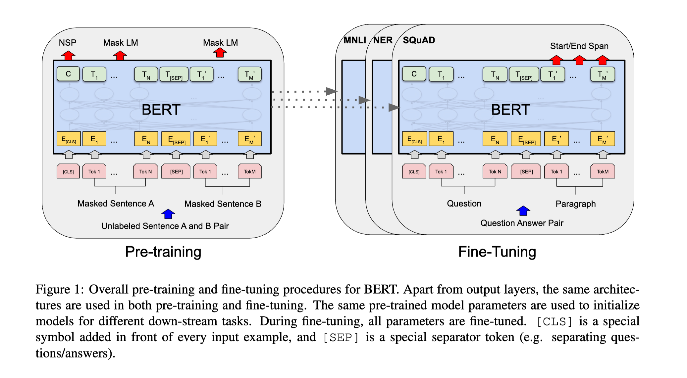
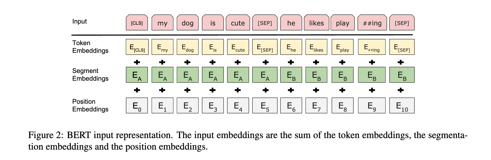
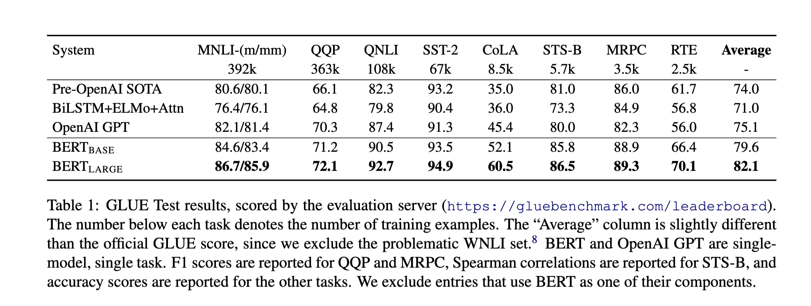
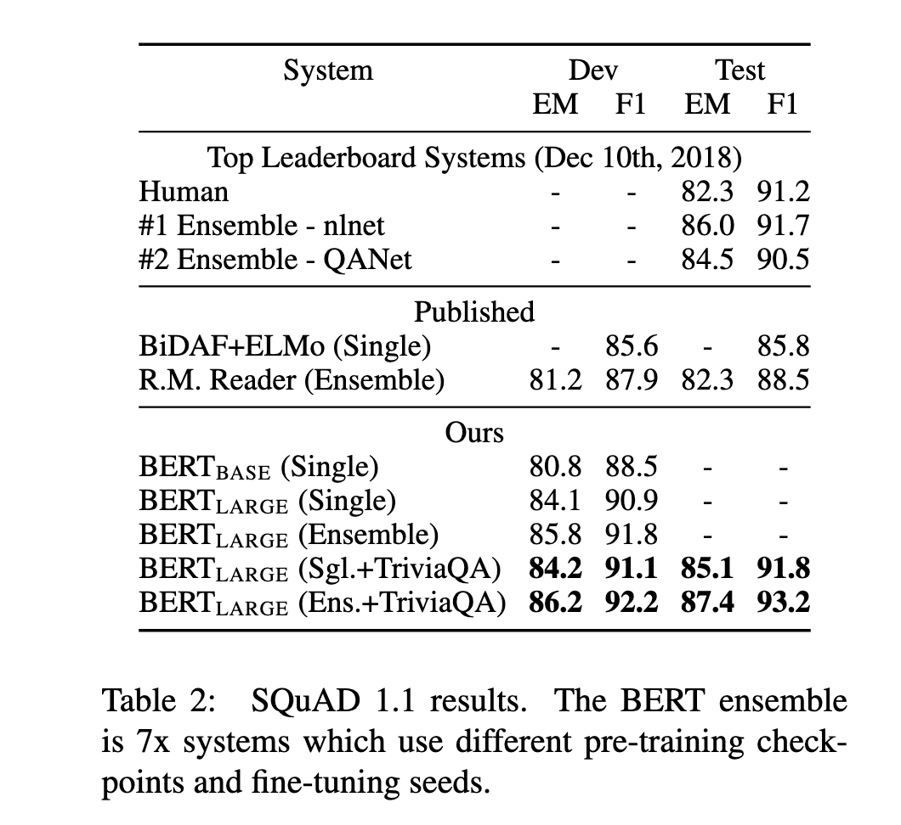
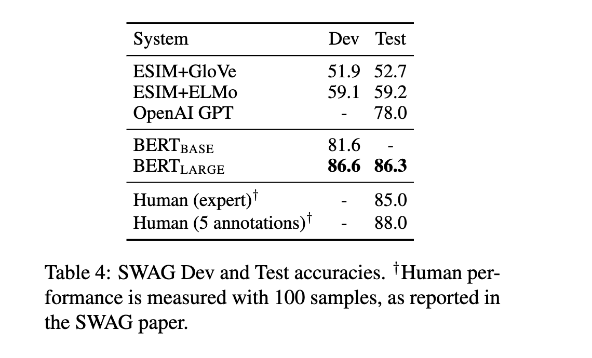
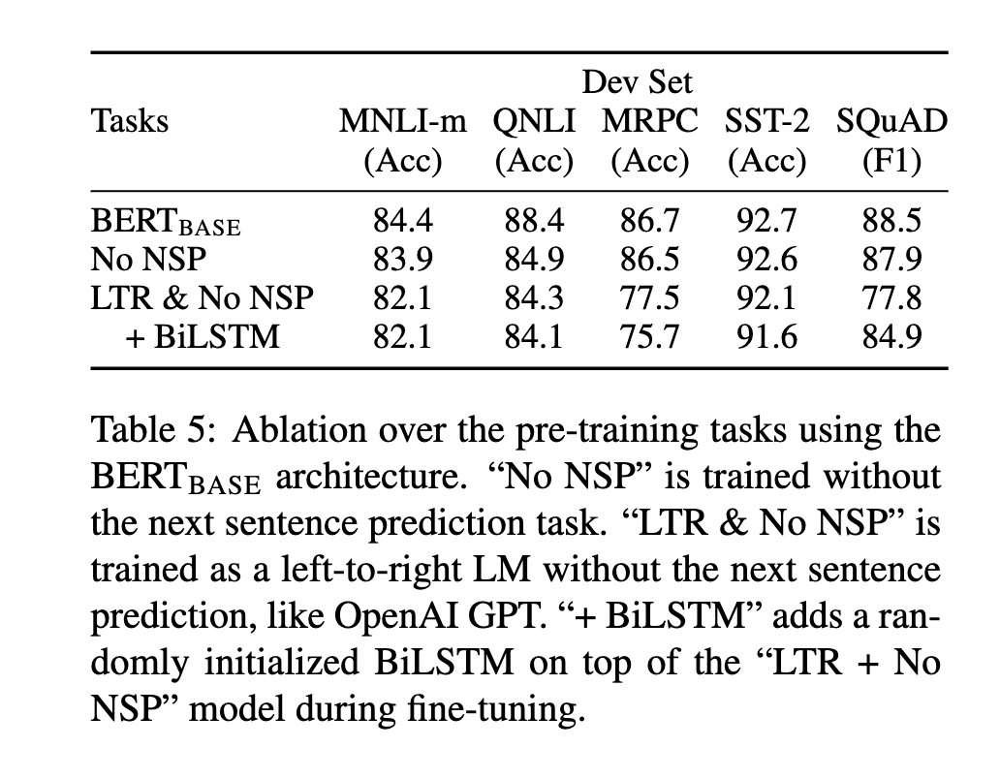
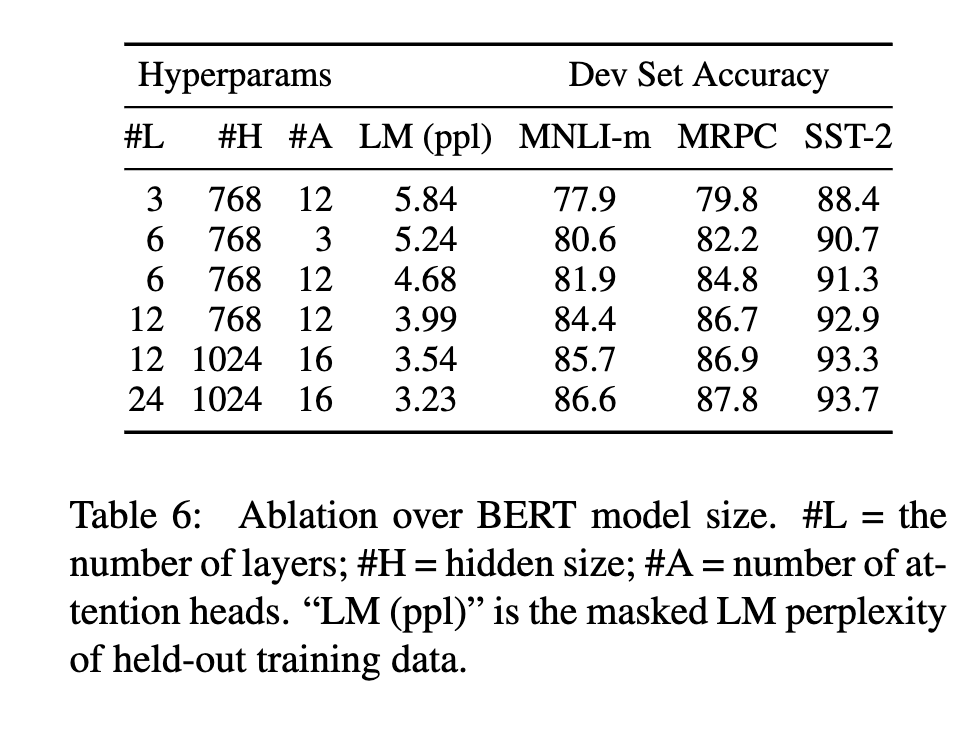
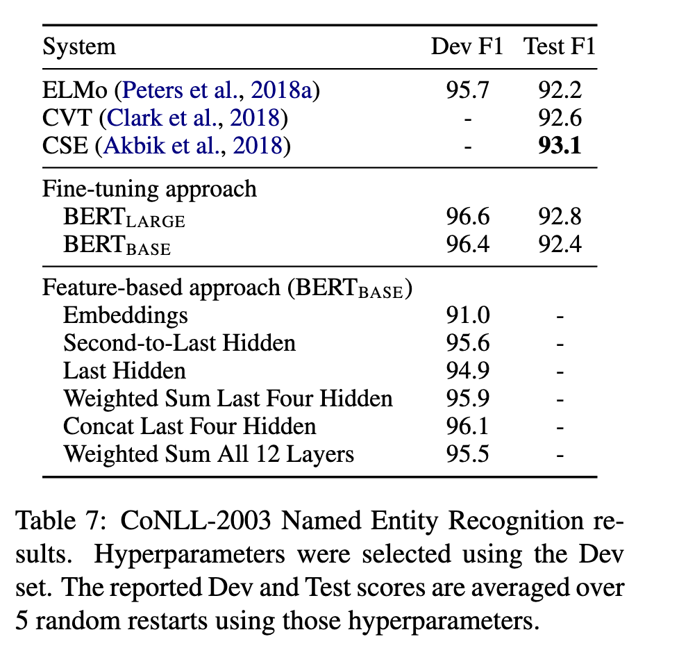

#  BERT: Pre-training of Deep Bidirectional Transformers for Language Understanding

# 摘要
我们介绍了一个新的语言表示模型BERT，全称为“双向编码器表示的变压器”。与最近的语言表示模型（Peters et al., 2018a; Radford et al., 2018）不同，BERT是设计来从未标记的文本中预训练深度双向表示，通过在所有层中联合调整左右上下文。因此，预训练的BERT模型可以通过添加一个额外的输出层进行微调，从而为广泛的任务（例如问题回答和语言推断）创建最新的模型，无需大量的任务特定架构修改。
BERT在概念上简单且实证强大。它在十一个自然语言处理任务上获得了新的最佳结果，包括将GLUE得分推至80.5%（绝对提升7.7个百分点），MultiNLI精度至86.7%（绝对提升4.6个百分点），SQuAD v1.1问题回答测试F1至93.2（绝对提升1.5个百分点）和SQuAD v2.0测试F1至83.1（绝对提升5.1个百分点）。

# 1 引言

已经证明，语言模型预训练可以有效地改善许多自然语言处理任务（Dai和Le，2015; Peters et al.，2018a; Radford et al.，2018; Howard and Ruder，2018）。这些包括诸如自然语言推断（Bowman et al.，2015; Williams et al.，2018）和释义（Dolan和Brockett，2005）等句子级任务，这些任务通过整体分析句子来预测句子之间的关系，以及诸如命名实体识别和问题回答等令牌级任务，其中模型需要在令牌级产生细粒度的输出（Tjong Kim Sang和De Meulder，2003; Rajpurkar et al.，2016）。

对于将预训练的语言表示应用到下游任务的策略有两种现有的方法：基于特征和微调。基于特征的方法，如ELMo（Peters et al.，2018a），使用包含预训练表示作为额外特征的任务特定架构。微调方法，如生成预训练变压器（OpenAI GPT）（Radford et al.，2018），引入最小的任务特定参数，并通过简单地微调所有预训练参数在下游任务上进行训练。这两种方法在预训练期间分享相同的目标函数，其中他们使用单向语言模型来学习通用语言表示。

我们认为，现有的技术限制了预训练表示的能力，尤其是对于微调方法。主要的限制是标准的语言模型是单向的，这限制了可以在预训练期间使用的架构的选择。例如，在OpenAI GPT中，作者使用了从左到右的架构，其中每个令牌只能在变压器的自我关注层中关注到以前的令牌（Vaswani et al.，2017）。这种限制对于句子级任务是次优的，并且在将微调方法应用到令牌级任务（如问题回答）时可能非常有害，因为在这种情况下，结合两个方向的上下文至关重要。

在本文中，我们通过提出BERT：双向编码器表示的变压器来改善基于微调的方法。BERT通过使用“被掩蔽的语言模型”（MLM）预训练目标，受到Cloze任务（Taylor，1953）的启发，来缓解之前提到的单向性限制。被掩蔽的语言模型随机掩蔽输入的一些令牌，目标是仅基于其上下文预测被掩蔽的单词的原始词汇id。与从左到右的语言模型预训练不同，MLM目标使得表示能够融合左右上下文，这允许我们预训练深度双向变压器。除了被掩蔽的语言模型，我们还使用了一个“下一句预测”任务，该任务共同预训练文本对表示。我们的论文的贡献如下：

- 我们展示了双向预训练对于语言表示的重要性。与Radford et al.（2018）不同，后者使用单向语言模型进行预训练，BERT使用被掩蔽的语言模型来实现预训练深度双向表示。这与Peters et al.（2018a）形成了对比，后者使用浅层连接独立训练的从左到右和从右到左的LMs。
- 我们表明预训练表示减少了对许多重工程任务特定架构的需求。BERT是第一个基于微调的表示模型，该模型在大量的句子级和令牌级任务上实现了最先进的性能，超过了许多任务特定的架构。
- BERT推进了十一个NLP任务的最新水平。代码和预训练模型可以在https://github.com/google-research/bert 中找到。”

# 3 BERT

我们在本节中介绍BERT及其详细实现。我们的框架中有两个步骤:预训练和微调。在预训练过程中,模型在不同的预训练任务上的无标注数据上进行训练。对于微调,BERT模型首先用预训练的参数进行初始化,然后使用下游任务的标注数据微调所有参数。每个下游任务都有独立的微调模型,尽管它们用相同的预训练参数进行了初始化。图1中的问答示例将作为本节的运行示例。

BERT的一个独特特征是其跨不同任务的统一架构。预训练架构和下游架构之间几乎没有区别。

## 模型架构

BERT的模型架构是一个基于Vaswani等人(2017)的原始实现并在tensor2tensor库中发布的多层双向Transformer编码器。因为Transformer的使用已经很常见,而且我们的实现几乎与原始实现相同,所以我们将省略对模型架构的冗长背景描述,请读者参阅Vaswani等人(2017)以及例如“The Annotated Transformer”等优秀指南。

在这项工作中,我们将层数(即Transformer块)表示为L,隐层大小表示为H,自注意力头数表示为A。我们主要报告两个模型大小的结果:BERTBASE(L=12,H=768,A=12,总参数量=110M)和BERTLARGE(L=24,H=1024,A=16,总参数量=340M)。

选择BERT-BASE的模型大小与OpenAI GPT相同是为了比较。但是,关键的是BERT Transformer使用双向自注意力,而GPT Transformer使用受约束的自注意力,其中每个记号只能参照其左侧的上下文。

## 输入/输出表示

为了让BERT处理各种下游任务,我们的输入表示能够明确表示单个句子和一对句子(例如,<问题,答案>)在一个记号序列中。在整个工作中,“句子”可以是任意连续文本跨度,而不一定是实际的语言句子。“序列”是指BERT的输入记号序列,可以是一个句子或两个打包在一起的句子。

我们使用30,000个词表的WordPiece嵌入(Wu等,2016)。每个序列的第一个记号总是特殊的分类记号([CLS])。与此对应的最后隐状态用于分类任务的汇总序列表示。句子对被打包成一个序列。我们以两种方式区分句子。首先,我们用一个特殊记号([SEP])把它们分开。其次,我们向每个记号添加一个学习到的嵌入,指示它属于句子A还是句子B。如图1所示,我们将输入嵌入表示为E,特殊[CLS]记号的最后隐向量表示为C∈RH,第i个输入记号的最后隐向量表示为Ti∈RH。

对于给定的记号,它的输入表示通过求和对应的记号、段落和位置嵌入来构建。该构建的可视化如图2所示。

## 3.1 BERT预训练

与Peters等(2018a)和Radford等(2018)不同,我们不使用传统的从左到右或从右到左的语言模型来预训练BERT。相反,我们使用本节描述的两种无监督任务来预训练BERT。 此步骤在图1的左侧表示。

**任务1:遮蔽语言模型** 从直觉上讲,可以合理地认为深度双向模型严格优于左到右模型或左到右模型与右到左模型的浅层拼接。不幸的是,标准条件语言模型只能从左到右或从右到左进行训练,因为双向条件化将允许每个词间接“看到”自己,模型可以在多层上下文中轻松预测目标词。

为了训练深度双向表示,我们简单地随机遮蔽输入记号的一些百分比,然后预测这些遮蔽记号。我们称此过程为“遮蔽语言模型”(MLM),尽管在文献中它经常被称为Cloze任务(Taylor,1953)。在这种情况下,与遮蔽记号对应的最后隐向量被馈送到词汇表上的输出softmax,就像标准语言模型一样。在我们的所有实验中,我们随机遮蔽每个序列中15%的所有WordPiece记号。与去噪自动编码器(Vincent等,2008)相反,我们仅预测遮蔽单词而不是重构整个输入。

虽然这允许我们获得双向预训练模型,但一个缺点是我们在预训练和微调之间创建了不匹配,因为[MASK]记号在微调期间不出现。为了减轻这一问题,我们不总是用实际的[MASK]记号替换“被遮蔽”的词。训练数据生成器随机选择15%的记号位置进行预测。如果第i个记号被选择,我们用(1) 80%时间的[MASK]记号 (2) 10%时间的随机记号 (3) 10%时间的不变的第i个记号来替换第i个记号。 然后,Ti将用于预测原始记号,损失函数为交叉熵。我们在附录C.2中比较了此过程的变体。

**任务2:下一句预测(NSP)** 许多重要的下游任务,如问答(QA)和自然语言推理(NLI),都是基于理解两个句子之间的关系,这并没有被语言建模直接捕获。 为了训练一个理解句子关系的模型,我们预训练一个可以从任何单语语料库中轻松生成的二值化下一句预测任务。具体来说,在为每个预训练示例选择句子A和B时,50%的时间B是实际跟随A的下一句(标记为IsNext),50%的时间它是一个从语料库中随机抽取的句子(标记为NotNext)。 如我们在图1中所示,C用于下一句预测(NSP)。 尽管很简单,但我们在第5.1节中证明,针对此任务的预训练对QA和NLI都非常有益。

NSP任务与Jernite等人(2017)和Logeswaran和Lee(2018)中使用的表征学习目标密切相关。 但是,在以前的工作中,只有句子嵌入被传递给下游任务,而BERT传递所有参数来初始化终任务模型参数。

**预训练数据** 预训练过程在很大程度上遵循语言模型预训练的现有文献。 对于预训练语料,我们使用BooksCorpus(800M字)(Zhu等,2015)和英语维基百科(2500M字)。 对于维基百科,我们只提取文本段落,而忽略列表,表格和标题。 使用文档级语料库而不是像亿词语料库(Chelba等,2013)这样的洗牌句子级语料库是关键的,以便提取长的连续序列。

## 3.2 BERT微调

微调非常简单,因为Transformer中的自注意力机制允许BERT通过交换适当的输入和输出来建模许多下游任务,无论它们是单文本还是文本对。

对于涉及文本对的应用,在进行双向交叉注意力之前独立地对文本对进行编码是一个常见的模式,例如Parikh等人(2016); Seo等人(2017)。但是BERT使用自注意力机制来统一这两个阶段,因为使用自注意力对连接的文本对进行编码可以有效地在两个句子之间进行双向交叉注意力。

对于每个任务,我们简单地将特定任务的输入和输出插入BERT中,并端到端微调所有参数。在输入方面,预训练中的句子A和句子B与下列各项相似:(1)改写中的句子对;(2)蕴涵中的假设-前提对;(3)问答中的问题-段落对;以及(4)文本分类或序列标注中的简化文本-∅对。在输出方面,令牌表示被馈送到针对令牌级任务的输出层,例如序列标注或问答;而[CLS]表示被馈送到针对分类的输出层,例如蕴涵或情感分析。

与预训练相比,微调的相对成本较低。本文中的所有结果都可以在同一个预训练模型的基础上,在最多1小时的单个Cloud TPU上复现,或者在GPU上几小时内复现。我们在相应的第4节子节中描述了特定任务的详细信息。更多详细信息请参见附录A.5。

# 4 实验

在本节中,我们在11个NLP任务上呈现BERT微调的结果。

## 4.1 GLUE

通用语言理解评估(GLUE)基准是一个包含各种自然语言理解任务的数据集合集(Wang et al., 2018a)。GLUE数据集的详细描述在附录B.1中给出。

为了在GLUE上进行微调,我们将输入序列(单句或句子对)表示为第3节所述,并使用对应的第一个输入符号([CLS])的最终隐状态C ∈ R^H作为聚合序列表示。微调期间引入的唯一新参数是分类层权重W ∈ R^K×H,其中K是标签数。我们使用C和W计算标准分类损失,即log(softmax(CW^T))。

我们对所有GLUE任务使用批量大小为32,微调3个时期。对每个任务,我们在开发集上从5e-5、4e-5、3e-5和2e-5中选择了最佳的微调学习率。另外,对于BERT^LARGE,我们发现在小数据集上微调有时不稳定,因此我们运行了几次随机重启,并在开发集上选择了最佳模型。通过随机重启,我们使用相同的预训练检查点,但执行不同的微调数据洗牌和分类器层初始化。

结果如表1所示。BERT^BASE和BERT^LARGE在所有任务上都明显优于所有系统,获得了4.5%和7.0%的平均准确率提升。注意,BERT^BASE和OpenAI GPT在模型架构方面几乎相同,只有注意力遮蔽不同。对于最大且最广泛报道的GLUE任务MNLI,BERT获得了4.6%的绝对准确率提升。在官方GLUE排行榜上,BERT^LARGE获得了80.5分,而在撰写本文时,OpenAI GPT获得了72.8分。

我们发现BERT^LARGE在所有任务上都明显优于BERT^BASE,尤其是在训练数据非常少的任务上。模型大小的影响在第5.2节中进行了更全面的探讨。

## 4.2 SQuAD v1.1

斯坦福问答数据集(SQuAD v1.1)是一个包含10万个众包问题/答案对的数据集(Rajpurkar等,2016)。给定来自维基百科的一个问题和包含答案的段落,任务是预测段落中的答案文本跨度。

如图1所示,在问答任务中,我们将输入的问题和段落表示为单个打包序列,其中问题使用A嵌入,段落使用B嵌入。我们只在微调期间引入起始向量S ∈ R^H和结束向量E ∈ R^H。第i个词为答案跨度开始的概率计算为S和T_i的点积,后面是对段落中所有词的softmax:P_i = e^(S·T_i) / Σ_j e^(S·T_j)。结束位置的类比公式也是如此。候选跨度从位置i到位置j的得分定义为S·T_i + E·T_j,最大得分的跨度(其中j ≥ i)用作预测。训练目标是正确起始和结束位置的对数似然和。我们微调3个epochs,学习率为5e-5,批量大小为32。

表2显示了排行榜上的顶级系统以及顶级发表系统的结果(Seo等,2017; Clark和Gardner,2018; Peters等,2018a; Hu等,2018)。排行榜上的顶级结果目前没有可用的最新公开系统描述,并且允许在训练系统时使用任何公开数据。因此,我们通过先在TriviaQA上微调然后再在SQuAD上微调的方式对我们的系统进行了适度的数据增强。

我们最好的系统通过集成提高了+1.5 F1,单模型提高了+1.3 F1,超过了之前的最佳系统。事实上,我们的单个BERT模型甚至在F1得分方面优于顶级集成系统。如果不用TriviaQA微调数据,我们只损失0.1-0.4的F1,仍然大幅领先所有现有系统。

## 4.3 SQuAD v2.0

SQuAD 2.0任务通过允许提供的段落中可能没有短答案来扩展SQuAD 1.1问题定义,从而使问题更realistic。

我们使用一个简单的方法来扩展SQuAD v1.1 BERT模型以适应此任务。我们将没有答案的问题视为具有起始和结束位置都在[CLS]符号上的答案跨度。答案跨度起始和结束位置的概率空间被扩展以包括[CLS]符号的位置。对于预测,我们将无答案跨度的分数s_null = S·C + E·C与最佳非空跨度的分数ˆs_i,j = max_{j≥i} S·T_i + E·T_j进行比较。当ˆs_i,j > s_null + τ时我们预测一个非空答案,其中阈值τ在开发集上经过选择以最大化F1。我们没有为此模型使用TriviaQA数据。我们用学习率5e-5、批量大小48微调了2个epochs。

与以前的排行榜条目和顶级工作(Sun等,2018; Wang等,2018b)的结果进行了比较,排除了使用BERT作为组成部分的系统。我们观察到比以前最佳系统高出+5.1的F1提升。

## 4.4 SWAG 

情况与对抗生成(SWAG)数据集包含113k个句子对完形填空示例,用于评估扎实的常识推理(Zellers等,2018)。给定一个句子,任务是在四个选择中选择最合理的继续语句。

在SWAG数据集上进行微调时,我们为每个给定句子(句子A)和可能的继续语句(句子B)构造四个输入序列。引入的唯一特定任务的参数是一个向量,其与[CLS]符号表示的点积表示每个选择的得分,然后通过softmax层归一化。

我们用学习率为2e-5、批量大小为16微调模型3个epochs。结果如表4所示。BERT^LARGE比作者的基准ESIM+ELMo系统提高了27.1%,比OpenAI GPT提高了8.3%。

# 5 消融实验

在本节中,我们对BERT的多个方面进行消融实验,以便更好地理解它们的相对重要性。附录C中提供了BERT的额外消融研究结果,包括:

- 训练步骤数量的影响;以及
- 对不同遮蔽过程的消融。

## 5.1 预训练任务的影响

我们通过评估两个使用与BERT^BASE完全相同的预训练数据、微调方案和超参数训练的预训练任务,来演示BERT的深度双向性的重要性:

- No NSP:一个双向模型,使用“遮蔽语言模型”(MLM)训练,但没有“下一句预测”(NSP)任务。

- LTR & No NSP:一个只用左上下文的模型,使用标准的从左到右(LTR)LM训练,而不是MLM。左侧约束在微调时也应用,因为删除它会在预训练和微调之间引入不匹配,降低下游性能。此外,此模型也是在没有NSP任务的情况下预训练的。这与OpenAI GPT直接可比,但使用我们更大的训练数据集、输入表示和微调方案。

我们首先检查NSP任务所带来的影响。表5表明,在QNLI、MNLI和SQuAD 1.1上删除NSP会显著降低性能。接下来,我们通过比较“No NSP”和“LTR & No NSP”来评估训练双向表示的影响。LTR模型在所有任务上的表现均比MLM模型差,MRPC和SQuAD上的下降尤为明显。

对SQuAD来说,不言自明的是,LTR模型在标记预测上表现很差,因为标记级隐状态没有右侧上下文。为了真诚地试图加强LTR系统,我们在顶部添加了一个随机初始化的BiLSTM。这确实显著改进了SQuAD上的结果,但结果仍远远落后于预训练的双向模型。 BiLSTM损害了GLUE任务上的性能。

我们认识到,训练独立的LTR和RTL模型并将每个标记表示为两个模型的拼接,如ELMo所做的那样,也是可能的。但是:(a)这比单个双向模型昂贵一倍;(b)这在QA等任务中不直观,因为RTL模型无法将答案条件化到问题上;(c)它严格低于每层都可以使用左右两侧上下文的深度双向模型。

## 5.2 模型大小的影响

在本节中,我们探讨了模型大小对微调任务准确性的影响。我们训练了不同层数、隐层大小和注意力头数的许多BERT模型,其他超参数使用与预训练相同。

表6中的结果显示了在选定的GLUE任务上的平均开发集准确率。我们可以看到,更大的模型在所有四个数据集上都带来了严格的准确率提升,即使对于只有3,600个标注训练示例的MRPC也是如此,与预训练任务有很大差异。增大已经相对文献较大的模型规模获得如此显著的改进可能也令人惊讶。例如,Vaswani等人(2017)中探讨的最大Transformer是(L=6,H=1024,A=16),编码器参数量约为1亿;而我们在文献中找到的最大Transformer是(L=64,H=512,A=2),参数量2.35亿。相比之下,BERT^BASE包含1.1亿个参数,BERT^LARGE包含3.4亿个参数。

众所周知,增加模型规模会在大规模任务上带来持续改进,如表6中持出训练数据的LM困惑度所示。但是,我们认为这是首次有力地证明,在足够预训练的前提下,扩大到极端模型规模对非常小的任务也带来了大幅改进。 Peters等(2018b)展示了将预训练双语言模型的大小从2层提高到4层对下游任务影响的混合结果;而Melamud等(2016)简要提到将隐层维度从200增加到600有帮助,但进一步增加到1000则没有带来进一步改进。这两项先前工作都采用了基于特征的方法 – 我们推测,当模型直接在下游任务上微调,并只使用极少量随机初始化的额外参数时,任务特定模型可以受益于更大、更具表现力的预训练表示,即使下游任务数据非常少。

## 5.3 基于BERT的特征方法

到目前为止,所呈现的所有BERT结果都使用了微调方法,其中一个简单的分类层被添加到预训练模型中,所有参数在下游任务上联合微调。但是,基于特征的方法也有一定优势,其中从预训练模型中提取固定特征。首先,并非所有任务都可以轻松表示为Transformer编码器架构,因此需要为特定任务添加模型架构。其次,预先计算训练数据的昂贵表示,然后在该表示之上运行更便宜的模型,有着重大的计算优势。

在本节中,我们通过将BERT应用于CoNLL-2003命名实体识别(NER)任务来比较这两种方法。在BERT的输入中,我们使用保留大小写的WordPiece模型,并包括数据提供的最大文档上下文。遵循标准做法,我们将其表述为标记任务,但不使用CRF层。我们使用第一个子词记号的表示作为针对NER标签集的词级分类器的输入。

为了对微调方法进行消融,我们通过提取一个或多个层的激活来应用基于特征的方法,而不微调BERT的任何参数。这些上下文嵌入用作随机初始化的双层768维BiLSTM的输入,然后是分类层。

结果在表7中呈现。 BERT^LARGE的性能与最先进的方法相当。将预训练Transformer顶四层的标记表示拼接起来是最佳表现的方法,仅落后整个模型微调0.3的F1。这证明BERT适用于微调和基于特征的方法。

# 6 结论

最近由语言模型迁移学习带来的经验改进证明,丰富的无监督预训练是许多语言理解系统不可或缺的组成部分。特别是,这些结果使得资源匮乏的任务也能从深度单向架构中受益。我们的主要贡献是进一步将这些发现推广到深度双向架构,使相同的预训练模型能够成功解决广泛的NLP任务。