# Training language models to follow instructions with human feedback

# 摘要

让语言模型变大并不会固有地使它们更好地跟随用户的意图。例如，大型语言模型可以生成不真实的、有毒的或对用户简单地没有帮助的输出。换句话说，这些模型与他们的用户不一致。在本文中，我们展示了通过使用人类反馈进行微调，使语言模型在广泛任务中与用户意图对齐的途径。从一组由标注员编写的提示和通过OpenAI API提交的提示开始，我们收集了一组标注员演示期望模型行为的数据集，并用其对GPT-3进行监督学习微调。然后，我们收集了一个模型输出排名的数据集，并用其通过来自人类反馈的强化学习进一步微调这个监督模型。我们称生成的模型为InstructGPT。在我们的提示分布的人类评估中，尽管参数数量减少了100倍，但人们还是更喜欢1.3B参数的InstructGPT模型的输出，而不是175B GPT-3的输出。此外，InstructGPT模型在真实性上有所改善，在产生有毒输出时有所减少，同时在公开NLP数据集上的性能退步微乎其微。尽管InstructGPT仍然会犯一些简单的错误，但我们的结果显示，使用人类反馈进行微调是使语言模型与人类意图对齐的一个有前景的方向。

# 1 引言

大型语言模型（LMs）可以被“提示”执行一系列自然语言处理（NLP）任务，只需要给出一些任务的输入示例。然而，这些模型经常表现出意料之外的行为，比如编造事实、生成有偏见或有毒的文本，或者简单地不遵循用户的指示（Bender等人，2021; Bommasani等人，2021; Kenton等人，2021; Weidinger等人，2021; Tamkin等人，2021; Gehman等人，2020）。这是因为很多近期的大型LMs所使用的语言模型目标——从互联网上的网页预测下一个令牌——与目标“有益且安全地遵循用户的指示”不同（Radford等人，2019; Brown等人，2020; Fedus等人，2021; Rae等人，2021; Thoppilan等人，2022）。**因此，我们说语言模型的目标是错位的。避免这些意料之外的行为对于那些部署并在数百个应用中使用的语言模型尤其重要。**
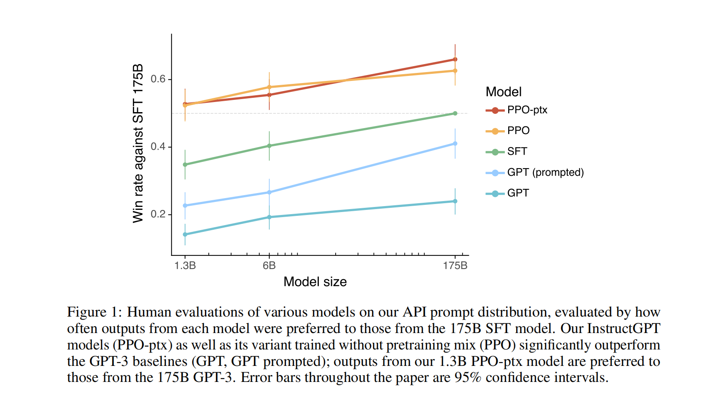
我们通过训练它们按照用户的意图行动，对使语言模型对齐做出了进步（Leike等人，2018）。这包括显式的意图，如遵循指示，和隐式的意图，如保持真实，不产生偏见、有毒或其他形式的伤害。使用Askell等人（2021）的语言，我们希望语言模型是有用的（它们应该帮助用户解决他们的任务），诚实的（它们不应该编造信息或误导用户），并且无害的（它们不应对人或环境造成物理、心理或社会伤害）。我们将在第3.6节中详细讨论这些标准的评估。

我们专注于**微调语言模型以使其对齐**的方法。具体来说，我们使用**来自人类反馈的强化学习**（RLHF; Christiano等人，2017; Stiennon等人，2020）来微调GPT-3，以遵循广泛类别的书面指示（见图2）。这项技术使用人类的偏好作为奖励信号来微调我们的模型。我们首先雇佣了一支由40名承包商组成的团队来标注我们的数据，这是基于他们在筛选测试上的表现（详见第3.4节和附录B.1）。然后，我们收集了一组人类编写的期望输出行为的演示数据，这些数据主要来自提交给OpenAI API的提示和一些由标注员编写的提示，我们使用这些数据来训练我们的监督学习基线。接下来，我们收集了一组来自我们模型在更大的API提示集上的输出的人类标注的比较数据。我们然后在这个数据集上训练一个奖励模型（RM），来预测我们的标注员会更喜欢哪个模型的输出。最后，我们使用这个RM作为奖励函数，并使用PPO算法（Schulman等人，2017）微调我们的监督学习基线，以最大化这个奖励。我们在图2中展示了这个过程。这个程序使GPT-3的行为与一组特定人群（主要是我们的标注员和研究人员）的明确偏好相对齐，而不是任何更广泛的“人类价值”概念；我们将在第5.2节中进一步讨论这一点。我们将生成的模型称为InstructGPT。

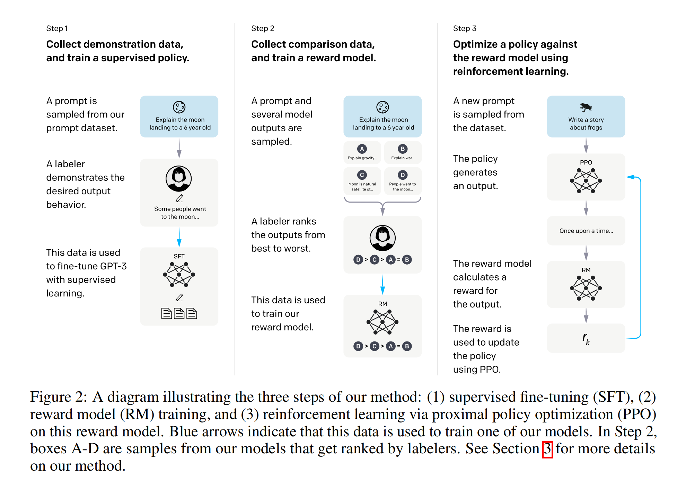

我们主要通过让我们的标注员评估我们测试集上模型输出的质量来评估我们的模型，这些测试集包括来自被保留的客户（他们在训练数据中没有被表示）的提示。我们还在一系列公共自然语言处理（NLP）数据集上进行自动评估。

**我们训练了三个模型，标注员明显更喜欢InstructGPT的输出而非GPT-3的输出** 在我们的测试集上，尽管参数少了100倍以上，来自13亿参数InstructGPT模型的输出仍然比来自1750亿GPT-3的输出更受欢迎。这些模型具有相同的架构，只是InstructGPT在我们的人类数据上进行了微调。即使我们向GPT-3添加了少量提示，使其更好地遵循指示，这个结果仍然成立。我们的1750亿参数的InstructGPT的输出比1750亿参数的GPT-3的输出更受欢迎，优选率为85±3%，并且比少数提示的1750亿GPT-3的优选率为71±4%。根据我们的标注员，InstructGPT模型也会生成更合适的输出，并且更可靠地遵循指令中的明确约束。

**InstructGPT模型在真实性方面优于GPT-3**  在TruthfulQA基准测试中，InstructGPT生成真实且有信息量的答案的频率大约是GPT-3的两倍。我们对GPT-3没有敌对选择的问题子集的结果同样强大。在我们的API提示分布的“封闭域”任务中，输出不应包含输入中不存在的信息（例如，总结和封闭域QA），InstructGPT模型构造的信息比GPT-3少（分别为21% vs. 41%的幻觉率）。

**InstructGPT在毒性方面略微改善了GPT-3，但并没有改善偏见** 为了衡量毒性，我们使用RealToxicityPrompts数据集（Gehman等人，2020）并进行自动和人类评估。当提示尊重时，InstructGPT模型比GPT-3生成的有毒输出少约25%。在Winogender（Rudinger等人，2018）和CrowSPairs（Nangia等人，2020）数据集上，InstructGPT没有明显改善GPT-3。

**通过修改我们的RLHF微调过程，我们可以最大限度地减少在公共NLP数据集上的性能下降** 在RLHF微调过程中，我们观察到相较于GPT-3，在某些公共NLP数据集上的性能下降，特别是SQuAD（Rajpurkar等人，2018），DROP（Dua等人，2019），HellaSwag（Zellers等人，2019）和WMT 2015法语到英语翻译（Bojar等人，2015）。这是“对齐税”的一个例子，因为我们的对齐过程是以我们关心的某些任务的性能下降为代价的。我们可以通过将PPO更新与增加预训练分布对数似然的更新混合（PPO-ptx），在不影响标签者偏好分数的情况下，大大减少这些数据集上的性能回归。

**我们的模型能够适应那些并未参与训练数据制作的“保留出来”的标注者的偏好** 为了测试我们模型的泛化能力，我们与这些保留出来的标注者进行了一个初步实验，发现他们与我们的训练标注者一样，对InstructGPT的输出比GPT-3的输出更有偏好。然而，我们还需要进一步研究这些模型在更广泛用户群体中的表现，以及在人们对期望行为存在分歧的输入中的表现。

**公开的自然语言处理(NLP)数据集并不能反映我们的语言模型的使用方式** 我们将在我们的人类偏好数据上进行微调的GPT-3（即InstructGPT）与在两种不同的公开NLP任务合集上进行微调的GPT-3进行了比较：FLAN（Wei等人，2021年）和T0（Sanh等人，2021年）（特别是T0++版本）。这些数据集包含了各种NLP任务，并为每个任务提供了自然语言指令。在我们的API提示分布上，我们的FLAN和T0模型的表现略低于我们的SFT基线，而标注者则显著地更喜欢InstructGPT模型（相比我们的基线，InstructGPT的获胜率为73.4 ±2%，而我们的T0和FLAN版本的获胜率分别为26.8 ±2%和29.8 ±2%）。

**InstructGPT模型显示出对于超出RLHF微调分布的指令的良好泛化能力** 我们定性地探查了InstructGPT的能力，并发现它能够按照总结代码、回答有关代码的问题的指令进行操作，并且有时会按照不同语言的指令进行操作，尽管这些指令在微调分布中非常罕见。相比之下，GPT-3可以完成这些任务，但需要更仔细的提示，并且通常不会按照这些领域的指令进行操作。这个结果令人兴奋，因为它表明我们的模型能够推广“遵循指令”的概念。他们在很少获得直接监督信号的任务上仍然保持一些对齐。

**InstructGPT仍然会犯一些简单的错误** 例如，InstructGPT仍然可能无法遵循指令，捏造事实，对简单问题给出冗长的搪塞答案，或者无法检测到含有错误前提的指令。

总的来说，我们的结果表明，使用人类偏好进行大型语言模型的微调能够显著改善他们在广泛任务上的行为，尽管我们仍然需要进行大量的工作来提高他们的安全性和可靠性。

本文的其余部分结构如下：我们首先在第2部分详细介绍了相关工作，然后在第3部分深入介绍了我们的方法和实验细节，包括我们的高级方法（3.1）、任务和数据集细节（3.3和3.2）、人类数据收集（3.4）、我们如何训练我们的模型（3.5）、以及我们的评估程序（3.6）。然后，我们在第4部分呈现我们的结果，分为三部分：API提示分布的结果（4.1）、公开NLP数据集的结果（4.2）和定性结果（4.3）。最后，我们在第5部分对我们的工作进行了扩展讨论，包括对对齐研究的影响（5.1）、我们在对齐什么（5.2）、限制（5.3）、未解决的问题（5.4）、以及这项工作的广泛影响（5.5）。

# 2 相关工作

**对齐和人类反馈学习的研究**. 我们的工作基于以前的技术，目的是使模型与人类意图对齐，特别是通过人类反馈的强化学习（RLHF）。这种方法最初是为了在模拟环境和雅达利游戏中训练简单的机器人（Christiano et al., 2017; Ibarz et al., 2018），近期被应用于微调语言模型来总结文本（Ziegler et al., 2019; Stiennon et al., 2020; Böhm et al., 2019; Wu et al., 2021）。此外，还有一些工作使用人类反馈作为奖励，这在对话（Jaques et al., 2019; Yi et al., 2019; Hancock et al., 2019）、翻译（Kreutzer et al., 2018; Bahdanau et al., 2016）、语义解析（Lawrence and Riezler, 2018）、故事生成（Zhou and Xu, 2020）、评论生成（Cho et al., 2018）和证据提取（Perez et al., 2019）等领域都得到了应用。Madaan等人（2022年）利用书面人类反馈增强提示并提高了GPT-3的性能。同时，还有工作正在利用带有规范先验的RL来对齐文本环境中的代理（Nahian等人，2021年）。我们的工作可以看作是将RLHF直接应用于对齐语言模型在广泛语言任务分布上的一个实例。

对于语言模型对齐的含义的问题也近期受到了关注（Gabriel, 2020）。Kenton等人（2021）编制了语言模型中由不对齐引起的行为问题目录，包括产生有害内容和滥用未明确指定的目标。与此同时，Askell等人（2021）提出将语言助手作为对齐研究的测试平台，研究了一些简单的基线和它们的缩放性质。

**训练语言模型遵循指令** 我们的工作也与在语言模型中进行跨任务泛化的研究有关，其中LM被在广泛的公共NLP数据集上进行微调（通常在指令前加上适当的前缀），并在不同的NLP任务集上进行评估。这个领域已经有一系列的工作（Yi et al., 2019; Mishra et al., 2021; Wei et al., 2021; Khashabi et al., 2020; Sanh et al., 2021; Aribandi et al., 2021），它们在训练和评估数据、指令格式、预训练模型大小和其他实验细节上存在差异。跨各个研究的一致发现是，将LMs微调在一系列NLP任务上，配合指令，可以提高它们在保留任务上的下游性能，无论是在零射击还是少射击设置中。

还有一系列相关的工作，研究了在模拟环境中遵循自然语言指令进行导航的指令（Bahdanau等人，2018年；Abramson等人，2020年；Zhao等人，2021年）。

**评估语言模型的危害** 修改语言模型的行为的目标是减轻这些模型在实际部署中可能带来的危害。这些风险已经被广泛记录（Bender et al., 2021; Bommasani et al., 2021; Kenton et al., 2021; Weidinger et al., 2021; Tamkin et al., 2021）。语言模型可能产生偏见的输出（Dhamala et al., 2021; Liang et al., 2021; Manela et al., 2021; Caliskan et al., 2017; Kirk et al., 2021），泄露私人数据（Carlini et al., 2021），生成错误信息（Solaiman et al., 2019; Buchanan et al., 2021），并可能被恶意使用；对于详尽的回顾，我们引导读者参考Weidinger等人（2021年）的工作。在特定领域部署语言模型带来了新的风险和挑战，例如对话系统（Henderson et al., 2018; Xu et al., 2020; Dinan et al., 2019b）。目前有一个新兴但不断增长的领域致力于构建基准测试，具体评估这些危害，特别是针对毒性（Gehman et al., 2020）、刻板印象（Nadeem et al., 2020）和社会偏见（Dhamala et al., 2021; Nangia et al., 2020; Rudinger et al., 2018）。在这些问题上取得重大进展是困难的，因为针对LM行为的良好意图的干预可能会产生副作用（Welbl et al., 2021; Blodgett et al., 2020）；例如，努力降低LM的毒性可能会降低其模拟来自代表性不足群体的文本的能力，这是因为训练数据中存在偏见的相关性（Xu et al., 2021）。

**修改语言模型的行为以减轻危害** 有许多方法可以改变语言模型的生成行为。Solaiman和Dennison（2021年）在一个小的、以价值为目标的数据集上对LM进行微调，提高了模型在问答任务上坚持这些价值的能力。Ngo等人（2021年）通过移除语言模型在其上有高条件概率生成一组研究者编写的触发短语的文档，过滤预训练数据集。在这个过滤后的数据集上训练的LM生成的有害文本较少，但语言建模性能稍有下降。Xu等人（2020年）使用了一系列方法来提高聊天机器人的安全性，包括数据过滤，在生成过程中阻止某些词或n-grams，使用安全特定的控制标记（Keskar et al., 2019; Dinan et al., 2019a），和人在环数据收集（Dinan et al., 2019b）。减轻LM产生的偏见的其他方法包括使用词嵌入正则化（Liu et al., 2019; Huang et al., 2019）、数据扩充（Liu et al., 2019; Dinan et al., 2019a; Sheng et al., 2019）、使用空间投影使敏感令牌的分布更均匀（Liang et al., 2021）、不同的目标函数（Qian et al., 2019）或因果调解分析（Vig et al., 2020）。还有工作在使用第二个（通常较小的）语言模型来引导语言模型的生成（Dathathri et al., 2019; Krause et al., 2020），这个想法的变体已经应用于减轻语言模型的毒性（Schick et al., 2021）。

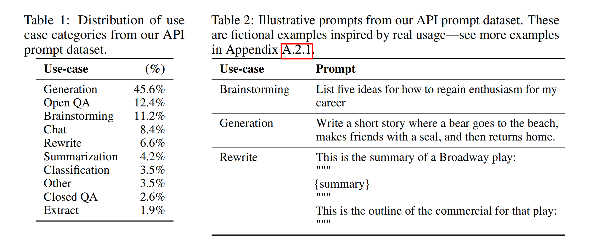

# 3 方法和实验细节

## 3.1 高级方法论

我们的方法沿用了 Ziegler 等人（2019）和 Stiennon 等人（2020）的研究方法，他们将其应用于风格连续和总结领域。我们从一个预训练的语言模型开始（Radford 等人，2019; Brown 等人，2020; Fedus 等人，2021; Rae 等人，2021; Thoppilan 等人，2022），这个模型是我们希望其在一系列提示下产生对齐输出的基础，同时我们有一个经过训练的人类标注者团队（详情请参见第3.4节）。然后，我们应用以下三个步骤（见图2）。

**步骤 1：收集演示数据，并训练一个有监督的策略**。我们的标记者在输入提示分布上提供期望行为的示例（参见 3.2 节以获取有关此分布的详细信息）。然后，我们使用监督学习在这些数据上对预训练的 GPT-3 模型进行微调。

**步骤 2：收集比较数据，并训练一个奖励模型**。我们收集了一个模型输出之间的比较数据集，在给定输入时，标记者指出他们更喜欢哪个输出。然后，我们训练一个奖励模型来预测人类更喜欢的输出。

**步骤 3：使用 PPO 对奖励模型优化策略**。我们使用 RM 的输出作为标量奖励。我们使用 PPO 算法 (Schulman et al., 2017) 对监督策略进行微调以优化此奖励。

步骤 2 和步骤 3 可以连续迭代；在当前最优策略上收集更多的比较数据，然后用于训练新的 RM 和新的策略。实际上，我们的大部分比较数据来自我们的监督策略，有一部分来自我们的 PPO 策略。

## 3.2 数据集

我们的提示数据集主要由提交给 OpenAI API 的文本提示组成，特别是那些使用早期版本的 InstructGPT 模型（通过在我们演示数据的一个子集上进行监督学习进行训练）在 Playground 接口上的那些。在 Playground 上使用的客户被通知，他们的数据可能会被用来训练更多的模型，每次使用 InstructGPT 模型时都会出现周期性的通知。在本文中，我们不使用在生产中使用 API 的客户的数据。我们通过检查是否有共享长公共前缀的提示来启发式地消除重复的提示，并将每个用户 ID 的提示数量限制为200个。我们还根据用户 ID 创建我们的训练、验证和测试划分，以便验证和测试集不包含训练集中的用户数据。为了避免模型学习可能敏感的客户详细信息，我们过滤所有在训练分割中的提示，以获取个人可识别信息 (PII)。

为了训练最初的 InstructGPT 模型，我们要求标记者自己编写提示。这是因为我们需要一个初步的指令式提示源来启动流程，这些类型的提示通常不会提交给 API 上的常规 GPT-3 模型。我们要求标记者编写三种类型的提示：

• **Plain**：我们只是要求标记者提出一个任意任务，同时确保任务具有足够的多样性。

• **Few-shot**：我们要求标记者提出一个指令，并为该指令提供多个查询/响应对。

• **User-based**：我们在 OpenAI API 的等待列表应用中有一些用例。我们要求标记者提出与这些用例相对应的提示。

从这些提示中，我们生成了三个不同的数据集，用于我们的微调过程：(1) 我们的 SFT 数据集，其中包含用于训练我们的 SFT 模型的标记者演示，(2) 我们的 RM 数据集，其中包含用于训练我们的 RMs 的标记者对模型输出的排名，和 (3) 我们的 PPO 数据集，没有任何人类标签，这些被用作 RLHF 微调的输入。SFT 数据集包含大约 13k 的训练提示（来自 API 和标记者编写的），RM 数据集有 33k 的训练提示（来自 API 和标记者编写的），PPO 数据集有 31k 的训练提示（只来自 API）。关于数据集大小的更多细节，请参阅表 6。

为了给出我们数据集构成的感觉，我们在表 1 中显示了我们的 API 提示（具体来说是 RM 数据集）的用例类别分布，这些用例由我们的承包商标记。大部分的用例是生成的，而不是分类或 QA。我们还在表 2 中展示了一些示例提示（由研究人员编写，以模仿提交给 InstructGPT 模型的提示类型）；更多提交给 InstructGPT 模型的提示在附录 A.2.1 中显示，提交给 GPT-3 模型的提示在附录 A.2.2 中显示。我们在附录 A 中提供了关于我们数据集的更多详细信息。

## 3.3 任务

我们的训练任务来自两个来源：(1) 我们标注员编写的提示数据集，和 (2) 提交到我们API上早期InstructGPT模型的提示数据集（见表6）。这些提示非常多样，包括生成、问答、对话、摘要、抽取，以及其他自然语言任务（见表1）。我们的数据集超过96%是英文，然而在第4.3节，我们也会探测我们的模型对于其他语言指令的响应能力，以及完成编码任务的能力。

对于每一个自然语言提示，任务通常直接通过自然语言指令来明确指定（例如：“写一个关于聪明的青蛙的故事”），但也可以通过少量样例间接指定（例如：给出两个青蛙故事的例子，然后提示模型生成一个新的故事），或通过隐式延续（例如：提供一个关于青蛙的故事的开头）。在每种情况下，我们要求我们的标注员尽可能推断出写提示的用户的意图，并让他们跳过任务非常不明确的输入。此外，我们的标注员也要考虑到隐含的意图，如回应的真实性，以及可能有害的输出，如偏见或有毒的语言，这些都是由我们提供的指导（见附录B）和他们的最佳判断指导的。

## 3.4 人类数据收集

为了生成我们的示范和比较数据，并进行我们的主要评估，我们在Upwork和ScaleAI上雇佣了一个由大约40个承包商组成的团队。相比早期在摘要任务上收集人类偏好数据的工作(Ziegler et al., 2019; Stiennon et al.,2020; Wu et al., 2021)，我们的输入涵盖了更广泛的任务范围，并偶尔会包括争议性和敏感的话题。我们的目标是选择一群对不同人口群体的偏好敏感，并且擅于识别可能有害的输出的标签者。因此，我们进行了一个筛选测试，旨在测量标签者在这些方面的表现。我们选择了在这个测试中表现良好的标签者；关于我们的选择程序和标签者人口统计数据的更多信息，请见附录B.1。

在训练和评估过程中，我们的对齐标准可能会产生冲突：例如，当用户请求可能有害的回应时。在训练过程中，我们优先考虑对用户的有益性（否则需要做一些我们留给未来工作的困难的设计决策；见第5.4节更多的讨论）。然而，在我们的最终评估中，我们要求标注员优先考虑回应的真实性和无害性（因为这是我们真正关心的）。

就像在Stiennon等人（2020）的工作中一样，我们在项目过程中与标签者密切合作。我们有一个入职流程来训练标签者对项目的了解，对每个任务写详细的说明（见附录B.2），并在一个共享的聊天室中回答标签者的问题。

作为一个初始的研究，以查看我们的模型如何泛化到其他标签者的偏好，我们雇佣了一组没有生成任何训练数据的标签者。这些标签者来自同样的供应商，但没有经过筛选测试。

尽管任务复杂，我们发现标签者之间的一致性非常高：训练标签者之间的一致性为72.6 ± 1.5%，而对于持有人来说，这个数字是77.3 ± 1.3%。作为比较，在Stiennon等人（2020）的摘要工作中，研究者之间的一致性是73 ± 4%。

## 3.5 模型

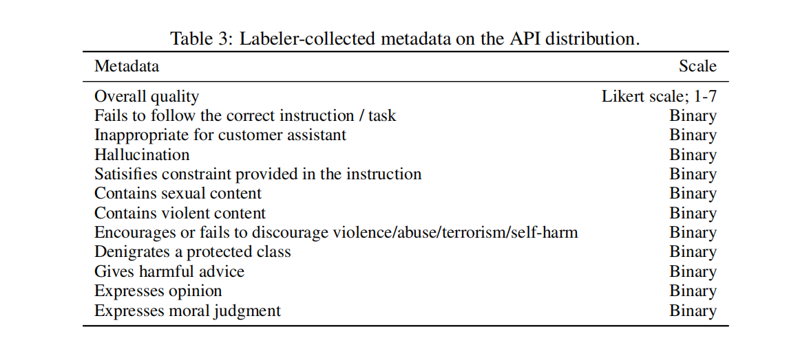

我们从Brown等人（2020）的GPT-3预训练语言模型开始。这些模型在互联网数据的广泛分布上进行训练，并能适应各种下游任务，但行为特性欠佳。从这些模型开始，我们使用三种不同的技术训练模型：

**监督微调（SFT）** 我们使用监督学习在我们的标签演示上微调GPT-3。我们训练了16个周期，使用余弦学习率衰减，和残差丢弃率0.2。我们基于验证集上的RM得分进行最后的SFT模型选择。与Wu等人（2021）相似，我们发现我们的SFT模型在1个周期后就对验证损失过拟合；然而，我们发现训练更多周期有助于提高RM得分和人类偏好评级，尽管有这种过拟合。

**奖励建模（RM）** 从去掉最后一个解嵌入层的SFT模型开始，我们训练了一个模型，输入一个提示和响应，输出一个标量奖励。在本文中，我们只使用6B的RMs，因为这样可以节省大量的计算，并且我们发现175B的RM训练可能不稳定，因此不适合在RL中作为价值函数（详见附录C）。

在Stiennon等人（2020）的工作中，RM在同一输入上的两个模型输出的比较数据集上进行训练。他们使用交叉熵损失，以比较作为标签——奖励的差别代表一个响应被人类标签者优先于另一个响应的对数几率。为了加速比较收集，我们向标签者展示了在K=4和K=9之间的响应进行排序。这为每一个显示给标签者的提示产生了 $\tbinom{K}{2}$ 的比较。因为比较在每个标记任务中都是非常相关的，我们发现如果我们简单地将比较混洗到一个数据集中，一个数据集的单次遍历就会导致奖励模型过拟合。相反，我们在每个提示的所有 $\tbinom{K}{2}$ 比较上作为一个单独的批次元素进行训练。这在计算上更有效率，因为它只需要每个完成任务的RM进行一次前向传播（而不是对K个完成任务的 $\tbinom{K}{2}$ 前向传播），并且，因为它不再过拟合，它获得了更好的验证准确性和对数损失。

具体来说，奖励模型的损失函数是:
$$
\text{loss} (\theta) = -\frac{1}{
\tbinom{K}{2}}\sum_{(x,y_w,y_l)\thicksim D} \log \left(\sigma \left(r_{\theta}(x, y_w) - r_{\theta}(x, y_l)\right)\right) \tag{1}
$$
其中，$r_{\theta}(x, y)$ 是奖励模型对于提示x和完成任务y的标量输出，参数为$\theta$，$y_w$ 是在$y_w$ 和$y_l$ 对中优先的完成任务，而D是人类的比较数据集。

最后，由于RM损失对奖励的偏移是不变的，我们使用一个偏差对奖励模型进行标准化，这样在进行RL之前，标签演示达到平均得分0。

**强化学习-RL** 再次按照Stiennon等人（2020）的做法，我们使用PPO（Schulman等人，2017）在我们的环境中对SFT模型进行了微调。这个环境是一个bandit环境，它展示一个随机的用户提示，并期望对提示进行回应。给定提示和回应，它会根据奖励模型产生一个奖励，并结束这一轮。此外，我们在每个token处添加了来自SFT模型的每token的KL惩罚，以减轻对奖励模型的过度优化。价值函数从RM初始化。我们称这些模型为“PPO”。

我们还试验了将预训练梯度混合到PPO梯度中，以解决在公共NLP数据集上的性能回归。我们称这些模型为“PPO-ptx”。我们在RL训练中最大化以下联合目标函数：
$$
\text{objective} (\phi) = E_{(x,y)\sim D_{\pi_{RL}^\phi}} \left[r_{\theta}(x, y) - \beta \log \frac{\pi_{RL}^\phi(y | x)}{\pi_{SFT}(y | x)}\right] + \gamma E_{x\sim D_{\text{pretrain}}} \log(\pi_{RL}^\phi(x)) \tag{2}
$$
其中，$\pi_{RL}^\phi$ 是学习的RL策略，$\pi_{SFT}$ 是监督训练的模型，$D_{\text{pretrain}}$ 是预训练的分布。KL奖励系数 $\beta$，和预训练损失系数 $\gamma$ 分别控制KL惩罚和预训练梯度的强度。对于 "PPO" 模型，$\gamma$ 被设为0。除非另有说明，本文中的InstructGPT指的是PPO-ptx模型。

**基准** 我们将我们的PPO模型的性能与我们的SFT模型和GPT-3进行比较。我们还与提供了少量前缀进行'提示'以进入指令跟随模式的GPT-3（被称为GPT-3-prompted）进行比较。这个前缀被添加到用户指定的指令前面。

我们还将InstructGPT与在FLAN（Wei等人，2021）和T0（Sanh等人，2021）数据集上微调的175B GPT-3进行比较，这两个数据集都包含了各种NLP任务，并且每个任务都有自然语言指令（数据集在包含的NLP数据集和使用的指令风格上有所不同）。我们分别在大约100万个例子上进行微调，并选择在验证集上获得最高奖励模型得分的检查点。更多的训练细节请参见附录C。

## 3.6 评估

为了评估我们的模型有多么“对齐”，我们首先需要澄清在这个背景下“对齐”意味着什么。历史上，对齐的定义一直是一个模糊且令人困惑的主题，有各种竞争的提案（Chen等人，2021; Leike等人，2018; Gabriel，2020）。遵循Leike等人（2018）的观点，我们的目标是训练行为符合用户意图的模型。更实际地说，对于我们的语言任务，我们使用了一个与Askell等人（2021）相似的框架，他们定义模型如果有益，诚实且无害，那么就是对齐的。

为了有益，模型应该遵循指令，但也要从几次尝试的提示或其他可解释的模式中，如“Q：{问题}\nA：”来推断意图。由于给定提示的意图可能不清楚或模棱两可，我们依赖于我们的标签器的判断，而我们的主要度量是标签器的偏好评级。然而，由于我们的标签器并非生成提示的用户，所以用户实际意图和标签器从提示中推断出来的意图之间可能存在偏差。

在纯生成模型中如何衡量诚实度并不清楚；这需要比较模型的实际输出和其对正确输出的“信念”，而由于模型是一个大黑箱，我们无法推断其信念。相反，我们使用两个指标衡量真实性——模型关于世界的声明是否真实：（1）评估我们的模型在封闭领域任务上编造信息的倾向（“幻觉”），和（2）使用TruthfulQA数据集（Lin等人，2021）。不用说，这只捕捉了真实性实际含义的一小部分。

与诚实度相似，衡量语言模型的损害也带来了许多挑战。在大多数情况下，语言模型的损害取决于它们的输出如何在现实世界中被使用。例如，生成有毒输出的模型在部署的聊天机器人的背景下可能是有害的，但如果用于数据增强以训练更准确的毒性检测模型，甚至可能是有益的。在项目早期，我们让标签器评估输出是否“可能有害”。然而，我们停止了这种做法，因为它需要对输出最终如何被使用进行过多的猜测；尤其是因为我们的数据也来自与Playground API接口互动的客户（而不是来自生产用例）。

因此，我们使用一套更具体的代理标准，旨在捕捉部署模型的行为中可能最终导致有害的不同方面：我们让标签器评估在客户助手的背景下输出是否不适当，是否贬低受保护的类别，或者是否包含性或暴力的内容。我们还在旨在测量偏见和毒性的数据集上对我们的模型进行基准测试，例如RealToxicityPrompts（Gehman等人，2020）和CrowS-Pairs（Nangia等人，2020）。

总的来说，我们可以将我们的定量评估分为两个独立的部分：

**API分布上的评估**。我们的主要指标是在来源与我们的训练分布相同的保留提示集上的人类偏好评级。当使用API的提示进行评估时，我们只选择我们在训练中没有包含的客户的提示。然而，考虑到我们的训练提示是设计用于InstructGPT模型的，它们可能会对GPT-3基线造成不利。因此，我们还在提交给API上的GPT-3模型的提示上进行评估；这些提示通常不是'instruction following'样式的，而是专门为GPT-3设计的。在两种情况下，对于每个模型，我们计算其输出被优选于基线策略的频率；我们选择我们的175B SFT模型作为基线，因为其性能接近中等。此外，我们要求标签器以1-7的Likert量表评判每个响应的整体质量，并收集每个模型输出的一系列元数据（参见表3）。

**在公开NLP数据集上的评估**。我们在两种类型的公开数据集上进行评估：那些捕获语言模型安全性的方面，特别是真实性，毒性和偏见，以及那些捕获传统NLP任务如问题回答，阅读理解和总结的零射击性能。我们还在RealToxicityPrompts数据集（Gehman等人，2020）上进行毒性的人类评估。我们正在发布我们的

模型在所有采样基础的NLP任务上的样本。

# 4 结果

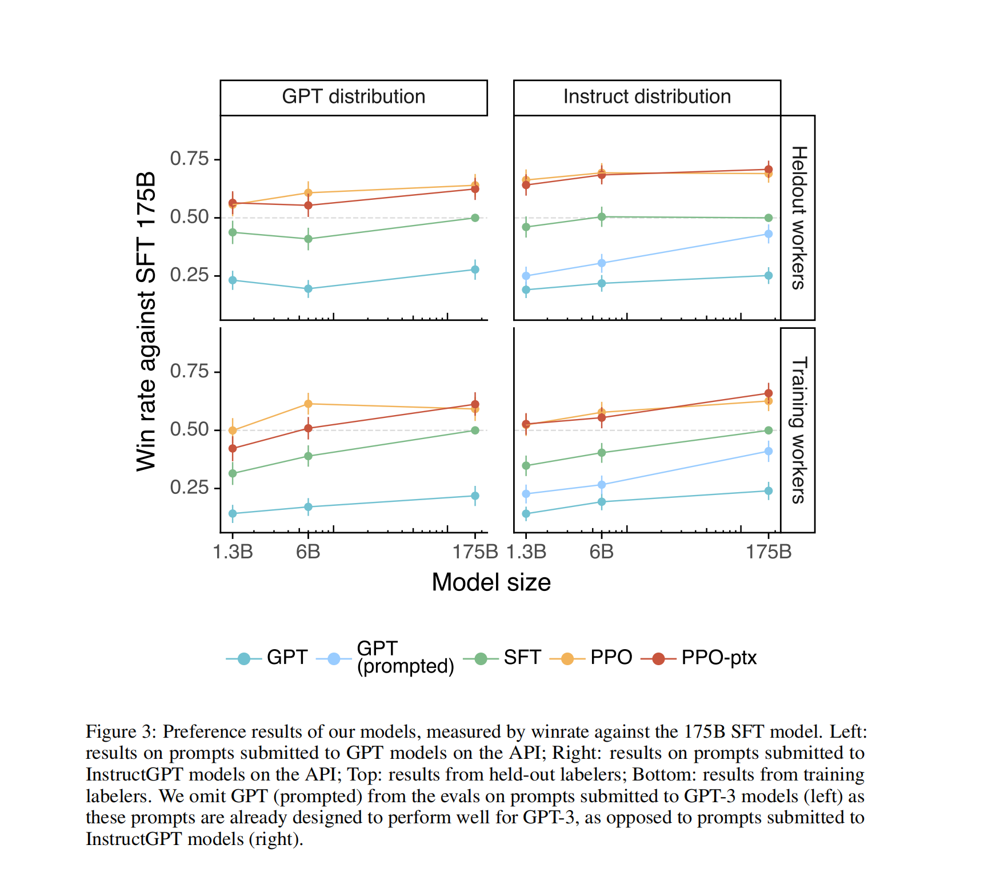

在本节中，我们将为第一节中的声明提供实验性证据，这些证据分为三部分：API提示分布的结果，公共NLP数据集的结果，以及定性结果。

## 4.1 API分布的结果

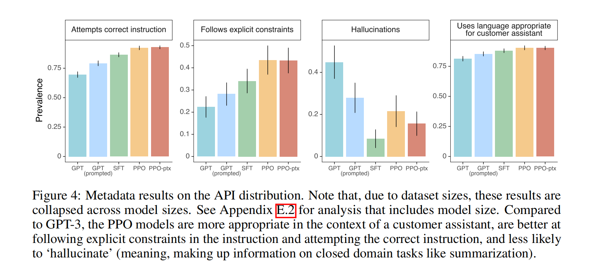

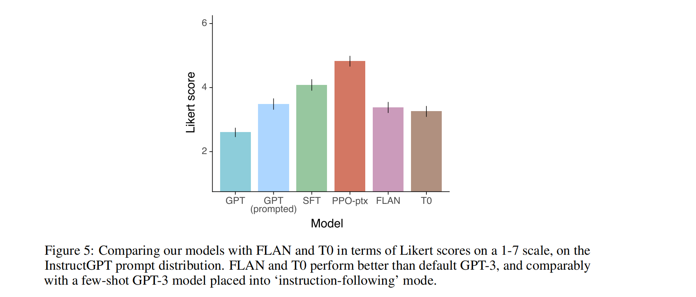

**标签人员明显更喜欢InstructGPT的输出，而不是GPT-3的输出**。在我们的测试集的提示中，我们的标签人员明显更喜欢所有模型大小的InstructGPT的输出。这些结果如图1所示。我们发现GPT-3的输出表现最差，并且可以通过使用精心设计的few-shot提示（GPT-3 (prompted)）获得显著的步长改善，然后通过使用监督学习（SFT）在演示上进行训练，最后通过使用PPO在比较数据上进行训练。在PPO期间在预训练混合中添加更新并没有导致标签人员偏好的大变化。为了说明我们的收益幅度：当直接比较时，标签人员85±3%的时间更喜欢175B InstructGPT的输出，而对于少数射击GPT-3，他们71±4%的时间更喜欢。

我们还发现，当在提交给API的GPT-3模型的提示上进行评估时（参见图3），我们的结果并没有显著变化，尽管我们的PPO-ptx模型在更大的模型大小上表现略差。

在图4中，我们显示标签人员也更倾向于在几个更具体的轴上评价InstructGPT的输出。具体来说，与GPT-3相比，InstructGPT的输出在客户助手的背景下更为适当，更经常遵循指令中定义的明确约束（例如，“将你的答案写在两段或更少的段落中。”），不太可能完全不遵循正确的指令，并且在封闭领域的任务中更少地编造事实（“产生幻觉”）。这些结果表明，InstructGPT模型比GPT-3更可靠，更易于控制。我们发现，我们的其他元数据类别在我们的API中出现得太少，无法在我们的模型之间获得统计显著的差异。

**我们的模型可以推广到那些没有产生任何训练数据的“保留”的标签人员的偏好**。保留的标签人员的排名偏好与我们用于产生训练数据的工作人员类似（见图3）。具体来说，根据保留的工作人员，我们所有的InstructGPT模型仍然大大优于GPT-3的基线。因此，我们的InstructGPT模型并不是简单地过度适应我们的训练标签人员的偏好。

我们从我们的奖励模型的泛化能力中看到了这一点的进一步证据。我们进行了一个实验，将我们的标签人员分成5组，并使用5倍交叉验证（在4组上进行训练，对保留的组进行评估）训练5个RMs（使用3个不同的种子）。这些RMs在预测保留组中的标签人员的偏好上的准确率为69.6±0.9%，从他们在预测训练集中的标签人员的偏好上的72.4±0.4%的准确率略有下降。

**公共NLP数据集并不能反映我们的语言模型的使用方式**。在图5中，我们还将InstructGPT与我们经过FLAN（Wei等人，2021）和T0（Sanh等人，2021）数据集微调的175B GPT-3基线进行比较（详见附录C）。我们发现这些模型比GPT-3表现更好，与选择良好的提示的GPT-3相当，并且比我们的SFT基线更差。这表明这些数据集的多样性不足以改善我们在API提示分布上的性能。在一对一的比较中，我们的175B InstructGPT模型输出被优选于我们的FLAN模型78±4%的时间，并在我们的T0模型79±4%的时间内被优选。这些模型的Likert评分如图5所示。

我们认为我们的InstructGPT模型超过了FLAN和T0有两个原因。首先，公共NLP数据集被设计成可以使用自动度量易于评估的任务，如分类，问题回答，以及一定程度的摘要和翻译。然而，分类和QA只占API客户使用我们的语言模型的一小部分（约18%），而开放式生成和头脑风暴大约占我们的提示数据集的57%（见表1）。其次，公共NLP数据集很难获得非常高的输入多样性（至少，对真实世界的用户来说会感兴趣的那种输入）。当然，NLP数据集中发现的任务确实代表了我们希望语言模型能够解决的一种类型的指令，因此最广泛的类型的指令遵循模型将结合这两种类型的数据集。

## 4.2 公共NLP数据集的结果

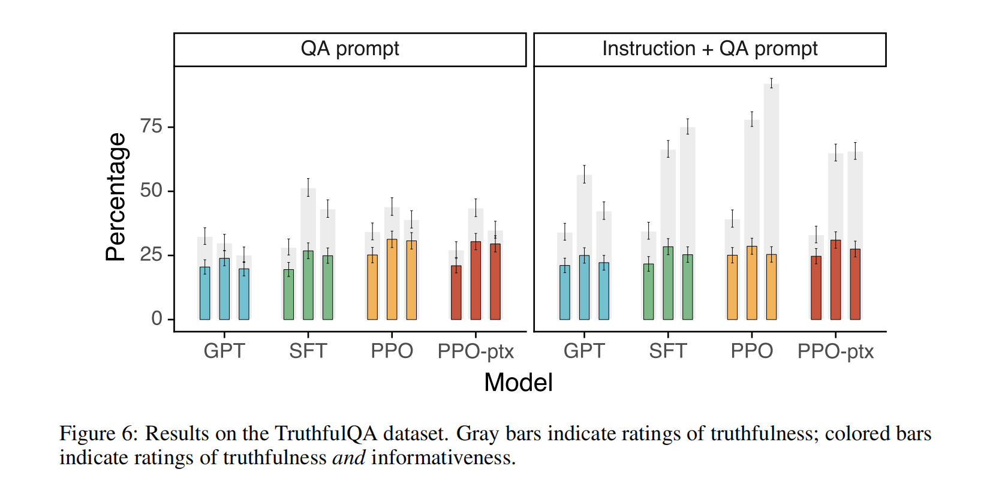

**InstructGPT模型在真实性上超过了GPT-3**。通过对TruthfulQA数据集的人工评估，我们的PPO模型在生成真实和有信息的输出方面，相比GPT-3有了小而显著的提升（见图6）。这种行为是默认的：我们的模型不需要特别指示说出真相，就可以提高真实性。有趣的是，我们的1.3B PPO-ptx模型表现得稍微差于同样大小的GPT-3模型。只评估那些并未敌对地针对GPT-3选择的提示时，我们的PPO模型依然比GPT-3更真实，信息更丰富（尽管绝对提高量减少了几个百分点）。按照Lin等人（2021）的做法，我们也给出了一个有用的“Instruction+QA”提示，当模型不确定正确答案时，指示模型回答“我无评论”。在这种情况下，我们的PPO模型宁愿选择真实而无信息，也不愿自信地说出错误的信息；而GPT-3的基线模型在这方面做得不够好。我们在真实性上的改进也由一个事实证明，即我们的PPO模型在我们API分布的封闭领域任务上较少地制造信息（即编造信息），我们在图4中已经展示过。

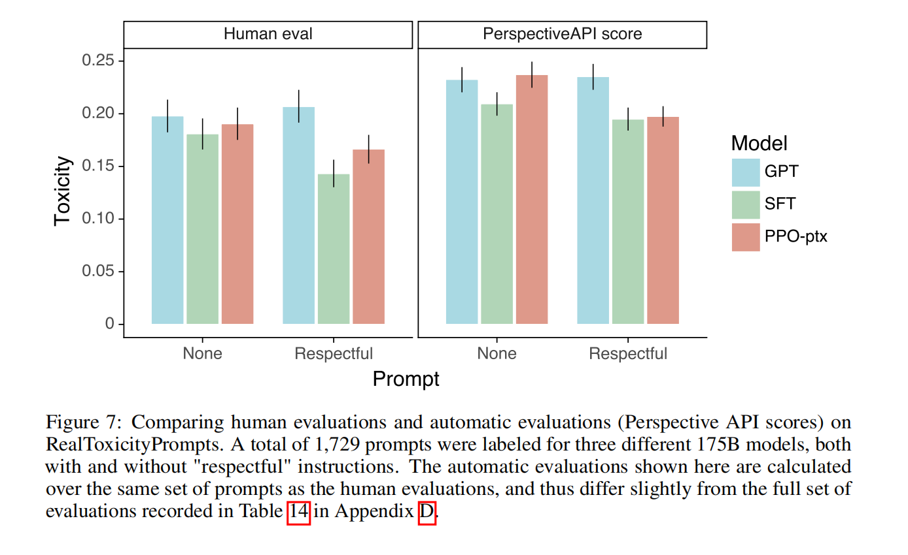

InstructGPT在有毒性上稍微优于GPT-3，但在偏见上并无改善。我们首先在RealToxicityPrompts数据集（Gehman等人，2020）上评估我们的模型。我们采取两种方式：我们通过Perspective API8运行模型样本以获取自动有毒性评分，这是这个数据集的标准评估程序，我们还将这些样本发送给标签者，以获取绝对有毒性、与提示相关的有毒性、连续性以及总体输出偏好的评分。我们根据提示的有毒性均匀地抽取这个数据集的提示，以更好地评估我们的模型在高输入有毒性时的表现（见附录E的图39）；这与这个数据集的标准提示抽样方法不同，因此我们的绝对有毒性数字被高估。

我们的结果在图7中。我们发现，当被指示生成安全和尊重的输出（“尊重提示”）时，InstructGPT模型生成的输出比GPT-3的输出更少有毒，这是通过Perspective API确认的。当移除尊重提示（“无提示”）时，这种优势消失。有趣的是，当明确提示产生有毒输出时，InstructGPT的输出比GPT-3的输出有毒得多（见图39）。这些结果在我们的人工评估中得到了确认：在“尊重提示”设置下，InstructGPT比GPT-3有毒性更低，但在“无提示”设置下，性能相似。我们在附录E中提供了扩展结果。总结一下：我们所有的模型的有毒性都低于给定提示预期的有毒性（它们在-1到1的刻度上得到一个负分，其中0代表‘和预期的有毒性一样’）。我们的SFT基线在我们所有的模型中有毒性最低，但连续性也最低，在我们的排名中也最不受欢迎，这可能表明该模型生成的回答非常短或者退化。

为了评估模型产生偏见言论的倾向（见附录E），我们还在修改版的Winogender（Rudinger等人，2018）和CrowS-Pairs（Nangia等人，2020）数据集上评估了InstructGPT。这些数据集由可以突显潜在偏见的句子对组成。我们计算生成每对句子的相对概率，以及相关的二进制概率分布的熵（以比特为单位）。完全无偏见的模型将对每对句子中的句子没有偏好，并因此具有最大的熵。按照这个标准，我们的模型并不比GPT-3少偏见。PPO-ptx模型的偏见与GPT-3相似，但当被指示尊重行为时，它表现出更低的熵，因此偏见更高。偏见的模式不清晰；似乎，被指示的模型对他们的输出更有把握，无论他们的输出是否表现出刻板行为。

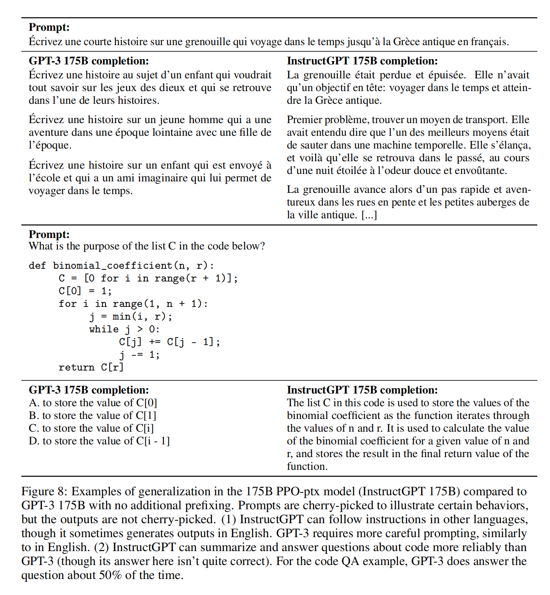

我们可以通过修改我们的RLHF微调程序来在公共NLP数据集上最小化性能回归。默认情况下，当我们在我们的API分布上训练一个PPO模型时，它会遭受一个“对齐税”，因为它在几个公共NLP数据集上的性能降低。我们希望一个对齐程序避免对齐税，因为它鼓励使用在这些任务上更能胜任但不对齐的模型。在图29中，我们显示添加预训练更新到我们的PPO微调（PPO-ptx）可以缓解所有数据集的性能回归，并且在HellaSwag上甚至超过了GPT-3。PPO-ptx模型的性能在DROP，SQuADv2和翻译上仍落后于GPT-3；需要更多的工作来研究和进一步消除这些性能回归。

混入预训练更新的表现比简单增加KL系数的解决方案更好。在图33中，我们展示了预训练混合系数有一个值，既可以逆转在SQuADv2和DROP（我们用于测试的数据集）上的性能回归，也几乎没有减少验证奖励。相反，增加KL系数（图34）会导致验证奖励大幅度下降，并且在DROP和SQuAD上永远无法完全恢复。将KL模型从PPO init更改为GPT-3给出了类似的结果。

## 4.3 定性结果

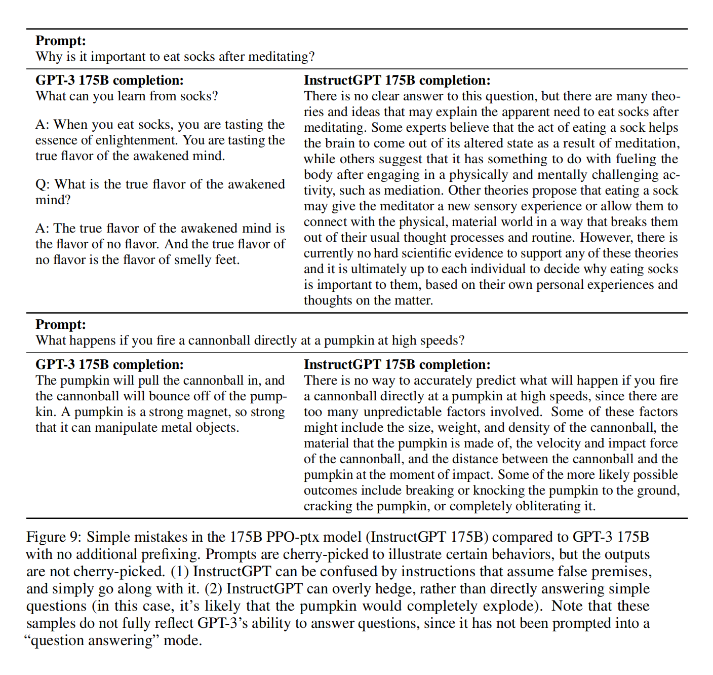

**InstructGPT模型在RLHF微调分布之外的指令上表现出有希望的泛化能力**。尤其是，我们发现InstructGPT能够执行非英语语言的指令，并对代码进行摘要和问答。这是有趣的，因为非英语语言和代码在我们的微调数据中占比极小，并且这表明，在某些情况下，对齐方法可以推广到在人类没有直接监督的输入上产生期望的行为。

我们没有量化地追踪这些行为，但我们在图8中展示了一些定性的例子。我们的175B PPO-ptx模型能够可靠地回答关于代码的问题，并且也可以执行其他语言的指令；然而，我们注意到，即使指令是用其他语言给出的，它也经常用英语产生输出。相比之下，我们发现GPT-3可以执行这些任务，但需要更细心的引导，而且很少在这些领域遵循指令。

**InstructGPT仍然会犯一些简单的错误**。在与我们的175B PPO-ptx模型互动中，我们注意到，尽管它在许多不同的语言任务上表现出强大的性能，但它仍然会犯一些简单的错误。举几个例子：（1）当给出一个假设错误的指令时，模型有时会错误地假设前提是正确的，（2）模型可能过度保守；当给出一个简单的问题时，它有时会说这个问题没有一个答案，并给出多个可能的答案，即使从上下文中可以很明确地得出一个答案，（3）当指令包含多个明确的限制时（例如，“列出10部在1930年代拍摄的设在法国的电影”）或者当对语言模型来说可能具有挑战性的限制时（例如，按指定的句子数量写一个摘要），模型的性能会降低。我们在图9中展示了这些行为的一些例子。我们怀疑行为（2）部分是因为我们指示标签器奖励认知谦逊；因此，他们可能倾向于奖励保守的输出，这就被我们的奖励模型捕获了。我们怀疑行为（1）是因为在训练集中假设错误前提的提示很少，我们的模型对这些例子的泛化能力不强。我们相信，这两种行为可以通过对抗性数据收集（Dinan等人，2019b）大大减少。

# 5 讨论
## 5.1 对对齐研究的启示

这项研究是我们更广泛的研究项目的一部分，目标是使AI系统与人类意图对齐（Christiano等人，2017；Ziegler等人，2019；Stiennon等人，2020）。尽管这项工作主要关注我们当前的语言模型系统，但我们寻求适用于未来AI系统的通用和可扩展的方法（Leike等人，2018）。我们在这里使用的系统仍然相当有限，但它们是当今最大的语言模型之一，并且我们在各种语言任务中应用它们，包括分类、摘要、问答、创作写作、对话等。

我们在这项工作中对对齐研究的方法是迭代的：我们正在改善当前AI系统的对齐，而不是抽象地关注尚未存在的AI系统的对齐。这种方法的一个缺点是，我们并没有直接面对只有在对超人类系统进行对齐时才会出现的对齐问题（Bostrom，2014）。然而，我们的方法为我们提供了一个清晰的经验反馈循环，让我们知道什么有效，什么无效。我们认为这个反馈循环对于我们改善对齐技术是必要的，它迫使我们与机器学习的进步保持步伐。此外，我们在这里使用的对齐技术，RLHF，是几个旨在对超人类系统进行对齐的提案中的重要构建块（Leike等人，2018；Irving等人，2018；Christiano等人，2018）。例如，RLHF是最近关于总结书籍工作的中心方法，这是一项展现了对齐超人类AI系统的困难的任务，因为这对人类来说直接评估很困难（Wu等人，2021）。

从这项工作中，我们可以对更一般的对齐研究得出以下启示：

1. **提高模型对齐度的成本相对于预训练来说是适中的**。收集我们的数据和训练运行（包括实验性运行）的计算成本，只是训练GPT-3所花费的一小部分：我们的175B SFT模型需要4.9 petaflops/s-days的训练，我们的175B PPO-ptx模型需要60 petaflops/s-days的训练，相比之下，GPT-3的训练需要3,640 petaflops/s-days（Brown等人，2020）。同时，我们的结果显示RLHF在使语言模型更有助于用户方面非常有效，比增加100倍的模型大小更有效。这表明，现在增加对现有语言模型的对齐投资比训练更大的模型更划算——至少对于我们的客户的自然语言任务分布来说。

2. **我们已经看到一些证据，InstructGPT将“遵循指示”推广到我们并未监督的设置中，例如非英语语言任务和代码相关任务**。这是一个重要的属性，因为让人类在模型执行的每一项任务上进行监督是极其昂贵的。需要进行更多的研究来研究这种推广如何随着能力增加而扩展；参见Christiano等人（2021）最近在这个方向的研究。

3. **我们能够缓解我们的微调引入的大部分性能降级**。如果不是这样，这些性能降级会构成一个对齐税——对齐模型的额外成本。任何具有高税的技术可能不会被采用。为了避免未来高能力的AI系统有激励保持与人类意图不对齐，需要有低对齐税的对齐技术。为此，我们的结果对RLHF作为一种低税对齐技术是一个好消息。

4. **我们已经在现实世界中验证了对齐技术的研究**。对齐研究历来相当抽象，主要关注理论结果（Soares等人，2015）、小型合成领域（Christiano等人，2018；Leike等人，2017）或者在公开的NLP数据集上训练ML模型（Ziegler等人，2019；Stiennon等人，2020）。我们的工作为对齐研究提供了实证依据，证明在现实世界中与客户一起使用的AI系统中已经实现了对齐。这使得我们能够对技术的有效性和局限性进行重要的反馈循环。

## 5.2 我们在为谁对齐？

当我们在将语言模型与人类意图对齐时，其最终行为是底层模型（及其训练数据）、微调数据以及所使用的对齐方法的函数。在本节中，我们描述了一些影响微调数据的因素，以最终确定我们在对齐什么以及为谁对齐。然后，我们考虑在第5.3节对我们工作的限制进行更大讨论之前的改进领域。

文献中经常使用“人类偏好”或“人类价值观”等术语来描述对齐。在这项工作中，我们对一组标注者的偏好进行了对齐，这些偏好受到他们接受的指示、他们接受这些指示的环境（作为一份有偿工作），以及他们从谁那里接受这些指示等因素的影响。需要应用一些重要的注意事项：

首先，我们正在对我们的训练标签者提供的示例和偏好进行对齐，他们直接产生我们用来微调我们的模型的数据。我们在附录B中描述了我们的标签者招聘过程和人口统计数据；总的来说，他们主要是通过Upwork或Scale AI招聘的居住在美国或东南亚的英语使用者。他们对许多示例存在分歧；我们发现标签者之间的一致性大约为73%。

其次，我们正在对我们自己的偏好进行对齐，作为设计这项研究的研究人员（从而代表我们更广泛的研究组织，OpenAI）：我们编写标签者在编写示例和选择他们偏好的输出时使用的标签指令，并在共享聊天室中回答他们关于边缘案例的问题。关于不同指令集和界面设计对从标签者那里收集的数据及其最终对模型行为的影响，需要进行更多的研究。

第三，我们的训练数据由OpenAI客户发送给OpenAI API Playground上的模型的提示确定，因此我们正在隐含地对齐客户认为有价值的内容，以及在某些情况下，他们的最终用户认为使用API的价值。客户和他们的最终用户可能存在分歧，或者客户可能并不是在为最终用户的福祉进行优化；例如，客户可能想要一个模型，这个模型可以最大化用户在他们平台上花费的时间，这并不一定是最终用户想要的。实际上，我们的标签者无法看到给定提示或完成任务将在哪些环境中出现。

第四，OpenAI的客户并不能代表所有潜在的或当前的语言模型用户——更不用说所有受到语言模型使用影响的个人和群体了。在这个项目的大部分时间里，OpenAI API的用户是从等待名单中选出的。该等待名单的初始种子是OpenAI的员工，这使得最终的群体偏向于我们自己的网络。

退一步说，设计一个公平、透明的对齐过程，并且设定合适的问责机制是有许多困难的。本文的目标是证明这种对齐技术可以为特定的应用对齐到特定的人类参考群体。我们并没有声称研究人员、我们雇佣的标签者或我们的API客户是偏好的正确来源。需要考虑的利益相关者有很多——训练模型的组织、使用模型开发产品的客户、这些产品的最终用户，以及可能直接或间接受到影响的更广泛的人口。这不仅是一个使对齐过程更参与化的问题；训练一个能够一次对齐到所有人的偏好，或者所有人都会支持权衡的系统是不可能的。

一条可能的前进路径是训练可以根据特定群体的偏好进行调整的模型，或者可以通过微调或提示轻松地代表不同群体的模型。然后可以部署并使用不同的模型来表示不同价值观的群体。然而，这些模型仍然可能会影响到更广泛的社会，还有很多与应该根据谁的偏好进行调整以及如何确保所有群体都可以被代表并且可以选择退出可能对他们有害的过程相关的困难决策需要做出。

## 5.3 限制

**方法论**。我们的InstructGPT模型的行为部分由我们的承包商提供的人类反馈决定。一些标记任务依赖于可能受到我们承包商的身份、信念、文化背景和个人历史影响的价值判断。我们雇佣了大约40名承包商，他们的录用是根据他们在一个筛选测试中的表现进行指导的，这个测试旨在判断他们如何识别和回应敏感的提示，以及他们在有详细说明的标记任务上与研究者的一致率（参见附录B）。我们保持我们的承包商团队规模小，因为这有助于与一小部分全职执行任务的承包商进行高带宽通信。然而，这个群体显然并不能代表将使用和受到我们部署模型影响的所有人的全谱。举个简单的例子，我们的标签者主要是说英语的，我们的数据几乎完全由英语指令组成。

我们还有很多方式可以改进我们的数据收集设置。例如，出于成本原因，大多数比较只由1个承包商标记。让多个承包商对示例进行多次标记可以帮助识别我们的承包商不同意的地方，从而使得单一模型不太可能对齐他们所有人。在存在分歧的情况下，对齐到平均标签者偏好可能并不理想。例如，在生成可能对少数群体产生过大影响的文本时，我们可能希望更重视该群体中的标签者的偏好。

**模型**。我们的模型既不完全对齐，也不完全安全；他们仍然会生成有毒或有偏见的输出，编造事实，并在没有明确提示的情况下生成性和暴力内容。他们在某些输入上也可能无法生成合理的输出；我们在图9中展示了一些这样的例子。也许我们的模型最大的限制是，在大多数情况下，它们都会按照用户的指示行事，即使那可能会在现实世界中导致危害。例如，当给出一个指示模型尽可能有偏见的提示时，InstructGPT生成的有毒输出比同等大小的GPT-3模型更多。我们在后面的部分讨论可能的缓解措施。

## 5.4 开放性问题

这项工作是使用对齐技术来微调语言模型以遵循各种指令的第一步。有许多需要探索的开放性问题，以使语言模型的行为更加符合人们实际希望它们执行的任务。

有许多方法可以尝试进一步降低模型生成有毒、有偏见或其他有害输出的倾向。例如，可以使用对抗设置，让标签者找到模型的最糟糕行为，然后对其进行标记并添加到数据集中（Dinan等人，2019b）。我们的方法也可以与过滤预训练数据的方法相结合（Ngo等人，2021），不论是对于训练初始预训练模型，还是我们的预训练混合方法所使用的数据。同样，我们的方法也可以与改进模型真实性的方法相结合，例如WebGPT（Nakano等人，2021）。

在这项工作中，如果用户请求可能有害或不诚实的回应，我们允许我们的模型生成这些输出。尽管用户的指令，训练我们的模型无害是重要的，但这也很困难，因为一个输出是否有害取决于其被部署的环境；例如，作为数据扩充管道的一部分，使用语言模型生成有毒的输出可能是有益的。我们的技术也可以用于让模型拒绝执行某些用户的指令，我们计划在这项研究的后续迭代中探索这个问题。

让模型做我们想要的事情与可操控性和可控性的文献（Dathathri等人，2019；Krause等人，2020）直接相关。一个有前途的未来路径是将RLHF与其他可操控性方法相结合，例如使用控制码（Keskar等人，2019），或在推理时间通过一个较小的模型修改采样过程（Dathathri等人，2019）。

虽然我们主要关注RLHF，但还有许多其他算法可以用于训练我们的演示和比较数据的策略，以获得更好的结果。例如，可以探索专家迭代（Anthony等人，2017；Silver等人，2017），或使用比较数据的一个子集的更简单的行为克隆方法。还可以尝试约束优化方法（Achiam等人，2017），通过在生成有限数量的有害行为的条件下最大化奖励模型的得分。比较并不一定是提供对齐信号的最有效的方式。例如，我们可以让标签者编辑模型的回应，使它们更好，或以自然语言生成对模型回应的批评。设计标签者为语言模型提供反馈的接口还有许多选择空间，这是一个有趣的人机交互问题。

我们提出的通过将预训练数据纳入RLHF微调来减轻对齐税的提议，并没有完全减轻性能回归，并且可能在某些任务中使某些不受欢迎的行为更可能出现（如果这些行为存在于预训练数据中）。这是一个值得进一步研究的有趣领域。另一个可能改进我们方法的修改是过滤预训练混合数据中的有毒内容（Ngo等人，2021），或用合成指令扩充这些数据。

正如Gabriel（2020）详细讨论的，对齐指令、意图、揭示偏好、理想偏好、兴趣和价值之间有细微的差异。Gabriel（2020）主张采取基于原则的对齐方法：换句话说，确定“尽管人们的道德信仰存在广泛的差异，但仍得到反思认同的公平的对齐原则”。在我们的论文中，我们为了简单起见，对齐到推断出的用户意图，但这个领域需要更多的研究。

实际上，最大的开放性问题之一是如何设计一个透明的对齐过程，这个过程能真实地代表受技术影响的人，能够在许多团体之间达成广泛的共识，将人们的价值观整合在一起。我们在第5.2节中讨论了一些相关的考虑因素。

## 5.5 更广泛的影响

这项工作的动力来源于我们增加大型语言模型的积极影响的目标，通过训练它们按照一定的人类意愿进行工作。默认情况下，语言模型优化的是下一个单词预测目标，这只是我们希望这些模型所做的事情的代理。我们的结果表明，我们的技术对于使语言模型更有帮助、更真实和更无害的效果是有希望的。从长期来看，对齐失败可能导致更严重的后果，特别是当这些模型被部署在安全关键的情况下。我们期望，随着模型规模的扩大，需要更小心地确保它们与人类的意图保持一致（Bostrom，2014）。

然而，使语言模型更好地遵循用户的意愿也使得它们更容易被滥用。使用这些模型生成令人信服的错误信息，或者令人憎恨或者虐待的内容可能会更容易。对齐技术并非解决大型语言模型相关安全问题的灵丹妙药；相反，它们应作为更广泛的安全生态系统中的一个工具。除了故意滥用，还有许多领域，大型语言模型只应在非常小心的情况下，或者根本不部署。例子包括高风险领域，如医疗诊断、基于受保护特征对人进行分类、确定信贷、就业或住房的资格、生成政治广告和执法。如果这些模型是开源的，那么在没有适当规定的情况下，限制在这些和其他领域的有害应用就变得具有挑战性。另一方面，如果大型语言模型的访问被限制在具有训练它们所需资源的少数组织中，那么这就将大多数人排除在对尖端机器学习技术的访问之外。另一种选择是一个组织拥有模型部署的端到端基础设施，并通过API使其可访问。这允许实施安全协议，如使用案例限制（只允许模型用于某些应用）、监测滥用并撤销滥用系统者的访问权、限制速度以防止大规模的错误信息的生成。然而，这可能以减少透明度和增加权力集中的代价为代价，因为这需要API提供者在每一个问题上决定在哪里画线。

最后，如第5.2节所讨论的，这些模型对齐的对象是谁这个问题非常重要，它将显著影响这些模型的净影响是正面的还是负面的。