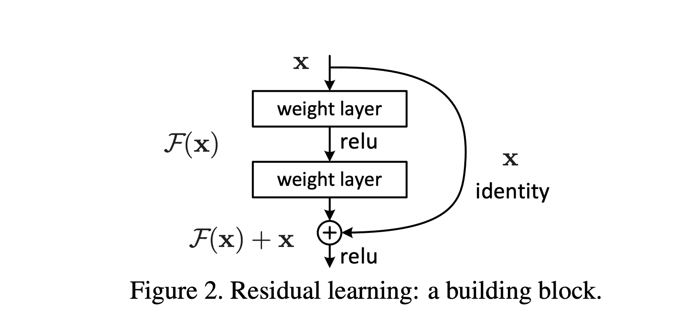
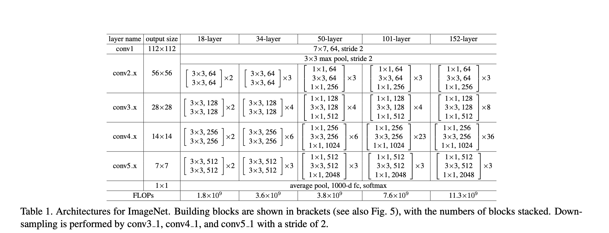

# Deep Residual Learning for Image Recognition

# 摘要

更深层的神经网络更难进行训练。我们提出了一种残差学习框架，以便于训练那些比之前使用的网络深得多的网络。我们明确地将层次重构为学习相对于层输入的残差函数，而不是学习未引用的函数。我们提供了全面的实证证据，表明这些残差网络更容易优化，并且可以从显著增加的深度中获得准确性。在ImageNet数据集上，我们评估了深度达到152层的残差网络，这比VGG网络[41]深8倍，但复杂度仍然较低。这些残差网络的集合在ImageNet测试集上达到了3.57%的错误率。这个结果赢得了ILSVRC 2015分类任务的第一名。我们还对CIFAR-10进行了100层和1000层的分析。
表现深度对于许多视觉识别任务来说是至关重要的。仅仅由于我们的超深表现，我们在COCO物体检测数据集上获得了28%的相对改善。深度残差网络是我们提交给ILSVRC和COCO 2015竞赛的基础，其中我们还赢得了ImageNet检测，ImageNet本地化，COCO检测和COCO分割任务的第一名。

# 1 引言

深度卷积神经网络[22, 21]已经引领了一系列图像分类[21, 50, 40]的突破。深度网络自然地以端到端的多层方式整合了低/中/高级特征[50]和分类器，并且通过堆叠层数（深度）可以丰富特征的“层次”。近期的证据[41, 44]揭示网络深度至关重要，并且在具有挑战性的ImageNet数据集[36]上的领先结果[41, 44, 13, 16]都利用了“非常深”的[41]模型，深度从十六[41]到三十[16]。许多其他非平凡的视觉识别任务[8, 12, 7, 32, 27]也已经从非常深的模型中获益匪浅。

由深度的重要性驱动，一个问题浮出水面：学习更好的网络是否就像堆叠更多的层那么简单？回答这个问题的障碍是众所周知的梯度消失/爆炸问题[1, 9]，该问题从一开始就阻碍了收敛。然而，这个问题已经被归一化初始化[23, 9, 37, 13]和中间归一化层[16]解决了很大一部分，这使得具有几十层的网络开始收敛于随机梯度下降（SGD）反向传播[22]。

当更深的网络能够开始收敛时，出现了一个退化问题：随着网络深度的增加，准确度达到饱和（这可能并不奇怪），然后迅速退化。出乎意料的是，这种退化并不是由过拟合引起的，而且向适当深度的模型添加更多层会导致更高的训练误差，如[11, 42]所述，并在我们的实验中得到了彻底的验证。图1显示了一个典型的例子。

训练精度的退化表明，并非所有系统都同样容易优化。让我们考虑一个浅层架构及其添加了更多层的深层对应架构。深层模型存在一个解决方案：添加的层是恒等映射，其余层从已学习的浅层模型复制而来。这种构建解决方案的存在表明，深层模型不应该产生比浅层模型更高的训练误差。但是实验表明，我们现有的求解器无法找到与构建解决方案相当好或者更好的解决方案（或者在可行时间内无法做到这一点）。

在本文中，我们通过引入深度残差学习框架来解决退化问题。我们不再希望每几个堆叠层直接拟合一个所需的底层映射，而是明确让这些层拟合一个残差映射。形式上，记所需的底层映射为H(x)，我们让堆叠的非线性层拟合另一个映射$F(x) := H(x) - x$。原始映射被重新投射为$F(x) + x$。我们假设，优化残差映射比优化原始的未引用映射更容易。极端情况下，如果恒等映射是最优的，那么将残差推向零比通过非线性层堆叠拟合恒等映射更容易。

$F(x) + x$的形式可以通过具有“快捷连接”的前馈神经网络实现（图2）。快捷连接[2, 34, 49]是那些跳过一个或多个层的连接。在我们的案例中，快捷连接只执行恒等映射，它们的输出被加到堆叠层的输出上（图2）。恒等快捷连接既不增加额外参数，也不增加计算复杂性。整个网络仍然可以通过SGD的反向传播进行端到端的训练，并且可以使用常见库（如Caffe[19]）轻松实现，无需修改求解器。

我们在ImageNet[36]上进行了全面的实验，展示了退化问题并评估了我们的方法。我们证明：1）我们的极深残差网络易于优化，但是对应的“普通”网络（只是堆叠层）在深度增加时会表现出更高的训练误差；2）我们的深度残差网络可以轻松从大幅增加的深度中获得准确度提升，产生的结果远好于以前的网络。

CIFAR-10集[20]也表现出类似的现象，表明优化困难和我们方法的效果并非仅仅与特定数据集相关。我们在这个数据集上展示了超过100层的成功训练模型，并探索了超过1000层的模型。

在ImageNet分类数据集[36]上，我们通过极深的残差网络获得了优秀的结果。我们的152层残差网络是迄今在ImageNet上展示的最深网络，但其复杂度仍低于VGG网络[41]。我们的集成在ImageNet测试集上的前五错误率为3.57%，并且在ILSVRC 2015分类竞赛中获得第一名。极深的表示也在其他识别任务上具有优秀的泛化性能，并使我们在ILSVRC & COCO 2015竞赛中赢得了ImageNet检测、ImageNet定位、COCO检测和COCO分割任务的第一名。这强烈的证据显示，残差学习原则是通用的，我们期望它也适用于其他视觉和非视觉问题。

# 2 相关工作

**残差表示** 在图像识别中，VLAD[18]是一种通过对词典进行残差向量编码的表示，而Fisher Vector[30]可以被看作是VLAD的概率版本[18]。这两者都是用于图像检索和分类[4,48]的强大的浅层表示。对于向量量化，编码残差向量[17]已经被证明比编码原始向量更有效。

在低级视觉和计算机图形学中，为了解偏微分方程(PDEs)，广泛使用的多网格方法[3]将系统重构为多个尺度上的子问题，每个子问题负责粗糙和更精细尺度之间的残差解。多网格的替代方法是分层基预处理[45, 46]，它依赖于代表两个尺度之间的残差向量的变量。已经被证明[3, 45, 46]，这些求解器比那些不了解解决方案的残差性质的标准求解器收敛得更快。这些方法表明，良好的重构或预处理可以简化优化。

**快捷连接** 引导快捷连接[2, 34, 49]的实践和理论已经被研究了很长时间。早期训练多层感知器(MLPs)的一种做法是从网络输入到输出添加一个线性层[34, 49]。在[44, 24]中，几个中间层直接连接到辅助分类器，以解决消失/爆炸梯度的问题。[39, 38, 31, 47]的论文提出了通过快捷连接实现的层响应、梯度和传播错误居中的方法。在[44]中，一个“inception”层由一个快捷分支和几个深层分支组成。

与我们的工作同时进行的，“高速网络”[42, 43]提出了具有门控函数[15]的快捷连接。这些门是数据依赖的并且有参数，与我们的恒等快捷连接无参数形成对比。当一个门控快捷“关闭”(接近零)时，高速网络中的层代表非残差函数。相反，我们的公式总是学习残差函数；我们的恒等快捷连接永不关闭，并且所有信息始终被传递，有额外的残差函数要学习。另外，高速网络尚未展示出与极度增加的深度（例如，超过100层）相应的准确性增益。”

# 3 深度残差学习

## 3.1 残差学习

假设我们考虑$H(x)$作为几个堆叠层（不一定是整个网络）需要拟合的底层映射，其中$x$表示这些层中第一层的输入。如果我们假设多个非线性层可以无穷逼近复杂函数，那么等同于假设它们可以无穷逼近残差函数，即，$H(x) - x$（假设输入和输出的维度相同）。所以，我们不期望堆叠层去逼近$H(x)$，而是明确让这些层逼近一个残差函数$F(x) := H(x) - x$。原始函数因此变成$F(x)+x$。尽管这两种形式都应该能够无穷逼近所需的函数（如假设的那样），但学习的难易度可能会有所不同。

这种重构是由关于退化问题的反直觉现象（图1，左图）所激发的。如我们在引言中所述，如果新增的层可以被构造为恒等映射，那么更深的模型应该有训练误差不大于其浅层对应物。退化问题表明，求解器可能在通过多个非线性层近似恒等映射时遇到困难。通过残差学习的重构，如果恒等映射是最优的，求解器可能会简单地将多个非线性层的权重驱动到零以接近恒等映射。

在实际情况中，恒等映射不太可能是最优的，但我们的重构可能有助于预处理问题。如果最优函数比零映射更接近恒等映射，那么对于求解器来说，找到相对于恒等映射的扰动应该比作为新的学习函数更容易。我们通过实验（图7）显示，一般情况下学习到的残差函数反应小，这表明恒等映射提供了合理的预处理。

## 3.2 通过快捷路径的恒等映射

我们将残差学习应用到每几个堆叠层。构建块如图2所示。在这篇论文中，我们考虑定义为$y = F(x, {W_i}) + x$（公式1）的构建块。在这里，$x$和$y$是被考虑的层的输入和输出向量。函数$F(x, {Wi})$表示要学习的残差映射。对于在图2中有两层的例子，$F = W2σ(W1x)$，其中$\sigma$表示ReLU [29]，为了简化符号，忽略了偏差。通过快捷连接和元素相加操作执行$F + x$。我们在加法后采用第二个非线性（即，$\sigma(y)$，参见图2）。

在公式(1)中的快捷连接既不引入额外的参数，也不增加计算复杂性。这不仅在实践中很有吸引力，而且在我们比较普通和残差网络之间时也很重要。我们可以公平地比较具有相同参数数量、深度、宽度和计算成本（除了可以忽略的元素相加）的普通/残差网络。

在公式(1)中，$x$和$F$的维度必须相等。如果不是这样（例如，当改变输入/输出通道时），我们可以通过快捷连接执行线性投影$Ws$来匹配维度：$y = F(x, {Wi}) + Wsx$（公式2）。

我们也可以在公式(1)中使用一个平方矩阵$Ws$。但我们将通过实验表明，恒等映射足以解决退化问题，并且经济高效，因此$Ws$仅在匹配维度时使用。

残差函数$F$的形式是灵活的。本文的实验涉及到有两层或三层的函数$F$（图5），而更多层是可能的。但是如果$F$只有单层，那么公式(1)类似于一个线性层：$y = W_1x + x$，我们没有观察到优点。

我们还注意到，尽管上述符号是关于全连接层的简单性，但它们适用于卷积层。函数$F(x, {Wi})$可以代表多个卷积层。元素相加操作在两个特征图之间进行，通道与通道之间进行。

## 3.3 网络架构

我们已经测试了各种普通/残差网络，并观察到一致的现象。为了提供讨论的实例，我们描述了如下的ImageNet的两个模型。

**普通网络** 我们的普通基线（图3，中图）主要受到VGG网络 [41]（图3，左图）的哲学的启发。卷积层大多数有3×3的过滤器，并遵循两个简单的设计规则：(i) 对于相同的输出特征映射大小，各层有相同数量的过滤器；和(ii) 如果特征映射大小减半，过滤器的数量就翻倍，以保持每层的时间复杂性。我们直接通过具有步幅为2的卷积层进行降采样。网络以全局平均池化层和一个具有softmax的1000-way全连接层结束。图3（中图）中的总加权层数为34。

值得注意的是，我们的模型比VGG网络 [41]（图3，左图）有更少的过滤器和更低的复杂性。我们的34层基线有36亿的FLOPs（乘法-加法），这只是VGG-19的18%（196亿FLOPs）。

**残差网络** 基于上述普通网络，我们插入快捷连接（图3，右图），将网络转变为其对应的残差版本。当输入和输出的维度相同时，可以直接使用恒等快捷（公式(1)）（图3中的实线快捷）。当维度增加时（图3中的虚线快捷），我们考虑两个选项：(A) 快捷仍然执行恒等映射，用额外的零项填充以增加维度。这个选项不引入额外的参数；(B) 使用公式(2)中的投影快捷以匹配维度（通过1×1卷积完成）。对于这两个选项，当快捷跨越两种大小的特征图时，它们的步幅为2。

## 3.4 实现

我们对ImageNet的实现遵循了[21, 41]的做法。图像被调整大小，其较短的一侧随机采样在[256, 480]的范围内，以进行规模扩增 [41]。从图像或其水平翻转中随机采样一个224×224的剪裁，并减去每个像素的平均值 [21]。使用了[21]中的标准色彩扩增。我们在每个卷积之后和激活之前采用批量标准化（BN）[16]，遵循[16]。我们按照[13]初始化权重，并从头开始训练所有的普通/残差网络。我们使用了256的小批量大小的SGD。学习率从0.1开始，并在误差平台时除以10，模型被训练到最多60 × 10^4^迭代。我们使用了0.0001的权重衰减和0.9的动量。我们没有使用dropout [14]，遵循[16]的实践。

在测试中，为了比较研究，我们采用了标准的10-crop测试[21]。为了获得最佳结果，我们采用了密集采样和多尺度采样的全卷积形式的测试[41]，在多个尺度（即，图像的短边在[224, 256, 384, 480, 640]上采样）上。

我们的实验在CUDA上进行。我们提供了MatConvNet [42]和Caffe [17]的代码。我们的单个模型测试（例如，10-crop的测试在1个Titan X GPU上使用了2.5秒钟，包括所有的前向和后向传播），基于MatConvNet和CuDNN v4.

# 4 实验

## 4.1 ImageNet分类

我们在包含1000个类别的ImageNet 2012分类数据集[36]上评估我们的方法。模型在128万训练图像上进行训练，并在5万验证图像上进行评估。我们也在10万测试图像上获得最终结果，由测试服务器报告。我们评估了前1和前5的错误率。

**普通网络** 我们首先评估18层和34层普通网络。图3（中）是34层普通网络。18层普通网络形式类似。详细架构请参见表1。

表2的结果显示，更深的34层普通网络的验证错误比较浅的18层普通网络要高。为了揭示原因，我们在图4（左）中比较了他们在训练过程中的训练/验证错误。我们观察到了退化问题 - 34层普通网络在整个训练过程中的训练错误都较高，即使18层普通网络的解空间是34层网络的子空间。

我们认为这种优化困难不太可能是由梯度消失引起的。这些普通网络使用BN [16]训练，这确保前向传播信号有非零的方差。我们还验证了在BN下，反向传播的梯度显示出健康的范数。所以前向和后向信号都没有消失。实际上，34层普通网络仍能够达到竞争性的准确性（表3），这表明解算器在某种程度上是有效的。我们猜测深度普通网络可能有指数级低的收敛率，这影响了训练误差的降低。这种优化困难的原因将在未来进行研究。

**残差网络**  接下来我们评估18层和34层的残差网络（ResNets）。基线架构与上述普通网络相同，只是在每对3×3滤波器中添加了一条快捷连接，如图3（右）所示。在第一次比较（表2和图4右）中，我们对所有的快捷方式使用恒等映射，并对增加的维度使用零填充（选项A）。所以他们与普通网络相比没有额外的参数。

我们从表2和图4中有三个主要的观察。首先，残差学习将情况逆转 - 34层的ResNet比18层的ResNet更好（提高了2.8%）。更重要的是，34层的ResNet显示出明显较低的训练误差，并且可以泛化到验证数据。这表明在这种设置下退化问题得到了很好的解决，我们设法从增加的深度中获得准确度的提高。

其次，与其普通对应物相比，34层的ResNet将前1错误减少了3.5%（表2），这是由成功降低训练错误（图4右vs左）造成的。这个比较验证了残差学习在极深的系统上的有效性。

最后，我们也注意到，18层的普通/残差网络的准确度相当（表2），但是18层的ResNet收敛更快（图4右vs左）。当网络“并非过于深入”（这里是18层）时，当前的SGD求解器仍能找到普通网络的良好解决方案。在这种情况下，ResNet通过在早期阶段提供更快的收敛来简化优化。

**恒等映射与投影快捷方式**  我们已经证明了无参数的恒等快捷方式有助于训练。接下来我们研究投影快捷方式（Eqn.(2)）。在表3中，我们比较了三种选项：（A）对于增加的维度，使用零填充快捷方式，并且所有的快捷方式都是无参数的（与表2和图4右相同）；（B）对于增加的维度，使用投影快捷方式，其他快捷方式是恒等的；和（C）所有的快捷方式都是投影的。

表3显示，所有三种选项都明显优于普通的对应物。B比A稍好一些。我们认为这是因为在A中，零填充的维度实际上没有残差学习。C比B稍好一些，我们将这归因于许多（十三个）投影快捷方式引入的额外参数。但是A/B/C之间的小差异表明，投影快捷方式并非解决退化问题的必要条件。所以我们在本文的其余部分不使用选项C，以减少内存/时间复杂度和模型大小。恒等快捷方式对于不增加瓶颈架构的复杂度特别重要。

更深的瓶颈架构。接下来我们描述我们为ImageNet设计的更深的网络。由于我们能够承受的训练时间的考虑，我们将构建块修改为瓶颈设计。对于每个残差函数F，我们使用3层而不是2层（图5）。这三层是1×1、3×3和1×1的卷积，其中1×1层负责减少和然后增加（恢复）维度，使3×3层成为具有较小输入/输出维度的瓶颈。图5显示了一个例子，其中两种设计具有相似的时间复杂度。

无参数的恒等快捷方式对于瓶颈架构特别重要。如果在图5（右）中将恒等快捷方式替换为投影，可以显示出时间复杂度和模型大小翻倍，因为快捷方式连接到两个高维端点。所以恒等快捷方式导致了瓶颈设计的更有效的模型。

50层ResNet：我们在34层网络中将每个2层块替换为这个3层瓶颈块，得到一个50层的ResNet（表1）。我们对于增加的维度使用选项B。这个模型有38亿次浮点操作（FLOPs）。

101层和152层ResNets：我们通过使用更多的3层块来构建101层和152层的ResNets（表1）。值得注意的是，尽管深度显著增加，但152层的ResNet（113亿次浮点操作）的复杂度仍然低于VGG-16/19网络（15.3/19.6亿次浮点操作）。

50/101/152层的ResNets比34层的网络更准确，差距显著（表3和4）。我们没有观察到退化问题，因此从显著增加的深度中享受了显著的准确度增益。所有的评价指标都证明了深度的优势（表3和4）。

与最先进的方法的比较。在表4中，我们与以前最好的单模型结果进行比较。我们的基线34层ResNets已经达到了非常竞争性的准确度。我们的152层ResNet的单模型前5验证错误为4.49%。这个单模型结果超过了所有以前的集成结果（表5）。我们组合了不同深度的六个模型形成一个集成（提交时只有两个152层的模型）。这导致了测试集上的3.57%的前5错误（表5）。这个成绩在ILSVRC 2015中获得了第一名。

## 4.2. CIFAR-10和分析

我们在CIFAR-10数据集[20]上进行了更多的研究，该数据集包含10个类别的50k训练图像和10k测试图像。我们展示的实验是在训练集上进行训练，并在测试集上进行评估。我们的关注点是极深网络的行为，而不是推动最先进的结果，所以我们故意使用简单的架构。

纯网络/残差架构遵循图3（中/右）中的形式。网络输入是$32 \times 32$的图像，减去了每像素的平均值。第一层是$3 \times 3$的卷积。然后我们在大小为{$32$, $16$, $8$}的特征图上使用一堆$6n$层的$3 \times 3$卷积，每个特征图大小有$2n$层。滤波器的数量分别为{$16$, $32$, $64$}。下采样是通过步长为2的卷积进行的。网络以全局平均池化，10路全连接层和softmax结束。总共有$6n+2$层堆叠的权重层。下表总结了架构：

|输出地图大小| $32 \times 32$ | $16 \times 16$ | $8 \times 8$ |
|:---:|:---:|:---:|:---:|
|层数| $1+2n$ | $2n$ | $2n$ |
|滤波器数| $16$ | $32$ | $64$ |

当使用快捷连接时，它们连接到$3 \times 3$层的对（共$3n$个快捷）。在这个数据集上，我们在所有情况下都使用恒等快捷（即，选项A），所以我们的残差模型与纯网络具有完全相同的深度、宽度和参数数量。

我们使用权重衰减$0.0001$和动量$0.9$，并采用[13]中的权重初始化和BN [16]，但不使用dropout。这些模型在两个GPU上以$128$的小批量大小进行训练。我们从学习率$0.1$开始，将其在$32k$和$48k$迭代时除以$10$，然后在$64k$迭代时终止训练，这是在$45k/5k$的训练/验证分割上确定的。我们按照[24]中的简单数据增强进行训练：每边填充$4$个像素，并从填充图像或其水平翻转中随机采样$32 \times 32$的裁剪。对于测试，我们只评估原始$32 \times 32$图像的单个视图。

我们比较$n = \{3, 5, 7, 9\}$，得到$20$、$32$、$44$和$56$层网络。图6（左）显示了纯网络的行为。深层纯网络因深度增加而受到影响，并在深入时表现出更高的训练错误。这种现象类似于ImageNet（图4，左）和MNIST（参见[42]）上的现象，表明这种优化困难是一个基本问题。

图6（中）显示了ResNets的行为。同样类似于ImageNet案例（图4，右），我们的ResNets成功克服了优化困难，并在深度增加时展示了准确性的提升。

我们进一步探索$n = 18$，得到一个$110$层的ResNet。在这种情况下，我们发现初始学习率$0.1$稍微过大，无法开始收敛。所以我们使用$0.01$来预热训练，直到训练错误低于$80\%$（大约$400$次迭代），然后回到$0.1$并继续训练。其余的学习计划和之前一样。这个$110$层网络收敛得很好（图6，中）。它的参数少于其他深层和瘦网络，如FitNet [35]和Highway [42]（表6），但是在最先进的结果中（$6.43\%$，表6）。

图7显示了层响应的标准偏差（std）。响应是每个$3 \times 3$层的输出，经过BN并在其他非线性（ReLU/添加）之前。对于ResNets，这个分析揭示了残差函数的响应强度。

图7显示，ResNets的响应一般比它们的纯对等物小。这些结果支持我们基本的动机（Sec.3.1），即残差函数可能普遍比非残差函数接近零。我们还注意到，深层的ResNet有更小的响应幅度，如ResNet-20、56和110在图7中的比较中所示。当有更多的层时，ResNets的一个单独层倾向于更少地修改信号。

探索超过1000层。我们探索了一个超过1000层的极深模型。我们设$n = 200$，得到一个$1202$层的网络，这个网络按照上述方式进行训练。我们的方法没有优化困难，并且这个$10^3$层网络能够达到小于$0.1\%$的训练错误（图6，右）。其测试错误仍然相当好（$7.93\%$，表6）。

但在这种极深模型上仍然存在未解决的问题。这个$1202$层网络的测试结果比我们的$110$层网络差，尽管两者都有类似的训练错误。我们认为这是因为过拟合。这个$1202$层网络对这个小数据集来说可能过于大（$19.4M$）。在这个数据集上，强大的正则化如maxout [10]或dropout [14]被应用以获得最好的结果（[10, 25, 24, 35]）。在这篇文章中，我们不使用maxout/dropout，只是通过设计深层和瘦的架构来简单地施加正则化，不会分散对优化困难的关注。但结合更强的正则化可能会改善结果，我们将在未来进行研究。

## 4.3. PASCAL和MS COCO上的物体检测

我们的方法在其他识别任务上具有良好的泛化性能。表7和8显示了PASCAL VOC 2007和2012 [5]以及COCO [26]上的物体检测基线结果。我们采用Faster R-CNN [32]作为检测方法。这里我们对使用ResNet-101替换VGG-16 [41]带来的改进感兴趣。使用这两种模型的检测实现（参见附录）是相同的，所以收益只能归因于更好的网络。

最值得注意的是，在具有挑战性的COCO数据集上，我们在COCO的标准指标（mAP@[.5,.95]）上获得了$6.0\%$的提高，这是$28\%$的相对改善。这个收益完全归因于学习的表示。

基于深度残差网络，我们在ILSVRC和COCO 2015比赛的几个赛道中赢得了第一名：ImageNet检测，ImageNet定位，COCO检测和COCO分割。详细信息在附录中。