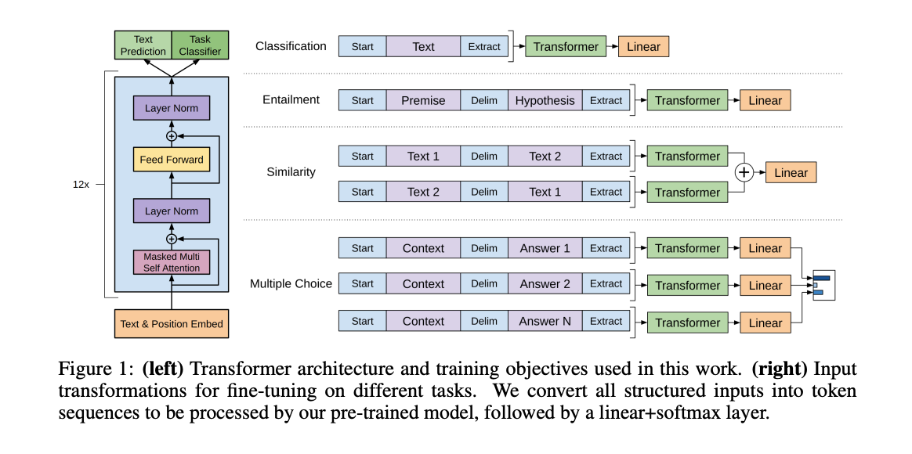
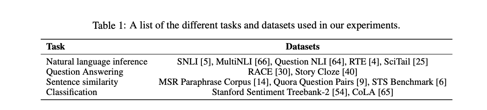
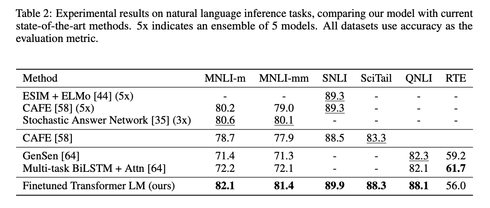
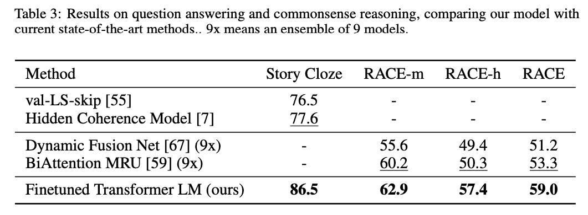
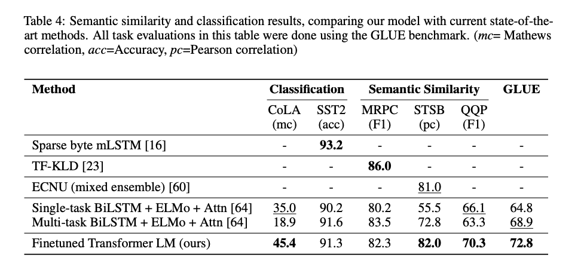
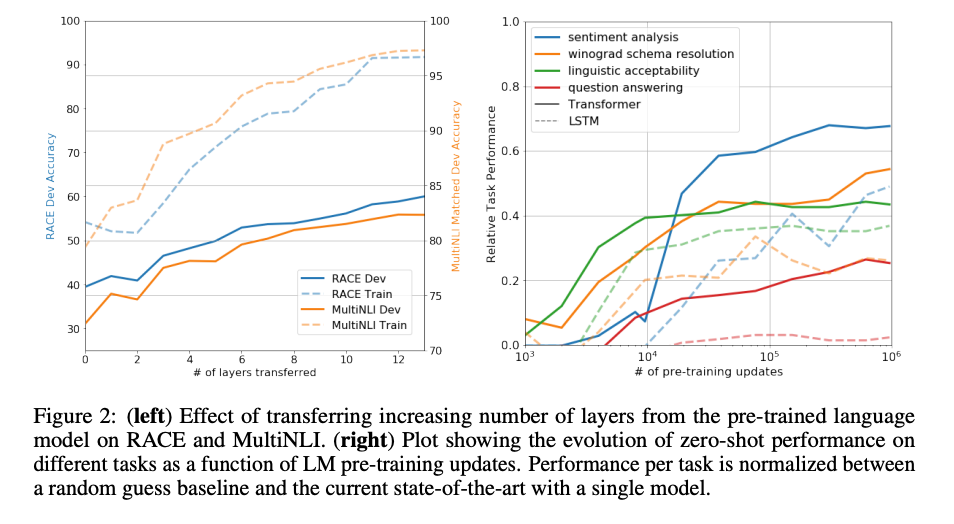
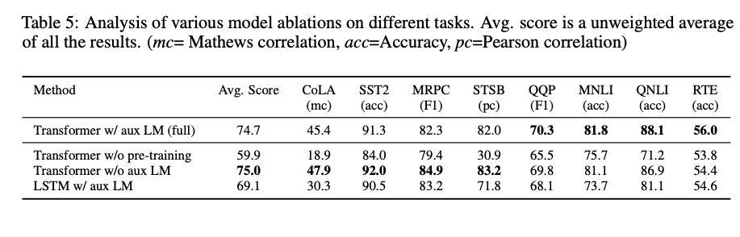

# GPT1-Improving Language Understanding by Generative Pre-Training

## 摘要

自然语言理解包括了诸如文本蕴含、问题回答、语义相似性评估以及文档分类等广泛的多样化任务。尽管我们可以轻易获得大量的未标注文本语料库，但用于学习这些特定任务的标注数据却相对稀缺，这对于经过区分训练的模型来说具有挑战性。我们证明，通过在多样化的未标注文本语料库上对语言模型进行生成式预训练，然后针对每个特定任务进行区分性微调，可以在这些任务上获得大幅度的提升。与之前的方法相比，我们在微调过程中使用了任务感知输入转换，以实现有效的迁移，同时最小化对模型架构的改变。我们证明了我们的方法在一系列自然语言理解基准上的有效性。我们的通用任务无关模型超越了使用针对每个任务特别设计的架构的区分训练模型，在12项研究任务中的9项任务上显著提升了最新技术水平。例如，我们在常识推理（Stories Cloze Test）上实现了8.9%的绝对提升，在问题回答（RACE）上提高了5.7%，在文本蕴含（MultiNLI）上提高了1.5%。

## 1 简介

有效地从原始文本中学习是减轻自然语言处理（NLP）中对有监督学习依赖的关键。大多数深度学习方法需要大量的手动标注数据，这限制了它们在许多因缺乏注释资源而受困的领域中的应用。在这些情况下，能够利用未标注数据的语言信息的模型提供了一种收集更多注释的有价值的替代方案，这可能需要花费大量时间和费用。此外，即使在有大量监督的情况下，以无监督的方式学习好的表示也可以提供显著的性能提升。迄今为止最引人注目的证据就是广泛使用预训练的词嵌入来改进一系列NLP任务的性能。然而，从未标注文本中获取超过词级别的信息有两个主要挑战。首先，目前尚不清楚哪种类型的优化目标最有效地学习有用的文本表示进行迁移。近期的研究考虑了各种目标，如语言建模、机器翻译和话语连贯性，每种方法在不同的任务上超越其他方法。其次，对于如何最有效地将这些学习到的表示迁移到目标任务，尚无共识。现有的技术涉及到结合改变模型架构、使用复杂的学习方案以及增加辅助学习目标等方法。这些不确定性使得开发有效的语言处理半监督学习方法变得困难。

在本文中，我们使用无监督预训练和有监督微调的组合探索了一种针对语言理解任务的半监督方法。我们的目标是学习一种能够轻微调整就能迁移到一系列任务的通用表示。我们假定可以访问大量的未标注文本语料库和几个具有手动注释训练样本（目标任务）的数据集。我们的设置并不要求这些目标任务与未标注语料库在同一领域。我们采用两阶段训练过程。**首先，我们使用语言建模目标在未标注数据上学习神经网络模型的初始参数。随后，我们使用相应的有监督目标调整这些参数以适应目标任务。**

对于我们的模型架构，我们使用了在诸如机器翻译、文档生成和句法解析等各种任务上都表现强劲的Transformer。这种模型选择为我们处理文本中的长期依赖关系提供了更有结构的记忆，与诸如循环网络等替代品相比，结果是在多样化任务上的稳健迁移性能。在迁移过程中，我们使用了源自遍历式方法的任务特定输入适应。正如我们在实验中所示，这些适应使我们能够在对预训练模型的架构进行最小的改变的同时进行有效的微调。

我们在四种类型的语言理解任务上评估我们的方法 - 自然语言推理，问题回答，语义相似性和文本分类。我们的通用任务无关模型超越了使用针对每个任务特别设计的架构的区分训练模型，在12项研究任务中的9项任务上显著提升了最新技术水平。例如，我们在常识推理（Stories Cloze Test）上实现了8.9%的绝对提升，在问题回答（RACE）上提高了5.7%，在文本蕴含（MultiNLI）上提高了1.5%，并在最近引入的GLUE多任务基准上提高了5.5%。我们还分析了预训练模型在四个不同设置中的零样本行为，并证明了它获取了对下游任务有用的语言知识。

## 2 相关工作

### 2.1 NLP的半监督学习

我们的工作大致属于自然语言的半监督学习类别。这个范例引起了大量的关注，应用于像序列标记[24,33,57]或者文本分类[41,70]的任务。最早的方法使用未标注数据计算词级或短语级统计，然后在监督模型中作为特征使用[33]。在过去几年里，研究者们证明了使用在未标注语料库上训练的词嵌入来改善各种任务性能的好处[8,11,26,45]。然而，这些方法主要传递词级信息，而我们的目标是捕捉更高级的语义。

最近的方法已经研究了学习和利用未标注数据中的词级语义以上的信息。短语级或句子级嵌入，可以使用未标注语料库进行训练，已经被用来将文本编码为适合各种目标任务的向量表示[28,32,1,36,22,12,56,31]。

### 2.2 无监督预训练

无监督预训练是半监督学习的一个特例，其目标是找到一个好的初始化点，而不是修改有监督学习目标。早期的工作探索了在图像分类[20,49,63]和回归任务[3]中使用这种技术。后续的研究[15]表明，预训练起到了正则化方案的作用，使得深度神经网络能够更好地泛化。在最近的工作中，这种方法已经被用来帮助训练深度神经网络完成各种任务，如图像分类[69]、语音识别[68]、实体消歧[17]和机器翻译[48]。

与我们最接近的工作包括使用语言建模目标预训练神经网络，然后在有监督的目标任务上对其进行微调。Dai等人[13]和Howard和Ruder[21]遵循这种方法来改进文本分类。然而，尽管预训练阶段帮助捕获了一些语言信息，但他们使用的LSTM模型限制了他们的预测能力到短范围。相反，我们选择的transformer网络允许我们捕获更长范围的语言结构，如我们的实验所示。此外，我们还展示了我们的模型在包括自然语言推断、释义检测和故事完成等更广泛的任务上的有效性。其他方法[43,44,38]使用预训练的语言或机器翻译模型的隐藏表示作为在目标任务上训练有监督模型的辅助特征。这涉及到每个单独目标任务大量的新参数，而我们在转移过程中对模型架构的改变只需最小化。

### 2.3 辅助训练目标

添加辅助无监督训练目标是半监督学习的另一种形式。Collobert和Weston[10]的早期工作使用了各种辅助NLP任务，如POS标记、块分割、命名实体识别和语言建模，来改进语义角色标注。最近，Rei[50]将辅助语言模型目标添加到他们的目标任务目标，并在序列标记任务上展示了性能提升。我们的实验也使用了一个辅助目标，但如我们所示，无监督预训练已经学习了对目标任务相关的多个语言方面。”

## 3 框架

我们的训练程序包含两个阶段。第一个阶段是在大规模文本语料库上学习一个高容量的语言模型。接下来是微调阶段，我们将模型适应到具有标签数据的判别任务。

### 3.1 无监督预训练

给定一个无监督的标记语料库$U = {u_1, . . . , u_n}$，我们使用标准的语言模型目标来最大化以下似然：
$$L_1(U) = \sum_{i}\log P(u_i | u_{i−k}, . . . , u{i−1}; Θ) （1）$$
其中$k$是上下文窗口的大小，条件概率$P$是使用参数$Θ$的神经网络进行建模的。这些参数是使用随机梯度下降[51]进行训练的。

在我们的实验中，我们使用多层Transformer解码器[34]作为语言模型，这是Transformer[62]的一个变种。这个模型在输入上下文标记上应用多头自注意力操作，然后通过逐位置前馈网络层产生目标标记的输出分布：
$$h_0 = UW_e + W_p$$
$$h_l = transformer\_block(h_{l−1})，\forall i ∈ [1, n]$$
$$P(u) = softmax(h_nW^T_e)（2）$$
其中$U = (u_{−k}, . . . , u_{−1})$是标记的上下文向量，$n$是层数，$W_e$是标记嵌入矩阵，$W_p$是位置嵌入矩阵。

### 3.2 有监督微调

使用等式1中的目标训练模型后，我们将参数适应到有监督的目标任务。我们假设有一个标记数据集$C$，其中每个实例包含一系列输入标记，$x_1, . . . , x_m$，以及一个标签$y$。输入通过我们的预训练模型进行处理，得到最后的Transformer块的激活$h^m_l$，然后将其输入到一个带有参数$W_y$的添加的线性输出层中来预测$y$：
$$P(y|x^1, . . . , x^m) = softmax(h^m_l W_y)（3）$$
这给了我们以下目标进行最大化：
$$L_2(C) = \sum_{(x,y)} \log P(y|x_1, . . . , x_m)（4）$$
我们还发现，将语言模型作为微调的辅助目标包含在内有助于学习，原因是 (a) 改善了有监督模型的泛化，以及 (b) 加速了收敛。这与之前的工作[50, 43]保持一致，他们也观察到这样一个辅助目标带来了性能的提升。具体来说，我们优化以下目标（权重为 $λ$ ）：
$$L_3(C) = L_2(C) + \lambda ∗ L_1(C) （5）$$
总的来说，我们在微调期间需要的额外参数只有Wy和定界符标记的嵌入（在3.3节中详细描述）。

### 3.3 任务特定的输入转换

对于某些任务，如文本分类，我们可以直接按照上述描述对模型进行微调。其他一些任务，如问题回答或文本蕴含，具有结构化输入，如有序的句子对，或者文档、问题和答案的三元组。因为我们的预训练模型是在连续的文本序列上进行训练的，我们需要一些修改才能将其应用到这些任务上。之前的工作提出在传递表示之上学习任务特定的架构[44]。这样的方法重新引入了大量的任务特定定制，并且没有使用迁移学习这些额外的架构组件。相反，我们使用一种遍历式方法[52]，我们将结构化输入转换为我们的预训练模型可以处理的有序序列。这些输入转换允许我们避免在任务之间对架构进行大量的改变。我们在下面提供了这些输入转换的简要描述，并在图1中提供了一个视觉插图。所有的转换都包括添加随机初始化的开始和结束标记$(<s>,<e>)$。

**文本蕴含**：对于蕴含任务，我们将前提$p$和假设$h$的标记序列用一个定界符标记($)串联在一起。

**相似度**：对于相似性任务，比较的两个句子没有固有的排序。为了反映这一点，我们修改输入序列，使其包含两个可能的句子排序（用定界符隔开），并且独立处理每一个以产生两个序列表示$h^m_l$，这些表示在输入线性输出层之前按元素相加。

**问题回答和常识推理**：对于这些任务，我们给出一个上下文文档$z$，一个问题$q$，和一组可能的答案$\{a_k\}$。我们将文档上下文和问题与每个可能的答案串联在一起，中间加入一个定界符标记，得到$\lbrack z; q;\textdollar ; a_k\rbrack$。每一个这样的序列都用我们的模型独立处理，然后通过softmax层进行归一化，以产生可能答案的输出分布。

## 4 实验

### 4.1 设置

**无监督预训练** 我们使用BooksCorpus数据集[71]进行语言模型的训练。它包含超过7000本不同类型的未发表书籍，如冒险、奇幻和浪漫等。关键是，它包含长段连续文本，这使得生成模型能够学习在长期信息上进行条件化。另一个可供选择的数据集是1B Word Benchmark，由ELMo [44]使用，大约同样大小，但是在句子级别进行混洗 - 破坏了长期结构。我们的语言模型在这个语料库上达到了非常低的词级困惑度，为18.4。

**模型规格** 我们的模型主要遵循原始的transformer工作[62]。我们训练了一个12层只有transformer的解码器，带有masked self-attention heads（768维度的状态和12个attention heads）。对于逐位置前馈网络(position-wise feed-forward networks)，我们使用3072维度的内部状态。我们使用Adam优化方案[27]，最大学习率为2.5e-4。学习率在前2000次更新中从零线性增加，并使用余弦调度降到0。我们在64个随机采样的连续序列的512个标记的小批量上训练100个周期。由于在模型中大量使用了layerNorm[2]，所以简单的权重初始化$N(0,0.02)$就足够了。我们使用了一个40,000合并的字节对编码（BPE）词汇[53]，以及残差、嵌入和注意力丢失率为0.1的正则化。我们还使用了在[37]中提出的L2正则化的修改版本，对所有非偏差或增益权重$w = 0.01$。对于激活函数，我们使用了高斯误差线性单元（GELU）[18]。我们使用了学习的位置嵌入，而不是原始工作中提出的正弦版本。我们使用ftfy库来清理BooksCorpus中的原始文本，标准化一些标点和空白，并使用spaCy分词器。

**微调(Fine-tuning)细节** 除非特别指定，我们复用无监督预训练的超参数设置。我们添加了一个丢失率为0.1的分类器。对于大多数任务，我们使用6.25e-5的学习率和32的批处理大小。我们的模型微调速度快，对于大多数情况，训练3个周期就足够了。我们使用了一个线性学习率衰减调度，预热超过0.2%的训练。λ被设定为0.5。

### 4.2 监督微调

我们对一系列的监督任务进行实验，包括自然语言推断、问题回答、语义相似性和文本分类。其中一些任务是作为最近发布的GLUE多任务基准[64]的一部分提供的，我们使用了这些任务。图1提供了所有任务和数据集的概览。

**自然语言推断** 自然语言推断（NLI）任务，也被称为文本蕴含识别，涉及读取一对句子并判断它们之间的关系，可以是蕴含、矛盾或中性。虽然最近有很多兴趣[58, 35, 44]，但由于词汇蕴含、共指和词汇和句法歧义等各种现象的存在，该任务仍然具有挑战性。我们在五个来源各异的数据集上进行评估，包括图像字幕（SNLI）、转录语音、流行小说和政府报告（MNLI）、维基百科文章（QNLI）、科学考试（SciTail）或新闻文章（RTE）。

表2详细描述了我们的模型和以前的最先进方法在不同NLI任务上的各种结果。我们的方法在五个数据集中的四个上显著优于基线，在MNLI上达到最高1.5%的绝对改进，在SciTail上达到5%的改进，在QNLI上达到5.8%的改进，而在SNLI上达到0.6%的改进，超过了以前的最好结果。这显示了我们的模型在处理多个句子，并处理语言歧义方面的优越能力。在RTE上，我们评估的一个较小的数据集（2490个示例），我们达到了56%的准确度，低于多任务biLSTM模型报告的61.7%。考虑到我们的方法在较大的NLI数据集上的强大性能，我们的模型可能也会从多任务训练中受益，但我们目前还没有探索这一点。

**问题回答和常识推理** 另一个需要单句和多句推理的任务是问题回答。我们使用最近发布的RACE数据集[30]，该数据集包含来自中学和高中考试的英语段落以及相关问题。这个语料库已被证明包含更多的推理类型问题，比如CNN[19]或SQuaD[47]等其他数据集，为我们的模型提供了完美的评估，因为我们的模型被训练来处理长范围的上下文。此外，我们还在StoryCloze Test[40]上进行评估，该任务涉及从两个选项中选择多句故事的正确结局。在这些任务上，我们的模型再次显著优于之前的最佳结果 - 在Story Cloze上提高了8.9%，在RACE上整体提高了5.7%。这证明了我们的模型处理长范围上下文的能力。

**语义相似性** 语义相似性（或者说释义检测）任务涉及预测两个句子是否在语义上等同。挑战在于识别概念的重述，理解否定，以及处理句法歧义。我们使用了三个数据集来完成这个任务 - 微软释义语料库（MRPC）[14]（从新闻源收集），Quora问题对（QQP）数据集[9]，和语义文本相似性基准（STS-B）[6]。我们在三个语义相似性任务中的两个任务上获得了最先进的结果（表4），在STS-B上的绝对增益为1点。在QQP上的性能差距显著，我们的模型比单任务BiLSTM + ELMo + Attn的结果提高了4.2%。

**分类** 最后，我们还在两个不同的文本分类任务上进行评估。语言可接受性语料库（CoLA）[65]包含了专家对一个句子是否符合语法的判断，这测试了训练模型的内在语言偏见。而斯坦福情感树库（SST-2）[54]则是一个标准的二分类任务。我们的模型在CoLA上获得了45.4的分数，这比之前最好的结果35.0有一个特别大的提高，展示了我们的模型学习到的内在语言偏见。模型在SST-2上也达到了91.3%的准确度，这与最先进的结果相当。我们还在GLUE基准测试上取得了72.8的总分，这比以前最好的68.9要好得多。

总的来说，我们的方法在我们评估的12个数据集中的9个上取得了新的最佳结果，很多情况下超过了集合。我们的结果还表明，我们的方法在不同大小的数据集上都表现良好，从较小的数据集如STS-B（约5.7k训练例子）到最大的数据集 - SNLI（约550k训练例子）。

## 5 分析

**传递层数的影响** 我们观察了从无监督预训练传递不同层数到监督目标任务的影响。图2（左）描绘了我们在MultiNLI和RACE上的方法表现作为传输层数量的函数。我们观察到标准结果，即转移嵌入改善了性能，而每个transformer层提供了进一步的好处，对于MultiNLI的全转移可以达到9%。这表明预训练模型中的每一层都包含有用的功能来解决目标任务。

**零样本行为** 我们想更好地理解为什么语言模型预训练的转换器是有效的。一个假设是，底层的生成模型学会执行我们评估的许多任务，以提高其语言建模能力，而转换器的更加结构化的注意力记忆相比于LSTM在转移中更有帮助。我们设计了一系列使用底层生成模型执行任务而无需监督微调的启发式解决方案。我们在图2（右）中可视化了这些启发式解决方案在生成预训练过程中的有效性。我们观察到这些启发式的性能是稳定的，并且在训练过程中稳步增加，这表明生成预训练支持学习各种任务相关的功能。我们还观察到LSTM在零样本性能中表现出更高的方差，这表明Transformer架构的归纳偏见在转移中起到了帮助。

对于CoLA（语言可接受性），将示例评分为生成模型分配的平均令牌log-概率，并通过阈值来做预测。对于SST-2（情感分析），我们将令牌"very"添加到每个例子，并将语言模型的输出分布仅限于"positive"和"negative"的词，然后猜测模型分配更高概率的令牌作为预测。对于RACE（问题回答），我们选择生成模型在给定文档和问题条件下分配最高平均令牌log-概率的答案。对于DPRD（Winograd schemas），我们将明确的代词替换为两个可能的参照物，并预测生成模型将更高的平均令牌log-概率分配给替换后的序列剩余部分的解决方案。

**消融研究** 我们进行了三个不同的消融研究（表5）。首先，我们检查了我们的方法在微调期间没有辅助LM目标的性能。我们观察到辅助目标在NLI任务和QQP上有所帮助。总的趋势表明，更大的数据集从辅助目标中受益，但小数据集则没有。其次，我们通过将其与单层2048单元LSTM比较，分析了Transformer的效果。我们观察到当使用LSTM而不是Transformer时，平均分数下降了5.6。只有在一个数据集上，LSTM的表现超过了Transformer——MRPC。最后，我们还将我们的transformer架构与直接在监督目标任务上训练的模型进行比较，而无需预训练。我们观察到缺乏预训练会损害所有任务的性能，导致与我们的完整模型相比下降了14.8%。

## 6 结论

我们引入了一个框架，通过生成预训练和判别性微调，用单一的任务不可知模型实现强大的自然语言理解。通过在包含长连续文本的多样化语料库上预训练，我们的模型获得了显著的世界知识和处理长范围依赖性的能力，这些都成功地转移到了解决判别性任务，如问题回答，语义相似性评估，蕴含判断和文本分类，改善了我们研究的12个数据集中的9个的最新技术。使用无监督（预）训练来提高判别任务的性能，一直是机器学习研究的重要目标。我们的工作表明，实现显著的性能提升确实是可能的，并提供了哪些模型（Transformers）和数据集（具有长范围依赖性的文本）最适合这种方法的线索。我们希望这将有助于推动无监督学习的新研究，包括自然语言理解和其他领域，进一步提高我们对无监督学习如何工作和何时工作的理解。
