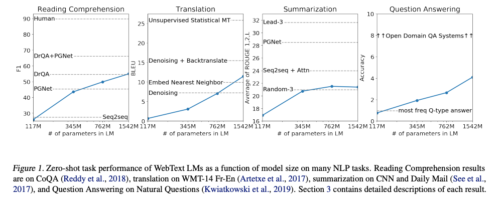
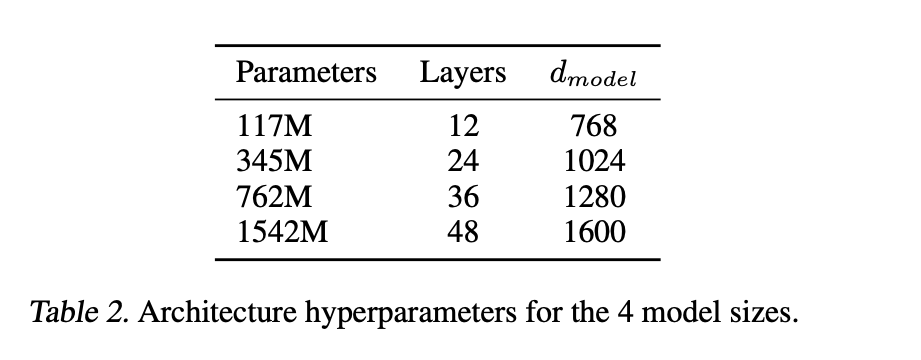
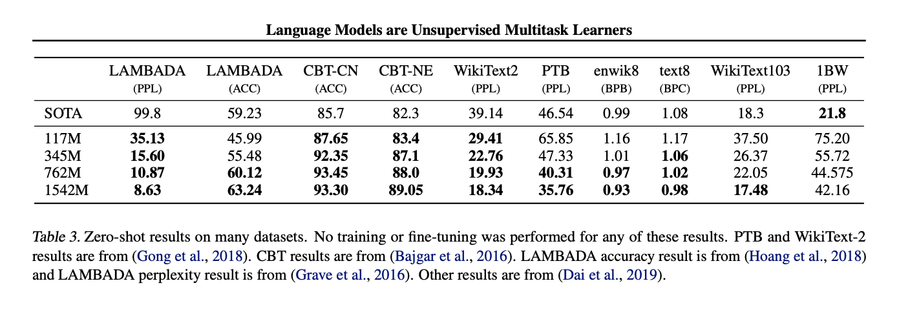
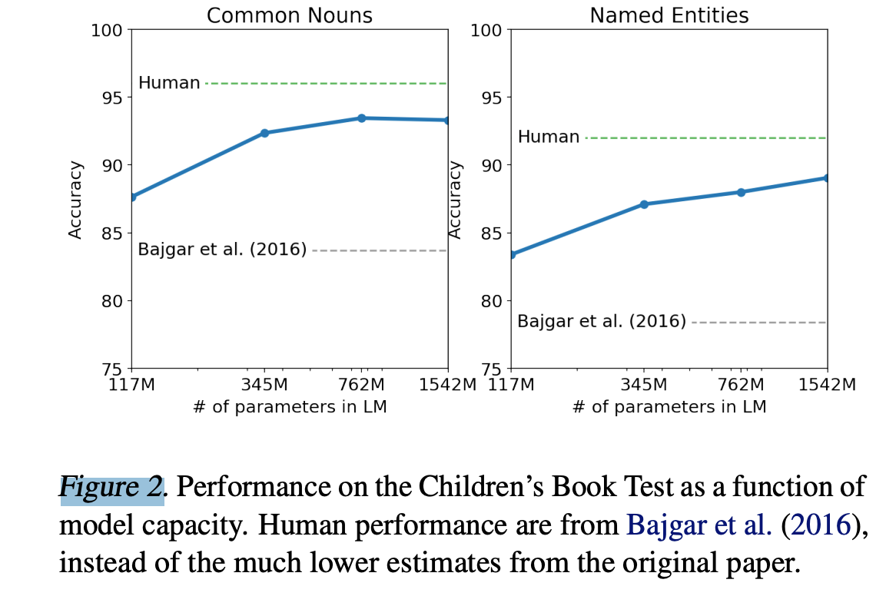
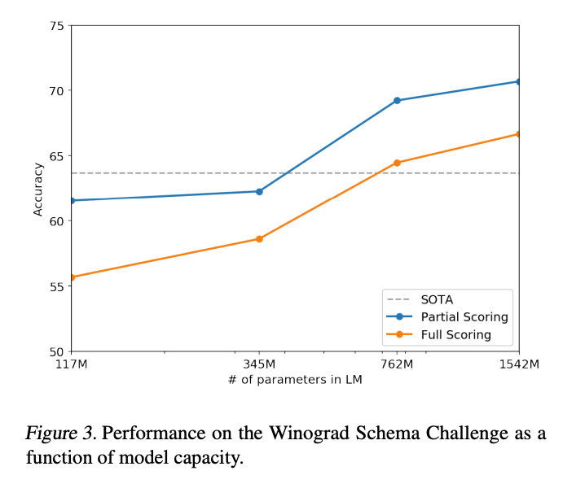
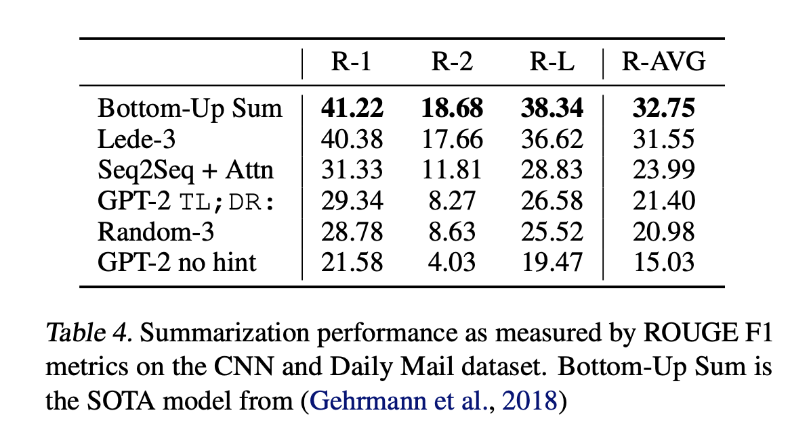
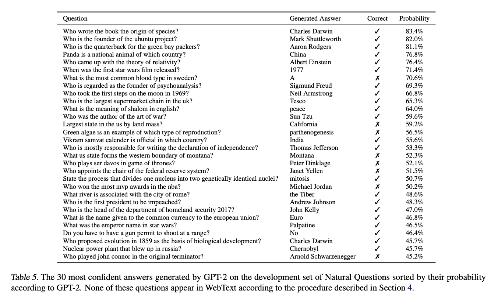
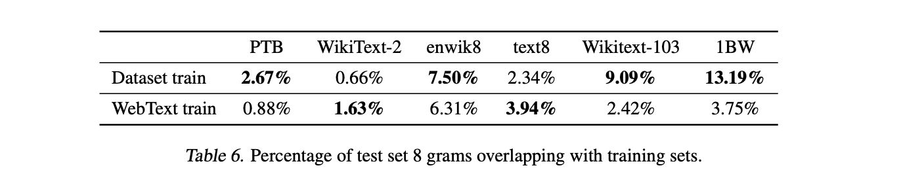
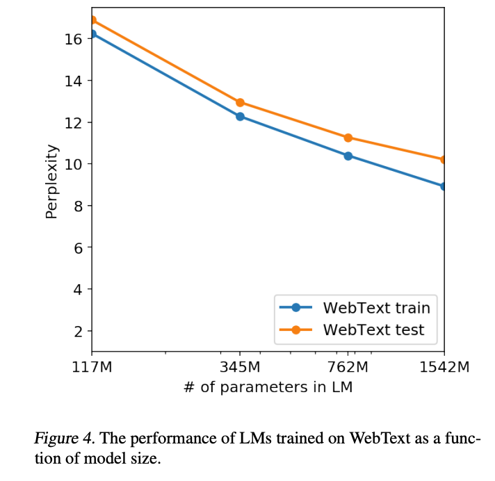

# Language Models are Unsupervised Multitask Learners

## 摘要

自然语言处理任务，如问答、机器翻译、阅读理解和摘要生成，通常都是通过在特定任务数据集上进行监督学习来解决的。我们证明，当在被称为WebText的数百万网页新数据集上训练时，语言模型开始学习这些任务，而无需任何明确的监督。当条件设定为一个文档加上问题时，语言模型生成的答案在CoQA数据集上达到55 F1分数 - 匹配或超过了3/4的基线系统的表现，而无需使用超过127,000+的训练样本。语言模型的容量对于零样本任务迁移的成功至关重要，并且增加容量将按对数线性方式提高任务间的性能。我们的最大模型，GPT-2，是一个拥有15亿参数的Transformer，它在零样本设置中在8个测试的语言建模数据集中的7个上取得了最先进的结果，但仍然无法适应WebText。模型的样本反映了这些改进，并包含连贯的文本段落。这些发现表明，构建语言处理系统的一种有前景的路径是从自然出现的演示中学习执行任务。

## 1. 引言

使用大数据集、高容量模型和监督学习的结合，机器学习系统现在在它们被训练的任务上表现优秀(Krizhevsky et al., 2012) (Sutskever et al., 2014) (Amodei et al., 2016)。然而，这些系统在数据分布的微小变化(Recht et al., 2018)和任务规范的改变(Kirkpatrick et al., 2017)上都是脆弱和敏感的。当前的系统更适合被描述为狭窄的专家，而不是能胜任的通用者。我们希望向更通用的系统转变，这样的系统可以执行许多任务 - 最终无需为每个任务手动创建和标记训练数据集。

创建机器学习系统的主流方法是收集一个演示正确行为的训练样本数据集，以实现所需的任务，训练一个系统去模仿这些行为，然后在独立且同分布(IID)的保留样本上测试其性能。这种方法已经被证明能很好地解决狭窄专家的问题。但是，字幕模型(Lake et al.,2017)、阅读理解系统(Jia & Liang, 2017)和图像分类器(Alcorn et al., 2018)在可能输入的多样性和变化上的常见的不稳定行为，揭示了这种方法的一些缺点。

我们怀疑，单一任务训练在单一领域数据集上的普遍存在是当前系统缺乏泛化能力的主要原因。要想使用当前的架构构建出稳健的系统，可能需要在广泛的领域和任务上进行训练，并测量性能。最近，已经有一些基准测试，例如GLUE (Wang et al., 2018)和decaNLP (McCann et al., 2018)，开始研究这个问题。

多任务学习(Caruana, 1997)是一个提高通用性能的有前景的框架。然而，NLP中的多任务训练仍然处于起步阶段。最近的研究报道了适度的性能改进(Yogatama et al.,2019)，而到目前为止最雄心勃勃的两项努力分别在总共10个和17个(数据集，目标)对上进行了训练(McCann et al., 2018) (Bowman et al., 2018)。从元学习的角度看，每个(数据集，目标)对是从数据集和目标分布中抽取的单个训练样本。当前的机器学习系统需要数百到数千个样本才能产生具有良好泛化能力的函数。这表明，多任务训练可能需要同样多的有效训练对，以便使用当前方法实现其潜力。我们很难继续扩大数据集的创建和目标设计的规模，达到可能需要使用当前技术暴力破解的程度。这就促使我们探索执行多任务学习的其他设定。

目前在语言任务上表现最佳的系统利用了预训练和监督微调的结合。这种方法有着悠久的历史，并且趋向于更灵活的传递形式。首先，学习了词向量，并将其用作任务特定架构的输入(Mikolov et al., 2013) (Collobert et al., 2011)，然后传递了循环网络的上下文表示(Dai & Le, 2015) (Peters et al., 2018)，最近的工作表明，任务特定的架构不再是必要的，传递许多自我注意力块就足够了(Radford et al., 2018) (Devlin et al., 2018)。

这些方法仍然需要进行监督训练才能执行任务。当只有最少的或没有监督数据时，另一条研究线证明了语言模型执行特定任务的潜力，如常识推理(Schwartz et al., 2017)和情感分析(Radford et al., 2017)。

在这篇论文中，我们连接了这两条研究线，继续推广更通用的传递方法。我们证明，语言模型可以在零样本设置中执行下游任务 - 不需要任何参数或架构修改。我们通过突出语言模型在零样本设置中执行广泛任务的能力，展示了这种方法的潜力。我们根据任务的不同，实现了有前途的、有竞争力的和最先进的结果。

## 2. 方法
我们的方法核心是语言模型。语言模型通常被框定为从一组示例$（x_1，x2_，...，x_n）$中进行无监督分布估计，每个示例由长度可变的符号序列$（s_1，s_2，...，s_n）$组成。由于语言具有自然的顺序性，因此常见的做法是将符号上的联合概率分解为条件概率的乘积(Jelinek & Mercer, 1980) (Bengio et al., 2003)：

$$p(x) = \prod p(s_n|s_1, ..., s_{n−1})  (1)$$

这种方法允许对$p(x)$以及形式为$p(s_{n-k}, ..., s_n|s_1, ..., s_{n-k-1})$的任何条件进行可处理的抽样和估计。近年来，能计算这些条件概率的模型的表达能力有了显著的改进，例如像Transformer (Vaswani et al., 2017)这样的自我注意力架构。

在概率框架中，学习执行单一任务可以表述为估计条件分布$p(output|input)$。由于一个通用系统应该能够执行许多不同的任务，即使对于同一输入，它也应该不仅依赖于输入，还依赖于要执行的任务。也就是说，它应该模拟$p(output|input, task)$。这已经在多任务和元学习环境中被多种形式的正式化。任务调度通常在架构级别实现，例如在(Kaiser et al., 2017)中的任务特定编码器和解码器，或者在算法级别实现，如MAML(Finn et al., 2017)的内外循环优化框架。但是，如McCann等人(2018)所示，语言提供了一种灵活的方式来指定任务、输入和输出，所有这些都作为一个符号序列。例如，一个翻译训练样例可以被写成序列$(translate \ to \ french, english \ text, french \ text)$。同样，一个阅读理解训练样例可以被写成$(answer\ the\ question,\ document,\ question,\ answer)$。McCann等人(2018)展示了可以训练一个单一模型，MQAN，来推断和执行许多不同的任务，这些任务都是用这种格式的示例。

语言建模原则上也能够学习McCann等人(2018)的任务，而不需要显式监督预测哪些符号是要预测的输出。由于监督目标与无监督目标相同，但只在序列的一个子集上进行评估，因此无监督目标的全局最小值也是监督目标的全局最小值。在这个稍微玩具化的环境中，Sutskever等人(2015)讨论的关于密度估计作为一个原则性训练目标的问题就被绕过了。问题反而变成了我们能否在实践中优化无监督目标以达到收敛。初步的实验验证了，足够大的语言模型能够在这种玩具般的设置中执行多任务学习，但是学习速度比在显式监督的方法中慢得多。

从上述明确的设置到“野生”语言(language in the wild)的混乱，这是一个大步骤。Weston(2016)在对话上下文中，主张需要开发能够直接从自然语言中学习的系统，并展示了一个概念验证 - 通过使用教师输出的前向预测来学习一个没有奖励信号的QA任务。虽然对话是一个吸引人的方法，但我们担心它过于限制性。互联网包含了大量的信息，这些信息可以在没有交互通信的需要下被动地获得。我们推测，具有足够容量的语言模型将开始学习推断并执行自然语言序列中展示的任务，以便更好地预测它们，无论它们的获取方式如何。如果语言模型能够做到这一点，那么实际上，它将在执行无监督的多任务学习。我们通过在零样本设置中分析语言模型在各种任务上的性能来测试这是否是这样。

### 2.1. 训练数据集

大多数先前的工作都在单一文本领域训练语言模型，如新闻文章(Jozefowicz et al., 2016)、维基百科(Merity et al., 2016)或小说(Kiros et al., 2015)。我们的方法推动构建尽可能大且多样化的数据集，以便收集尽可能多种领域和环境下的自然语言任务示例。

一个富有潜力的、多样且近乎无限的文本来源是网络抓取，比如Common Crawl。虽然这些存档比当前的语言模型数据集大了几个数量级，但它们存在显著的数据质量问题。Trinh & Le (2018)在他们关于常识推理的工作中使用了Common Crawl，但是注意到大量的文档“其内容大部分都是难以理解的”。在我们使用Common Crawl的初始实验中，我们观察到了类似的数据问题。Trinh & Le (2018)的最佳结果是使用Common Crawl的一个小子样本，该子样本只包含与他们的目标数据集——Winograd Schema挑战——最相似的文档。虽然这是一种实用的方法，可以改善在特定任务上的性能，但我们希望避免提前假设要执行的任务。

相反，我们创建了一个新的网络抓取，它强调文档质量。为了做到这一点，我们只抓取了经过人工策划/过滤的网页。手动过滤整个网络抓取将非常昂贵，所以作为一个起点，我们抓取了Reddit（一个社交媒体平台）上获得至少3个karma的所有外部链接。这可以被认为是其他用户是否发现链接有趣、有教育意义或者仅仅是有趣的一个启发式指标。

我们创建的数据集，WebText，包含这45百万个链接的文本子集。为了从HTML响应中提取文本，我们使用了Dragnet (Peters & Lecocq, 2013)和Newspaper的组合。本文中展示的所有结果都使用的是一个初步版本的WebText，它不包括2017年12月之后创建的链接，经过去重和一些基于启发式的清理后，它包含稍多于800万份文档，总计40GB的文本。我们从WebText中删除了所有维基百科的文档，因为它是其他数据集的常见数据源，可能会由于训练数据与测试评估任务的重叠而复杂化分析。

### 2.2. 输入表示

一个通用的语言模型（LM）应该能够计算（并生成）任何字符串的概率。当前的大规模语言模型包括预处理步骤，如转换为小写，标记化，以及对词汇表外的令牌进行处理，这限制了可建模字符串的空间。虽然像Gillick等人（2015）的工作中那样，将Unicode字符串作为UTF-8字节序列处理可以优雅地满足这个要求，但当前的字节级语言模型与大规模数据集（例如“One Billion Word Benchmark”）上的词级语言模型相比并不具有竞争力（Al-Rfou等人，2018）。我们在尝试在WebText上训练标准字节级语言模型时，观察到了类似的性能差距。

字节对编码（BPE）（Sennrich等人，2015）是字符级和词级语言建模之间的一个实用的中间地带，有效地在频繁的符号序列的词级输入和不频繁的符号序列的字符级输入之间进行插值。尽管名为字节对编码，参考的BPE实现通常操作的是Unicode码点，而不是字节序列。这些实现需要包括Unicode符号的全部空间以便模型所有的Unicode字符串。这将导致在添加任何多符号令牌之前，基础词汇量超过130,000。这个数字相比通常与BPE一起使用的32,000到64,000个令牌的词汇表大得多。相比之下，字节级版本的BPE只需要256个大小的基础词汇表。然而，直接应用BPE到字节序列会导致由于BPE使用基于贪婪频率的启发式方法来构建令牌词汇，从而导致次优的合并。我们观察到BPE包括了像“dog”这样的常见词的多个版本，因为它们以多种方式出现，如“dog.” “dog!” “dog? ”。这导致了有限词汇槽和模型容量的次优分配。为了避免这种情况，我们阻止BPE跨字符类别进行任何字节序列的合并。我们为空格添加了一个例外，这显著提高了压缩效率，同时只在多个词汇令牌之间添加了最小的词断裂。

这种输入表示允许我们将词级LM的实证优势与字节级方法的通用性结合起来。由于我们的方法可以为任何Unicode字符串分配概率，这使得我们可以在任何数据集上评估我们的LM，无论预处理、标记化或词汇量的大小如何。

### 2.3. 模型

我们使用基于Transformer（Vaswani等人，2017）的架构作为我们的LM。模型大部分按照OpenAI GPT模型（Radford等人，2018）的细节，但有几处修改。层标准化（Ba等人，2016）被移动到每个子块的输入，类似于预激活残差网络（He等人，2016），并在最后的自我注意块后增加了一个额外的层标准化。使用了一个考虑到模型深度上的残差路径积累的修改后的初始化。我们按1/√N的因子缩放残差层的权重，其中N是残差层的数量。词汇表扩展到了50,257。我们还将上下文大小从512增加到1024个令牌，并使用了更大的批量大小512。

## 3. 实验

我们训练并基准测试了四种大致呈对数均匀分布大小的语言模型（LM）。这些模型的架构在表2中进行了总结。最小的模型相当于原始的GPT，第二小的模型相当于BERT（Devlin等人，2018）的最大模型。我们的最大模型，我们称之为GPT-2，比GPT的参数量多一个数量级。每种模型的学习率都经过人工调整，以便在WebText的5%保留样本上获得最佳困惑度。所有模型在WebText上仍然存在欠拟合，且在给定更多的训练时间后，保留的困惑度还在改善。

### 3.1. 语言建模

作为向zero-shot任务转移的初始步骤，我们有兴趣了解WebText LM在其训练任务——语言建模上的zero-shot领域转移表现如何。因为我们的模型操作在字节级别，并且不需要损耗性的预处理或标记化，所以我们可以在任何语言模型基准上对其进行评估。语言建模数据集的结果通常以缩放或指数形式的平均负对数概率/规范预测单位——通常是一个字符、一个字节或一个词——的量来报告。我们通过计算一个数据集按照WebText LM的对数概率并除以规范单位的数量来评估这个数量。对于许多这样的数据集，WebText LM将在分布中明显受到测试，必须预测标准化的文本、标记化产生的断裂标点和缩写、打乱的句子，甚至在WebText中极其罕见的字符串，在400亿字节中只出现26次。我们在表3中报告我们的主要结果，使用可逆的反标记器(invertible de-tokenizers)来尽可能地去除这些标记化/预处理的影响。由于这些反标记器是可逆的，我们仍然可以计算一个数据集的对数概率，它们可以被认为是领域适应的一种简单形式。我们观察到使用这些反标记器，GPT-2的困惑度有2.5到5的增益。

WebText LMs在不同的领域和数据集上表现良好，以zero-shot设置在8个数据集中的7个上改善了最新的技术水平。在像Penn Treebank和WikiText-2这样只有1到2百万训练令牌的小数据集上，我们注意到了大的改进。在像LAMBADA（Paperno等人，2016）和Children’s Book Test（Hill等人，2015）这样创建用来测量长期依赖性的数据集上，我们也注意到了大的改进。我们的模型在One Billion Word Benchmark（Chelba等人，2013）上的表现仍然明显低于以前的工作。这可能是因为它既是最大的数据集，也是预处理最具破坏性的数据集——1BW的句子级别混洗去除了所有的长范围结构。

### 3.2. 儿童书籍测试

儿童书籍测试（CBT）（Hill等人，2015）是为了检查LM在命名实体、名词、动词和介词等不同类别的词上的表现而创建的。CBT报告的评估指标不是困惑度，而是在自动构建的完形填空测试中预测出一个被省略的词的10个可能选择中哪一个是正确的的准确性。按照原始论文中介绍的LM方法，我们计算每个选择和根据这个选择对句子的其余部分的概率，预测概率最高的那一个。如图2所示，随着模型大小的增加，性能稳步提高，并在这个测试中缩小了与人类表现的差距。数据重叠分析显示，CBT测试集中的一本书，《丛林之书》（Rudyard Kipling），在WebText中，所以我们报告了在验证集上的结果，这在验证集上没有明显的重叠。GPT-2在常见名词上获得了新的93.3%的最新技术水平，命名实体上获得了89.1%。应用了一个反标记器来移除来自CBT的PTB风格的标记化影响。

### 3.3. LAMBADA

LAMBADA数据集（Paperno等人，2016）测试了系统模拟文本中长期依赖性的能力。任务是预测至少需要50个令牌的上下文的句子的最后一个词。GPT-2将最新技术水平从99.8（Grave等人，2016）提高到了8.6的困惑度，并将LM在这个测试上的准确率从19%（Dehghani等人，2018）提高到了52.66%。调查GPT-2的错误显示，大部分预测是句子的有效连续词，但不是有效的最后一个词。这表明LM没有使用词必须是句子的最后一个词这个有用的附加约束。添加一个停词过滤器作为对此的近似，进一步将准确率提高到了63.24%，在这个任务上改进了整体的最新技术水平4%。前一个最新技术水平（Hoang等人，2018）使用了一个不同的限制预测设置，其中模型的输出被限制为只出现在上下文中的词。对于GPT-2来说，这个限制是有害的，而不是有帮助的，因为19%的答案不在上下文中。我们使用了一个没有预处理的数据集版本。

### 3.4. 温诺格拉德模式挑战

温诺格拉德模式挑战（Levesque等人，2012）被构建来测量一个系统执行常识推理的能力，通过测量其解决文本中模糊性的能力。最近，Trinh & Le（2018）通过预测有较高概率的模糊性解决方案，展示了LM在这个挑战上的显著进步。我们遵循他们的问题设定，并在图3中用全分和部分评分技术来展示我们模型的表现。GPT-2将最新技术水平的准确率提高了7%，达到了70.70%。数据集非常小，只有273个例子，所以我们建议阅读Trichelair等人（2018）来帮助理解这个结果。

### 3.5 阅读理解

对话式问答数据集（CoQA）（Reddy等人，2018）包含了来自7个不同领域的文档，以及关于这些文档的自然语言对话（由提问者和回答者进行）。CoQA测试阅读理解能力，以及模型回答依赖于对话历史（如“为什么？”）的问题的能力。基于GPT-2的贪婪解码，当模型根据文档、相关对话的历史和一个最终的代币A：进行条件化处理时，在开发集上达到了55的F1得分。这匹配或超过了3/4的基线系统的性能，而这些基线系统使用了127,000多个手动收集的问答对进行训练。有监督的SOTA，一个基于BERT的系统（Devlin等人，2018），接近人类的89的F1表现。尽管GPT-2的表现对于一个没有进行过任何监督训练的系统来说是令人兴奋的，但对其答案和错误的一些检查表明，GPT-2通常使用如响应一个who问题以文档中的名称进行回答等简单的检索基础。

### 3.6 摘要

我们在CNN和Daily Mail数据集（Nallapati等人，2016）上测试了GPT-2进行摘要的能力。为了引导摘要行为，我们在文章后添加了文字"TL;DR："，然后使用Top-k随机抽样（Fan等人，2018）生成100个令牌，其中k=2，这可以减少重复并鼓励比贪婪解码更具概括性的摘要。我们使用这100个令牌中的前3个生成的句子作为摘要。虽然从质量上看，这些生成的内容类似于摘要，如表14所示，但它们通常只关注文章中的最新内容，或者混淆了特定细节，比如一场车祸中有多少辆车参与，或者一个标志是在帽子上还是在衬衫上。在通常报道的ROUGE 1,2,L指标上，生成的摘要只是开始接近经典神经基线的表现，并且只是勉强优于从文章中随机选择3个句子。当去除任务提示时，GPT-2在总体指标上的性能下降了6.4个点，这表明了在自然语言模型中引入特定任务行为的能力。

### 3.7 翻译
我们测试了GPT-2是否开始学习如何从一种语言翻译到另一种语言。为了帮助模型推断出这是期望的任务，我们对语言模型进行条件化处理，使用格式为"英语句子 = 法语句子"的示例对，然后在最后的提示"英语句子 ="后，我们用贪婪解码从模型中进行抽样，并使用第一个生成的句子作为翻译。在WMT-14英法测试集上，GPT-2得到了5 BLEU，这比在先前关于无监督单词翻译的工作中推断出的双语词典的逐字翻译稍差（Conneau等人，2017b）。在WMT-14法英测试集上，GPT-2能够利用其非常强大的英语语言模型，表现得明显更好，达到了11.5 BLEU。这优于（Artetxe等人，2017）和（Lample等人，2017）的几个无监督机器翻译基线，但仍然远不及当前最好的无监督机器翻译方法的33.5 BLEU（Artetxe等人，2019）。我们对这个任务的表现感到惊讶，因为我们故意从WebText中移除了非英语网页作为过滤步骤。为了证实这一点，我们在WebText上运行了一个字节级的语言检测器，只检测到了大约10MB的法语数据，这比在先前的无监督机器翻译研究中常见的单语法语语料小约500倍。

### 3.8 问答

测试语言模型中包含什么信息的一种可能方式是评估它生成事实型问题正确答案的频率。以往在所有信息都存储在参数中的神经系统中展示这种行为，如A神经对话模型（Vinyals＆Le，2015）报告了定性结果，因为缺乏高质量的评估数据集。最近引入的自然问题数据集（Kwiatkowski等人，2019）是一个测试这一点更具定量性的有希望的资源。与翻译相似，语言模型的上下文是用示例问题答案对进行种子化的，这有助于模型推断出数据集的短答案风格。当使用在阅读理解数据集如SQUAD上常用的精确匹配指标进行评估时，GPT-2正确回答了4.1%的问题。作为比较点，最小的模型并没有超过一个非常简单的基线的1.0%的准确率，该基线对每种问题类型（who, what, where等）返回最常见的答案。GPT-2正确回答了5.3倍的问题，这表明模型容量已经是神经系统在这种任务上表现不佳的主要因素。GPT-2对其生成的答案分配的概率是精确的，并且在其最自信的1%的问题上，GPT-2的准确率为63.1%。在开发集问题上，GPT-2生成的最有信心的30个答案如表5所示。GPT-2的表现仍然比混合信息检索与文档问题回答的开放域问答系统的30到50%的范围差很多（Alberti等人，2019）。

### 4. 泛化 vs 记忆

近期的计算机视觉研究显示，常见的图像数据集中包含了不少近似重复的图片。例如，CIFAR-10训练集和测试集之间有3.3%的重叠（Barz & Denzler, 2019）。这导致对机器学习系统泛化性能的上报过高。随着数据集大小的增加，这个问题变得越来越常见，这表明WebText可能也存在类似的现象。因此，分析有多少测试数据同时出现在训练数据中是很重要的。

为了研究这一点，我们创建了包含WebText训练集令牌的8-grams的Bloom过滤器。为了提高召回率，字符串被标准化为只包含小写字母数字词，以一个空格为分隔符。Bloom过滤器的构建方式使得误报率被限制在1/10^8以内。我们通过生成1M个字符串进行了低误报率的进一步验证，其中没有一个被过滤器找到。

这些Bloom过滤器让我们可以计算，给定一个数据集，来自该数据集的8-grams的百分比也在WebText训练集中找到。表6展示了这种重叠分析在常见LM基准测试集的情况。常见的LM数据集测试集与WebText训练集之间的重叠率在1-6%之间，平均重叠率为3.2%。令人有些惊讶的是，许多数据集与他们自己的训练分割有更大的重叠，平均重叠率为5.9%。

我们的方法优化了召回率，虽然对重叠进行手动检查会发现许多常见短语，但是有许多更长的匹配是由于数据的重复。这不是WebText独有的情况。例如，我们发现WikiText-103的测试集有一篇文章也在训练数据集中。由于测试集中只有60篇文章，因此至少有1.6%的重叠。更值得担忧的是，根据我们的程序，1BW与其自身的训练集有近13.2%的重叠。

对于Winograd Schema挑战，我们只找到了10个模式，其8-gram与WebText训练集有重叠。其中2个是错误的匹配。在剩下的8个中，只有1个模式出现在任何透露答案的上下文中。

对于CoQA，在新闻领域，大约15%的文档已经在WebText中，模型在这些上表现得更好，

F1分数提高了约3。CoQA的开发集度量报告了5个不同领域的平均性能，我们在各个领域的重叠中测得约0.5-1.0的F1分数增益。然而，实际的训练问题或答案并不在WebText中，因为CoQA是在WebText的截止日期之后发布的。

在LAMBADA上，平均重叠率是1.2%。对于重叠率大于15%的例子，GPT-2的困惑度表现更好约2。当排除所有有任何重叠的例子重新计算度量时，结果从8.6的困惑度变为8.7，准确率从63.2%降到62.9%。这个非常小的整体结果变化可能是由于只有1/200的例子有显著的重叠。

总的来说，我们的分析建议，WebText训练数据和特定评估数据集之间的数据重叠为报告结果提供了小而一致的好处。然而，对于大多数数据集，我们并没有发现比那些已经存在于标准训练和测试集之间的重叠更大的重叠，如表6所示。

理解并量化高度相似文本如何影响性能是一个重要的研究问题。更好的去重技术，如可扩展的模糊匹配，也可以帮助更好地回答这些问题。就目前而言，我们建议在新的NLP数据集的训练和测试划分创建过程中，使用基于n-gram重叠的去重作为一个重要的验证步骤和健全性检查。

确定WebText LM的性能是否可以归因于记忆的另一种可能的方法是检查它们在自己的保留集上的表现。如图4所示，随着模型大小的增加，WebText的训练集和测试集的表现都相似且一起改善。这暗示了即使是GPT-2在许多方面仍然在WebText上欠拟合。

GPT-2也能够写关于发现会说话的独角兽的新闻文章。在表13中提供了一个例子。

### 5. 相关工作

本项工作的重要部分在于衡量在更大的数据集上训练的更大的语言模型的性能。这与Jozefowicz等人（2016）的工作类似，他们在10亿字的基准测试上扩展了基于RNN的语言模型。Bajgar等人（2016）也通过创建一个更大的训练数据集，来自Project Gutenberg来补充标准的训练数据集，从而改善了儿童书籍测试的结果。Hestness等人（2017）对不同深度学习模型的性能如何随模型容量和数据集大小变化进行了全面的分析。尽管我们的实验在各种任务上的噪声更大，但是它们建议在子任务的目标上，类似的趋势持续到10亿+参数的范围。

在生成模型中，之前已经有文献记录了一些有趣的学习功能，例如RNN语言模型中执行行宽度跟踪和引用/评论检测的单元（Karpathy等人，2015）。对我们的工作更有启发的是Liu等人（2018）的观察，他们发现一个被训练来生成维基百科文章的模型也学会了在语言之间翻译名字。

之前的工作已经探索了过滤和构建大型文本语料库的替代方法，例如iWeb语料库（Davies2018）。

对于语言任务的预训练方法，已经进行了大量的工作。除了在引言中提到的，GloVe（Pennington等人，2014）将词向量表示学习扩展到Common Crawl的所有内容。一个对文本深度表示学习有影响的早期工作是Skip-thought Vectors（Kiros等人，2015）。McCann等人（2017）探讨了使用来自机器翻译模型的表示的使用，Howard和Ruder（2018）改进了基于RNN的微调方法（Dai和Le，2015）。Conneau等人（2017a）研究了通过自然语言推理模型学习的表示的转移性能，Subramanian等人（2018）探索了大规模多任务训练。

Ramachandran等人（2016）证明了seq2seq模型从使用预训练语言模型作为编码器和解码器进行初始化中受益。最近的工作已经表明，当LM预训练在微调难度更大的生成任务时，例如闲聊对话和基于对话的问题回答系统，也是有帮助的（Wolf等人，2019）（Dinan等人，2018）。

### 6. 讨论

大量的研究致力于学习（Hill等人，2016），理解（Levy和Goldberg，2014）和批判性地评估（Wieting和Kiela，2019）监督和无监督预训练方法的表示。我们的结果建议无监督任务学习是一个值得探索的有希望的研究领域。这些发现可能有助于解释预训练技术在下游NLP任务的广泛成功，因为我们表明，在极限情况下，这些预训练技术之一开始学习直接执行任务，而无需进行监督的适应或修改。

在阅读理解方面，GPT-2在zero-shot设置下与监督基线具有竞争性的性能。然而，在其他任务上，如总结，虽然它在质量上执行了任务，但根据量化指标，其性能仍只是初级的。虽然这在研究结果上有一些启示性，但在实际应用方面，GPT-2的零射击性能还远未可用。

我们已经研究了WebText LMs在许多规范NLP任务上的零射击性能，但还有许多额外的任务可以进行评估。无疑，还有许多实际任务，GPT-2的性能仍然不如随机。即使在我们评估的常见任务上，例如问题回答和翻译，只有当语言模型具有足够的容量时，才开始胜过琐碎的基线。

虽然zero-shot性能建立了GPT-2在许多任务上的潜在性能基线，但是微调的上限还不清楚。在一些任务上，GPT-2的完全抽象输出与当前在许多问题回答和阅读理解数据集上的最先进技术，基于抽取式指针网络（Vinyals等人，2015）的输出有显著的差别。鉴于微调GPT的先前成功，我们计划在decaNLP和GLUE等基准上调查微调，特别是因为目前尚不清楚GPT-2的额外训练数据和容量是否足以克服BERT（Devlin等人，2018）展示的单向表示的低效率。

### 7. 结论

当在足够大且多样化的数据集上训练一个大的语言模型时，它能在许多领域和数据集上表现良好。GPT-2在测试的8个语言建模数据集中的7个上，都能零射击到最先进的性能。模型能在零射击设置中执行的任务的多样性表明，训练以最大化足够多样化的文本语料库的可能性的高容量模型，开始学习如何执行许多任务，而无需明确的监督。