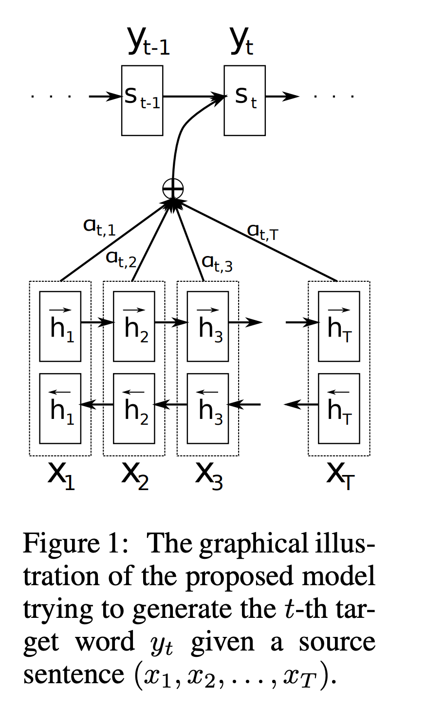
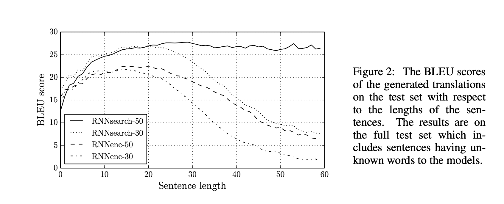
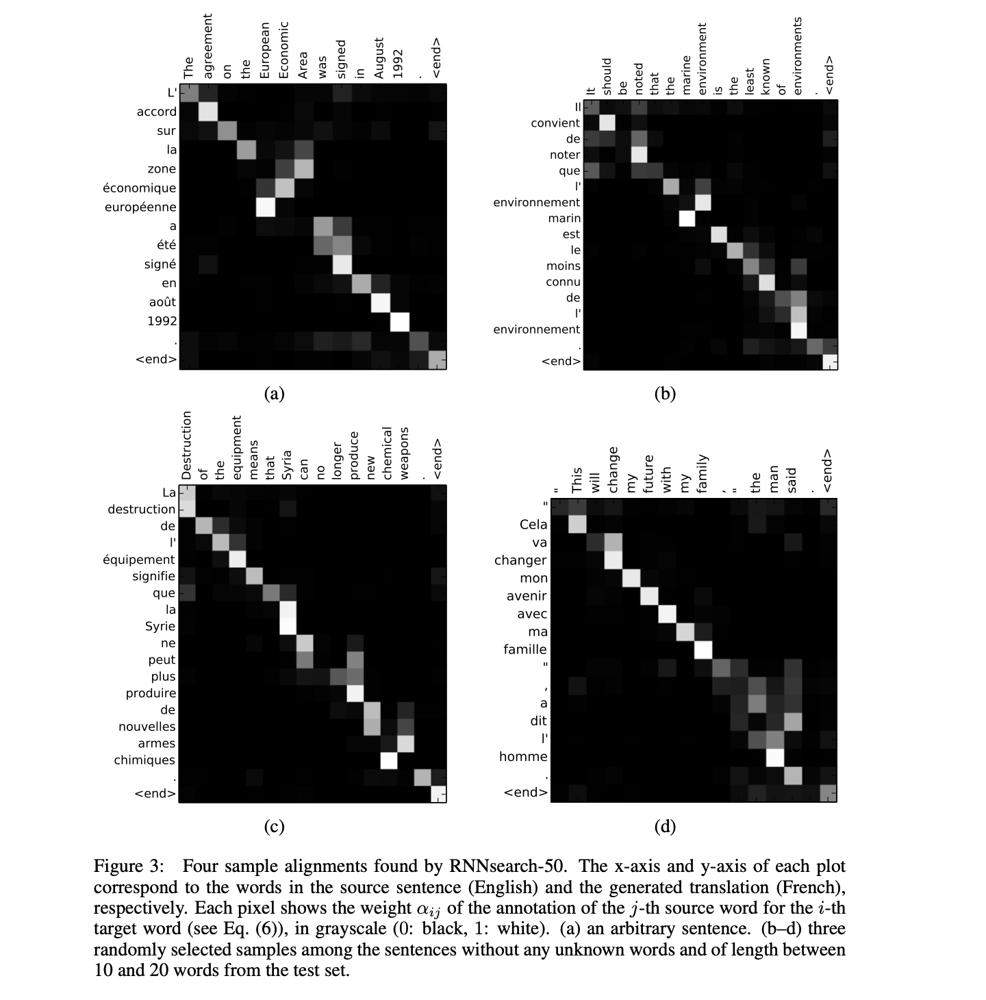
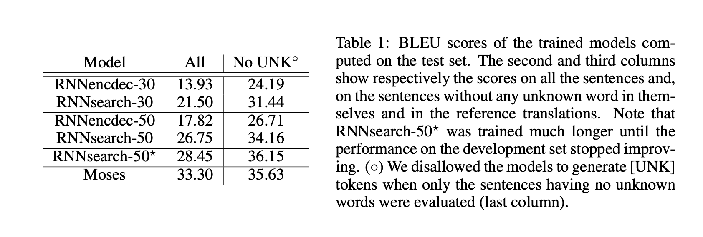

# Neural Machine Translation by Jointly Learning to Align and Translate

# 摘要

神经机器翻译是一种最近提出的机器翻译方法。与传统的统计机器翻译不同，神经机器翻译的目标是构建一个可以通过联合调整来最大化翻译性能的单一神经网络。最近提出的神经机器翻译模型通常属于编码器-解码器家族，并将源语句编码为固定长度的向量，然后解码器从中生成翻译。在本文中，我们推测使用固定长度向量是改善这种基本编码器-解码器架构性能的瓶颈，并提出通过让模型自动（软）搜索与预测目标词相关的源语句部分来扩展这一点，无需将这些部分明确形成为硬段。通过这种新方法，我们在英法翻译任务上实现了与现有最先进的基于短语的系统相媲美的翻译性能。此外，定性分析揭示，模型找到的（软）对齐与我们的直觉非常吻合。

# 1 引言

神经机器翻译是一种新兴的机器翻译方法，最近由Kalchbrenner和Blunsom（2013），Sutskever等人（2014）以及Cho等人（2014b）提出。与传统的基于短语的翻译系统（参见，例如，Koehn等人，2003）由许多独立调整的小子组件组成不同，神经机器翻译试图构建和训练一个大型神经网络，该网络阅读一个句子并输出正确的翻译。

大多数已经提出的神经机器翻译模型属于编码器-解码器家族（Sutskever等人，2014；Cho等人，2014a），对于每种语言都有一个编码器和解码器，或者涉及将特定于语言的编码器应用于每个句子，然后比较其输出（Hermann和Blunsom，2014）。编码器神经网络读取并将源语句编码成固定长度的向量。然后解码器从编码的向量输出翻译。整个编码器-解码器系统，包括一对语言的编码器和解码器，是联合训练的，以最大化给定源语句的正确翻译的概率。

这种编码器-解码器方法的潜在问题是神经网络需要能够将源语句的所有必要信息压缩到固定长度的向量中。这可能使神经网络难以处理长句子，特别是那些比训练语料库中的句子更长的句子。Cho等人（2014b）显示，随着输入句子长度的增加，基本的编码器-解码器的性能确实会迅速下降。

为了解决这个问题，我们引入了一个扩展到编码器-解码器模型，该模型学习联合对齐和翻译。每次该模型在翻译中生成一个词时，它（软）搜索源语句中的一组位置，其中包含最相关的信息。然后，模型根据与这些源位置相关的上下文向量以及所有以前生成的目标词来预测目标词。

这种方法与基本的编码器-解码器的最重要区别在于，它并没有试图将整个输入句子编码到单个固定长度的向量中。相反，它将输入语句编码为一系列向量，并在解码翻译时自适应地选择这些向量的一个子集。这使神经翻译模型不需要将源语句的所有信息，无论其长度如何，都压缩到固定长度的向量中。我们证明这使得模型能够更好地处理长句子。

在本文中，我们展示了联合学习对齐和翻译的提议方法显著改善了基本编码器-解码器方法的翻译性能。对于更长的句子，这种改进更为明显，但可以观察到任何长度的句子。在英法翻译任务上，所提出的方法使用单一模型实现了与传统基于短语的系统相当或接近的翻译性能。此外，定性分析揭示，所提出的模型找到了源语句与相应目标语句之间在语言上合理的（软）对齐。

# 2 背景：神经机器翻译

从概率的角度来看，翻译等价于找到一个目标语句$y$，该语句最大化了给定源语句$x$的条件概率，即$arg\ max_y p(y|x)$。在神经机器翻译中，我们使用并行训练语料库来拟合一个参数化模型，以最大化句子对的条件概率。一旦翻译模型学习了条件分布，只需给出源语句，就可以通过搜索最大化条件概率的语句来生成相应的翻译。

最近，一些论文已经提出使用神经网络直接学习这种条件分布（参见，例如，Kalchbrenner和Blunsom，2013; Cho等人，2014a; Sutskever等人，2014; Cho等人，2014b; Forcada和Neco，1997）。这种神经机器翻译方法通常由两部分组成，第一部分对源语句进行编码，第二部分对目标语句进行解码。例如，Cho等人（2014a）和Sutskever等人（2014）使用了两个循环神经网络（RNN）将可变长度的源语句编码为固定长度的向量，并将该向量解码为可变长度的目标语句。

尽管这是一种全新的方法，但神经机器翻译已经显示出有希望的结果。Sutskever等人（2014）报告说，基于长短期记忆（LSTM）单元的RNN的神经机器翻译在英法翻译任务上达到了接近传统基于短语的机器翻译系统的最先进性能。图1将神经组件添加到现有的翻译系统中，例如，用于在短语表中评分短语对（Cho等人，2014a）或重新排列候选翻译（Sutskever等人，2014），已经超越了先前的最先进的性能水平。

## 2.1 RNN编码器-解码器

在此，我们简要描述了由Cho等人（2014a）和Sutskever等人（2014）提出的底层框架，称为RNN编码器-解码器，我们在此基础上建立了一种新的架构，该架构学习同时对齐和翻译。

在编码器-解码器框架中，编码器读入输入句子，一系列向量$x=(x_1,··· ,x_{T_x})$，变成一个向量$c_.{2}$最常见的方法是使用RNN，使得$$h_t = f (x_t,h_{t−1}) $$和$$c = q ({h_1,··· ,h_{T_x}})$$ ，其中$h_t∈R^n$是在时间$t$的隐藏状态，$c$是从隐藏状态序列生成的向量。$f$和$q$是一些非线性函数。例如，Sutskever等人（2014）使用了LSTM作为$f$和$q({h_1,··· ,h_T})=h_T$。

解码器通常被训练以预测下一个单词 $y_{t0}$，给定上下文向量 $c$ 和所有之前预测的单词 ${y_1, · · · , y_{t0-1}}$。换句话说，解码器通过将联合概率分解为有序条件概率来定义转换 $y$ 的概率： $$ p(y) = \prod_{t=1}^{T} p(y_t | {y_1, · · · , y_{t-1}} , c), \tag{2} $$ 其中 $y = {y_1, · · · , y_T}$。使用 RNN，每个条件概率被建模为$$ p(y_t | {y_1, · · · , y_{t-1}} , c) = g(y_{t-1}, s_t, c), \tag{3} $$ 其中 $g$ 是一个非线性的，可能是多层的，输出 $y_t$ 的概率的函数，$s_t$ 是 RNN 的隐藏状态。应该注意的是，也可以使用其他架构，例如 RNN 和去卷积神经网络的混合（Kalchbrenner and Blunsom，2013）。

# 3 从对齐模型到神经网络

在这一部分中，我们介绍了一种新的模型，该模型不是先对齐，然后再翻译，而是同时进行对齐和翻译。我们将此模型称为对齐和翻译模型（Alignment and Translation Model，ATM）。为了介绍这个模型，我们首先回顾了如何使用对齐模型进行翻译，并说明这如何导致了我们的新模型。

## 3.1 DECODER: GENERAL DESCRIPTION

在新的模型架构中，我们将公式 (2) 中的每个条件概率定义为：

$$p(y_i |y_1, . . . , y_{i-1}, x) = g(y_{i-1}, s_i , c_i), \tag{4}$$

其中 $s_i$ 是在时间 i 的 RNN 隐藏状态，通过以下方式计算：

$$s_i = f(s_{i-1}, y_{i-1}, c_i).$$

需要注意的是，与现有的编码器-解码器方法（参见公式 (2)）不同，这里的概率是根据每个目标词 $y_i$ 的不同的上下文向量 $c_i$ 进行条件化的。

上下文向量 $c_i$ 取决于一系列注释 $(h_1, · · · , h_{T_x})$，编码器将输入句子映射到这些注释。每个注释 $h_i$ 包含关于整个输入序列的信息，重点关注输入序列的第 $i$ 个单词周围的部分。我们将在下一节详细解释如何计算注释。

然后，上下文向量 $c_i$ 作为这些注释 $h_i$ 的加权和计算：

$$c_i = \sum_{j=1}^{T_x} \alpha_{ij}h_j . \tag{5}$$

每个注释 $h_j$ 的权重 $\alpha_{ij}$ 由以下方式计算：

$$\alpha_{ij} = \frac{exp (e_{ij})}{\sum_{k=1}^{T_x} exp (e_{ik})} , \tag{6}$$

其中

$$e_{ij} = a(s_{i-1}, h_j)$$

是一个对齐模型，该模型评估位置 $j$ 处的输入和位置 $i$ 处的输出之间的匹配程度。评分基于 RNN 隐藏状态 $s_{i-1}$（刚刚发出 $y_i$，公式（4））和输入句子的第 $j$ 个注释 $h_j$。

我们将对齐模型 a 参数化为一个前馈神经网络，该网络与所提议系统的所有其他组件一起进行训练。注意，与传统的机器翻译不同，对齐并不被视为潜在变量。相反，对齐模型直接计算软对齐，这允许成本函数的梯度被反向传播。这个梯度可以用来联合训练对齐模型以及整个翻译模型。

我们可以理解将所有注释的加权和的方法为计算一个期望注释，其中期望是对可能的对齐进行的。让 $\alpha_{ij}$ 是目标词 $y_i$ 与源词 $x_j$ 对齐或翻译的概率。然后，第 $i$ 个上下文向量 $c_i$ 是在概率 $\alpha_{ij}$ 下所有注释的期望注释。

概率 $\alpha_{ij}$ 或其相关的能量 $e_{ij}$ 反映了注释 $h_j$ 对于决定下一个状态 $s_i$ 并生成 $y_i$ 的前一个隐藏状态 $s_{i-1}$ 的重要性。直观地说，这实现了解码器中的注意力机制。解码器决定源句子的哪些部分值得关注。通过让解码器具有注意力机制，我们减轻了编码器必须将源句子中的所有信息编码到固定长度向量的负担。通过这种新方法，信息可以分布在注释序列中，解码器可以相应地选择性地检索。

## 3.2 编码器：用于注解序列的双向RNN

描述在等式(1)中的常规RNN，按顺序从第一个符号$x_1$开始读取输入序列$x$，到最后一个$x_{Tx}$。然而，在我们提议的方案中，我们希望每个单词的注释不仅总结前面的单词，而且还总结后面的单词。因此，我们建议使用双向RNN (BiRNN, Schuster和Paliwal, 1997)，最近在语音识别中已经成功使用（见，例如，Graves等人，2013）。

双向RNN由前向和后向RNN组成。前向RNN $\overrightarrow{f}$ 按照顺序（从$x_1$到$x_{Tx}$）阅读输入序列，并计算前向隐藏状态序列($\overrightarrow{h_1}$，...，$\overrightarrow{h_{Tx}}$)。后向RNN $\overleftarrow{f}$ 按照相反的顺序（从$x_{Tx}$到$x_1$）阅读序列，得到后向隐藏状态序列（$ overleftarrow{h_1}$，...，$ \overleftarrow{h_{Tx}}$）

我们通过连接前向隐藏状态 $\overrightarrow{h_j}$ 和后向隐藏状态 $ \overleftarrow{h_j}$ 获得每个词$x_j$的注释，即，$h_j = [\overrightarrow{h_j}; \overleftarrow{h_j}]$。这样，注释$h_j$包含前面单词和后面单词的摘要。由于RNN更倾向于更好地表示最近的输入，注释$h_j$将集中在$x_j$附近的词上。这个注释序列被解码器和对齐模型用来计算上下文向量（等式（5）-（6））。

参见图1，了解我们提出的模型的图形说明。

# 4 实验设置

我们在英语到法语的翻译任务上评估提出的方法。我们使用ACL WMT '14提供的双语、并行语料库。作为对比，我们还报告了Cho等人（2014a）最近提出的RNN编码器-解码器的性能。我们使用相同的训练程序和相同的数据集对两种模型进行训练。

## 4.1 数据集

WMT '14包含以下英法并行语料库：Europarl（61M词）、新闻评论（5.5M）、联合国（421M）以及两个抓取语料库分别有90M和272.5M词，总共850M词。按照Cho等人（2014a）描述的过程，我们使用Axelrod等人（2011）的数据选择方法，将组合语料库的大小减小到348M词。

我们只使用上述并行语料库，而没有使用任何单语数据，尽管可能使用大量单语语料库进行编码器的预训练。我们把news-test-2012和news-test-2013连接起来作为开发（验证）集，并在WMT '14的测试集（news-test-2014）上评估模型，该测试集包含3003个在训练数据中不存在的句子。

在通常的分词后，我们使用每种语言中最常见的30,000个词来训练我们的模型。任何未包含在短名单中的词都映射到一个特殊的标记（[UNK]）。我们不对数据进行任何其他特殊的预处理，如转换为小写或词干提取。

## 4.2 模型

我们训练了两种类型的模型。第一种是RNN编码器-解码器（RNNencdec，Cho等人，2014a），另一种是我们提出的模型，我们称之为RNNsearch。我们训练每个模型两次：首先用长度为30个词的句子（RNNencdec-30，RNNsearch-30），然后用长度为50个词的句子（RNNencdec-50，RNNsearch-50）。

RNNencdec的编码器和解码器各有1000个隐藏单元。RNNsearch的编码器由前向和后向循环神经网络（RNN）组成，每个网络都有1000个隐藏单元。其解码器有1000个隐藏单元。在两种情况下，我们都使用一个具有单个maxout（Goodfellow等人，2013）隐藏层的多层网络来计算每个目标词的条件概率（Pascanu等人，2014）。

我们使用一个minibatch随机梯度下降（SGD）算法，配合Adadelta（Zeiler，2012）来训练每个模型。每个SGD更新方向使用80个句子的minibatch计算。我们对每个模型进行了大约5天的训练。

一旦模型训练完毕，我们使用束搜索来找到一个大致最大化条件概率的翻译（见，例如，Graves，2012; Boulanger-Lewandowski等人，2013）。Sutskever等人（2014）使用这种方法从他们的神经机器翻译模型生成翻译。关于在实验中使用的模型的结构和训练过程的更多细节，请参见附录A和B。

# 5 结果

## 5.1 定量结果

在表1中，我们列出了用BLEU分数衡量的翻译性能。从表中可以明显看出，在所有情况下，我们提出的RNNsearch都比传统的RNNencdec表现得更好。更重要的是，当只考虑包含已知词的句子时，RNNsearch的性能与传统的基于短语的翻译系统（Moses）的性能相当。这是一个重要的成就，考虑到Moses除了使用我们用来训练RNNsearch和RNNencdec的并行语料库外，还使用了一个独立的单语语料库（418M词）。

我们提出这种方法的一个动机是在基本的编码器-解码器方法中使用固定长度的上下文向量。我们推测，这种限制可能会导致基本的编码器-解码器方法在处理长句子时表现不佳。在图2中，我们看到RNNenc

dec的性能随着句子长度的增加而急剧下降。另一方面，RNNsearch-30和RNNsearch-50对句子长度的鲁棒性更强。特别是RNNsearch-50，即使在处理长度为50或更多的句子时，也不会出现性能下降。RNNsearch-30甚至超过了RNNencdec-50（见表1），这进一步证实了我们提出的模型优于基本的编码器-解码器。

## 5.2 定性分析

### 5.2.1 对齐

我们提出的方法提供了一种直观的方法，通过可视化注释权重αij（来自公式（6）），查看生成的翻译中的词与源句子中的词之间的（软）对齐。每个矩阵的每行都表示与注释相关的权重。通过这个，我们可以看到在生成目标词时，源句子中哪些位置被认为更重要。

从图3中的对齐中我们可以看到，英语和法语之间的词语对齐主要是单调的。我们在每个矩阵的对角线上看到强权重。然而，我们也观察到一些非平凡的、非单调的对齐。形容词和名词在法语和英语之间的顺序通常是不同的，我们在图3（a）中看到了一个例子。从这个图中，我们看到模型正确地将短语[European Economic Area]翻译成[zone économique européen]。RNNsearch能够正确地将[zone]与[Area]对齐，跳过两个词（[European]和[Economic]），然后一次回头一个词，完成整个短语[zone économique européenne]。

软对齐的优势，与硬对齐相对，是显而易见的，例如，来自图3（d）。考虑源短语[the man]，它被翻译成[l’ homme]。任何硬对齐都会将[the]映射到[l’]，将[man]映射到[homme]。这对翻译没有帮助，因为必须考虑[the]之后的词来决定它应该被翻译成[le]、[la]、[les]还是[l’]。我们的软对齐通过让模型看[the]和[man]来自然地解决了这个问题，在这个例子中，我们看到模型能够正确地将[the]翻译成[l’]。我们在图3中展示的所有案例中都观察到了类似的行为。软对齐的另

一个好处是，它能自然地处理不同长度的源和目标短语，而不需要通过映射一些词到或从无处([NULL])来处理（见，例如，Koehn, 2010的第4章和第5章）。

### 5.2.2 长句子

从图2中可以清楚地看出，我们提出的模型（RNNsearch）比传统模型（RNNencdec）更擅长翻译长句子。这可能是因为RNNsearch不需要将一长句完美地编码成一个固定长度的向量，而只需要准确地编码输入句子中围绕特定单词的部分。

作为一个例子，考虑这个来自测试集的源句子：
An admitting privilege is the right of a doctor to admit a patient to a hospital or a medical centre to carry out a diagnosis or a procedure, based on his status as a health care worker at a hospital.

RNNencdec-50将这句话翻译成：
Un privilège d’admission est le droit d’un médecin de reconnaître un patient à l’hôpital ou un centre médical d’un diagnostic ou de prendre un diagnostic en fonction de son état de santé.

RNNencdec-50正确地翻译了源句子，直到[a medical center]。然而，从那里开始（下划线部分），它偏离了源句子的原始含义。例如，它用[en fonction de son état de santé]（"根据他的健康状况"）替换了源句子中的[based on his status as a health care worker at a hospital]。

另一方面，RNNsearch-50生成了以下正确的翻译，保留了输入句子的全部含义，没有省略任何细节：
Un privilège d’admission est le droit d’un médecin d’admettre un patient à un hôpital ou un centre médical pour effectuer un diagnostic ou une procédure, selon son statut de travailleur des soins de santé à l’hôpital。

再来考虑另一个来自测试集的句子：
This kind of experience is part of Disney’s efforts to ”extend the lifetime of its series and build new relationships with audiences via digital platforms that are becoming ever more important,” he added.

RNNencdec-50的翻译是：
Ce type d’expérience fait partie des initiatives du Disney pour ”prolonger la durée de vie de ses nouvelles et de développer des liens avec les lecteurs numériques qui deviennent plus complexes.

就像前面的例子一样，RNNencdec在生成大约30个词之后开始偏离源句子的实际含义（看下划线的短语）。从那个点开始，翻译的质量开始下降，基本的错误，如缺少关闭引号。

再次，RNNsearch-50能够正确地翻译这个长句子：

Ce type d’expérience fait partie des efforts de Disney pour ”prolonger la durée de vie de ses séries et nouer de nouvelles relations avec le public via des plateformes numériques qui deviennent de plus en plus importantes”, a-t-il ajouté.

以上两个例子清楚地显示了我们提出的模型能够在处理长句子时保持其性能的优点。

# 6 相关工作

## 6.1 学习对齐
Graves（2013）在手写合成的环境中提出了一种类似的方法，这种方法要求模型对给定字符序列的手写进行生成。在他的工作中，他使用高斯核混合来计算注释的权重，其中每个核的位置、宽度和混合系数由对齐模型预测。更具体地说，他的对齐被限制为预测位置，以便位置单调增加。与我们的方法最大的不同在于，他的注释权重的模式只能朝一个方向移动。在机器翻译的背景下，这是一个严重的限制，因为经常需要（长距离）重新排序才能生成语法正确的翻译（例如，英语到德语）。

相反，我们的方法要求计算源句子中每个单词对于翻译中每个单词的注释权重。这个缺点对于翻译任务来说并不严重，因为大部分的输入和输出句子只有15-40个词。然而，这可能会限制所提出的方案在其他任务中的适用性。

## 6.2 用于机器翻译的神经网络

自从Bengio等人（2003）引入了一个神经概率语言模型，该模型使用神经网络来模拟给定固定数量的前导词的单词的条件概率，神经网络已经被广泛用于机器翻译。然而，神经网络的作用主要是为现有的统计机器翻译系统提供一个特征，或者重新排列现有系统提供的候选翻译列表。

例如，Schwenk（2012）提出使用前馈神经网络来计算源语和目标语短语对的得分，并使用该得分作为基于短语的统计机器翻译系统的附加特征。更近一步，Kalchbrenner和Blunsom（2013）以及Devlin等人（2014）报告了神经网络作为现有翻译系统的一个子组件的成功应用。传统上，训练为目标端语言模型的神经网络被用来重新评分或重新排列候选翻译列表（参见，例如，Schwenk等人，2006）。

虽然上述方法已经被证明可以提高翻译性能，超越了最先进的机器翻译系统，但我们更感兴趣的是一个更加雄心勃勃的目标，即设计一个完全基于神经网络的新翻译系统。因此，

我们在本文中考虑的神经机器翻译方法与这些早期的工作有着根本的不同。我们的模型不是作为现有系统的一部分，而是独立工作，直接从源句子生成翻译。

# 7 结论

传统的神经机器翻译方法，称为编码器-解码器方法，将整个输入句子编码成一个固定长度的向量，从这个向量中解码出翻译。我们推测，使用固定长度的上下文向量对于翻译长句子是有问题的，这基于Cho等人（2014b）和Pouget-Abadie等人（2014）的最近的实证研究。

在这篇论文中，我们提出了一种新的架构来解决这个问题。我们扩展了基本的编码器-解码器，让模型在生成每个目标词时（软）搜索一组输入词，或者由编码器计算出的注释。这使得模型无需将整个源句子编码成一个固定长度的向量，也让模型只关注与生成下一个目标词相关的信息。这对于神经机器翻译系统处理长句子的能力有很大的积极影响。与传统的机器翻译系统不同，翻译系统的所有部分，包括对齐机制，都被联合训练以提高产生正确翻译的对数概率。

我们在英语到法语的翻译任务上测试了所提出的模型，称为RNNsearch。实验表明，所提出的RNNsearch显著优于传统的编码器-解码器模型（RNNencdec），无论句子的长度如何，而且它对源句子的长度更加稳健。从我们对RNNsearch生成的（软）对齐进行的定性分析中，我们得出的结论是，当模型生成正确的翻译时，它可以正确地将每个目标词与源句子中的相关词或它们的注释对齐。

也许更重要的是，所提出的方法达到了与现有的基于短语的统计机器翻译相当的翻译性能。考虑到所提出的架构或整个神经机器翻译的家族只在今年才被提出，这是一个惊人的结果。我们相信，这里提出的架构是朝着更好的机器翻译和更好的自然语言理解的有前途的一步。

未来的挑战之一是更好地处理未知的，或者罕见的词。这将需要模型在所有环境中更广泛地使用，并达到当前最先进的机器翻译系统的性能。