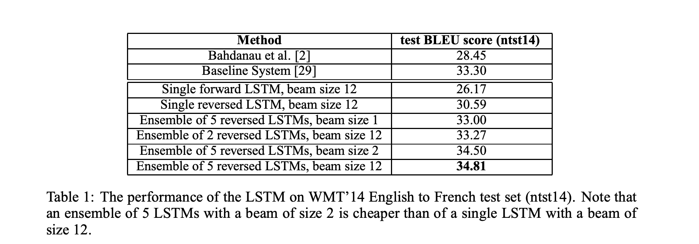
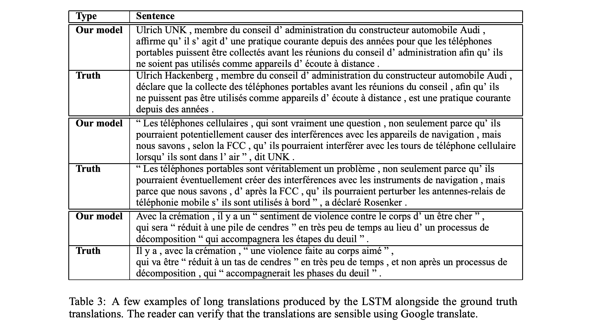
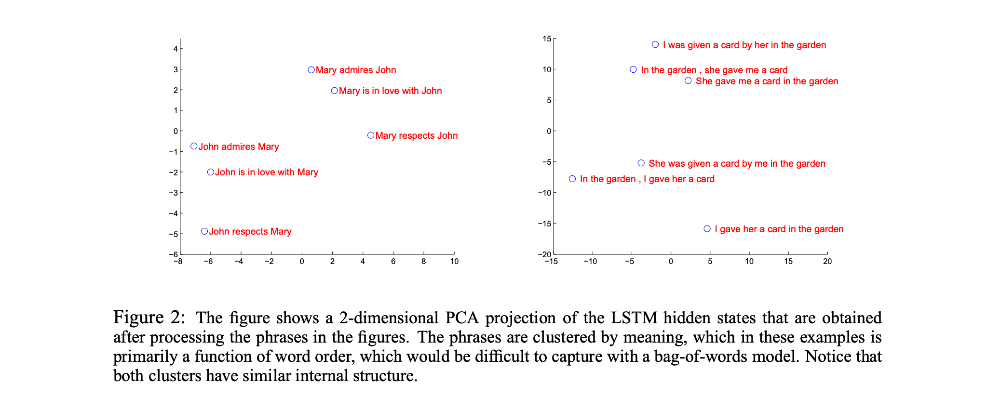

# Sequence to Sequence Learning with Neural Networks

## 摘要

深度神经网络（DNNs）是强大的模型，已在困难的学习任务上取得了出色的表现。尽管当有大量标记的训练集可用时，DNNs表现良好，但它们不能用于将序列映射到序列。在本文中，我们提出了一种通用的端到端序列学习方法，该方法对序列结构的假设最小化。我们的方法使用多层长短期记忆（LSTM）将输入序列映射到固定维度的向量，然后使用另一个深度LSTM从该向量解码目标序列。我们的主要结果是，在WMT’14数据集的英语到法语的翻译任务上，由LSTM生成的翻译在整个测试集上的BLEU得分为34.8，其中LSTM的BLEU得分在词汇外的词上被罚分。此外，LSTM在长句子上没有困难。作为比较，一个基于短语的SMT系统在同一数据集上的BLEU得分为33.3。当我们使用LSTM重新排列由上述SMT系统生成的1000个假设时，其BLEU得分增加到36.5，这接近于此任务的之前最好的结果。LSTM还学习了对词序敏感且相对不受主动和被动语态影响的合理的短语和句子表示。最后，我们发现反转所有源句子（但不是目标句子）中的词的顺序显著提高了LSTM的性能，因为这样做在源句子和目标句子之间引入了许多短期依赖关系，使得优化问题变得更加简单。

## 1 引言

深度神经网络（DNNs）是极其强大的机器学习模型，在诸如语音识别和视觉对象识别等难题上表现出卓越的性能。DNNs之所以强大，是因为它们能在适度的步骤中执行任意的并行计算。DNNs的一项令人惊讶的能力是，它们能用只有两层隐藏层的网络来对N个N位数进行排序。因此，尽管神经网络与传统的统计模型相关，但它们学习的是复杂的计算。此外，只要标注的训练集有足够的信息来确定网络的参数，大型DNNs就可以通过监督反向传播进行训练。因此，如果存在一个大型DNN的参数设置可以取得好的结果（例如，因为人类可以迅速解决任务），监督反向传播就会找到这些参数并解决问题。

尽管DNNs灵活且强大，但它们只能应用于输入和目标可以被合理地编码为固定维度向量的问题。这是一个重大的限制，因为许多重要的问题最好用序列表示，而这些序列的长度并非事先已知。例如，语音识别和机器翻译都是序列问题。同样，问答也可以看作是将表示问题的词序列映射到表示答案的词序列。因此，明显的是，一种学习映射序列到序列的领域独立方法会很有用。

序列对DNNs构成了挑战，因为它们需要输入和输出的维度是已知的和固定的。在本文中，我们展示了如何使用长短期记忆（LSTM）架构直接解决通用序列到序列问题。我们的想法是使用一个LSTM一次读取输入序列的一个时间步，得到一个大的固定维度的向量表示，然后使用另一个LSTM从该向量中提取输出序列。第二个LSTM基本上是一个递归神经网络语言模型，只是它是根据输入序列进行条件化的。LSTM成功学习长期时间依赖数据的能力使其成为这个应用的自然选择，因为输入和其对应输出之间存在大量的时间延迟。

已经有一些尝试使用神经网络解决通用序列到序列学习问题的相关工作。我们的方法与Kalchbrenner和Blunsom的方法密切相关，他们是第一个将整个输入句子映射到向量的人，也与Cho等人的工作相关，尽管后者只用于对基于短语的系统产生的假设进行重新打分。Graves引入了一种新颖的可微分注意力机制，允许神经网络聚焦于输入的不同部分，Bahdanau等人成功地将这种思想的优雅变体应用到了机器翻译中。连接序列分类是使用神经网络映射序列到序列的另一种热门技术，但它假定输入和输出之间存在单调的对齐。

本文的主要结果是，在WMT'14英法翻译任务中，我们通过直接从五个深度LSTM（每个具有384M参数和8000维状态）的集合中提取翻译，使用一个简单的从左到右的束搜索解码器，得到了34.81的BLEU分数。这是迄今为止大型神经网络直接翻译所取得的最好结果。

相比之下，这个数据集上的SMT基线的BLEU得分是33.30。34.81的BLEU分数是由一个具有80k词汇的LSTM获得的，所以每当参考翻译包含这80k词汇之外的词时，该分数就会受到惩罚。这个结果表明，一个相对未优化的小词汇神经网络架构在改进的空间仍然很大的情况下，性能超过了基于短语的SMT系统。

最后，我们使用LSTM对同一任务上的SMT基线的公开可用的1000个最佳列表进行重排序。通过这样做，我们得到了36.5的BLEU分数，这改进了基线3.2个BLEU点，接近该任务之前发布的最佳结果（为37.0）。令人惊讶的是，LSTM并未在非常长的句子上出现问题，尽管最近其他研究人员使用相关架构的经验。我们能在长句子上做得好是因为我们反转了训练集和测试集中的源句子的词序，但没有反转目标句子的词序。通过这样做，我们引入了许多短期依赖关系，使优化问题更加简单。结果，SGD可以学习不会对长句子产生困扰的LSTMs。反转源句子中的词序的这个简单技巧是本文的关键技术贡献之一。

LSTM的一个有用特性是，它学会了将可变长度的输入句子映射到固定维度的向量表示。考虑到翻译倾向于是源句子的释义，翻译目标鼓励LSTM找到捕捉它们含义的句子表示，因为含义相似的句子彼此接近，而不同的句子含义将远离。定性评估支持这个声明，表明我们的模型知道词序，并对主动和被动语态相当不变。

## 2 模型

递归神经网络（RNN） 是对前馈神经网络向序列的自然推广。给定一系列输入$（x_1, . . . , x_T）$，标准的RNN通过迭代以下等式来计算一系列输出$（y_1, . . . , y_T）$：
$$h_t = sigm (W^{hx}x_t + W^{hh}h_t−1 )$$
$$y_t = W^{yh}h_t$$
只要提前知道输入与输出之间的对齐方式，RNN就可以轻松地将序列映射到序列。然而，如何将RNN应用到输入和输出序列长度不同且关系复杂非单调的问题上，还不清楚。
![[Pasted image 20230625131208.png]]
一般序列学习的最简单策略是使用一个RNN将输入序列映射到固定大小的向量，然后使用另一个RNN将该向量映射到目标序列（Cho等人[5]也采用了这种方法）。虽然原则上这种方法可行，因为RNN得到了所有相关的信息，但是由于产生的长期依赖关系（图1）[14, 4, 16, 15]，训练RNN会很困难。然而，众所周知，长短期记忆（LSTM）[16]可以学习具有长期时间依赖性的问题，所以在这种设置下，LSTM可能会成功。

LSTM的目标是估计条件概率$p(y_1, . . . , y_{T'} |x_1, . . . , x_T )$，其中$(x_1, . . . , x_T )$是输入序列，$y_1, . . . , y_{T '}$是对应的输出序列，其长度$T'$可能与$T$不同。LSTM通过首先获得输入序列$(x_1, . . . , x_T )$的固定维度表示$v$（由LSTM的最后一个隐藏状态给出），然后用标准的LSTM-LM公式计算$y_1, . . . , y_{T'}$的概率，其初始隐藏状态被设置为$x_1, . . . , x_T$的表示$v$：
$$p(y_1, . . . , y_{T'} |x_1, . . . , x_T ) =\prod^{T'}_{t=1}p(y_t|v, y_1, . . . , y_{t−1}) $$

在这个等式中，每个$p(y_t|v, y_1, . . . , y_{t−1})$分布都用词汇表中所有单词的softmax来表示。我们使用Graves [10]的LSTM公式。注意，我们要求每个句子都以特殊的句子结束符号$“EOS”$结束，这使得模型能够定义在所有可能长度的序列上的分布。总体的方案概述在图1中，其中显示的LSTM计算“A”，“B”，“C”，$“EOS”$的表示，然后使用这个表示来计算“W”，“X”，“Y”，“Z”，“”的概率。

我们实际的模型与上述描述有三个重要的不同。首先，我们使用了两个不同的LSTM：一个用于输入序列，另一个用于输出序列，因为这样做可以增加模型参数的数量，计算成本可以忽略不计，并且可以自然地在多语言对上同时训练LSTM [18]。其次，我们发现深度LSTM明显优于浅层LSTM，所以我们选择了一个具有四层的LSTM。第三，我们发现反转输入句子的单词顺序非常有价值。所以例如，而不是将句子a, b, c映射到句子α, β, γ，LSTM被要求将c, b, a映射到α, β, γ，其中α, β, γ是a, b, c的翻译。这样，a就接近α，b相当接近β，等等，这样的事实使得SGD很容易在输入和输出之间“建立通信”。我们发现这种简单的数据转换大大提高了LSTM的性能。

## 3 实验

我们将方法应用于WMT'14英语到法语的机器翻译任务，使用了两种方式。一种是直接翻译输入句子，不使用参考的SMT系统；另一种是用它重新评分SMT基线的n-best列表。我们报告了这些翻译方法的准确性，提供了样本翻译，并可视化了结果句子的表示。

### 3.1 数据集详情

我们使用了WMT'14英语到法语的数据集。我们在由348M法语单词和304M英语单词组成的12M句子的子集上训练我们的模型，这是一个由[29]中清洁“选择”的子集。我们选择了这个翻译任务和这个特定的训练集子集，是因为有公开可用的标记训练和测试集，以及来自基线SMT [29]的1000-best列表。

由于典型的神经语言模型依赖于每个单词的向量表示，我们对两种语言都使用了固定的词汇。我们使用源语言最频繁的160,000个单词，目标语言最频繁的80,000个单词。所有词汇表外的单词都被替换成特殊的“UNK”标记。

### 3.2 解码和重新评分

我们的实验的核心部分涉及到在许多句子对上训练一个大型的深度LSTM。我们通过最大化给定源句子$S$的正确翻译$T$的对数概率来训练它，所以训练目标是
$$1/|S| \sum_{(T,S)∈S } \log p(T |S)$$
其中$S$是训练集。一旦训练完成，我们通过找到LSTM认为最可能的翻译来产生翻译：
$$\hat{T} = arg\ max_{T}\ p(T |S)$$
我们使用一个简单的从左到右的束搜索解码器来寻找最可能的翻译，这个解码器保持一小部分$B$的部分假设，其中部分假设是某个翻译的前缀。在每个时间步，我们用词汇表中的每个可能单词扩展束中的每个部分假设。这大大增加了假设的数量，所以我们丢弃了除模型对数概率最可能的B个假设之外的所有假设。只要$"<EOS>"$符号被添加到一个假设，它就从束中移除，并添加到完成假设的集合。虽然这个解码器是近似的，但它易于实现。有趣的是，即使在束大小为1的情况下，我们的系统也表现得很好，而且大小为2的束提供了束搜索的大部分好处（表1）。

我们还使用LSTM重新评分基线系统[29]产生的1000-best列表。为了重新评分一个n-best列表，我们用我们的LSTM计算每个假设的对数概率，并取它们的分数和LSTM的分数的平均值。

### 3.3 反转源句子

虽然LSTM能够解决长期依赖性问题，但我们发现，当源句子被反转（目标句子不反转）时，LSTM学习得更好。这样做后，LSTM的测试困惑度从5.8降到4.7，解码翻译的测试BLEU分数从25.9增加到30.6。虽然我们对这个现象还没有完整的解释，但我们认为，这是由于在数据集中引入了许多短期依赖性引起的。通常，当我们把源句子和目标句子连接起来时，源句子中的每个单词都离它在目标句子中对应的单词很远。结果，这个问题有一个大的“最小时间滞后”[17]。通过反转源句子中的单词，源语言和目标语言中对应单词的平均距离没有改变。然而，源语言中的前几个单词现在离目标语言中的前几个单词很近，所以问题的最小时间滞后大大减少。因此，反向传播在源句子和目标句子之间更容易“建立通信”，这反过来又大大提高了总体性能。

最初，我们认为反转输入句子只会导致目标句子早期部分的预测更有信心，而在后期部分的预测信心较低。然而，对反转源句子进行训练的LSTM在长句子上的表现比对原始源句子进行训练的LSTM好得多（见sec. 3.7），这表明反转输入句子可以使LSTM更好地利用记忆。

### 3.4 训练细节

我们发现LSTM模型相当容易训练。我们使用了具有4层的深度LSTM，每层有1000个单元和1000维的词嵌入，输入词汇量为160,000，输出词汇量为80,000。因此，深度LSTM使用8000个实数来表示一个句子。我们发现深度LSTM明显优于浅层LSTM，每增加一层，困惑度减少了近10%，可能是因为它们有更大的隐藏状态。我们在每个输出上使用了一个对80,000个单词的简单softmax。结果LSTM有384M参数，其中64M是纯粹的递归连接（“编码器”LSTM和“解码器”LSTM各32M）。下面给出完整的训练细节：
- 我们使用-0.08和0.08之间的均匀分布初始化LSTM的所有参数。
- 我们使用没有动量的随机梯度下降，学习率固定为0.7。在5个时期后，我们开始每半个时期把学习率减半。我们的模型总共训练了7.5个时期。
- 我们使用128个序列的批次计算梯度，并将其除以批次的大小（即，128）。
- 尽管LSTM往往不受梯度消失问题的影响，但它们可能有梯度爆炸的问题。因此，我们在梯度的范数超过阈值时强制执行一个硬约束[10, 25]，通过缩放来实现。对于每个训练批次，我们计算$s = ‖g‖_2$，其中g是除以128的梯度。如果$s > 5$，我们设定$g = 5g/s$。
- 不同的句子有不同的长度。大多数句子都很短（例如，长度20-30），但有些句子很长（例如，长度> 100），所以一个包含128个随机选择的训练句子的小批量会有很多短句子和少量的长句子，结果，小批量中的大部分计算被浪费了。为了解决这个问题，我们确保一个小批量中的所有句子长度大致相同，从而实现了2倍的加速。

### 3.5 并行化

使用前一节配置的深度LSTM的C++实现在单个GPU上的处理速度大约为每秒1700个单词。这对我们的目的来说太慢了，所以我们使用8-GPU机器对我们的模型进行了并行化。每层的LSTM在不同的GPU上执行，并在计算出活动状态后立即将其传递给下一个GPU/层。我们的模型有4层LSTM，每一层都在一个单独的GPU上。剩下的4个GPU用于并行化softmax，所以每个GPU负责乘以一个1000 × 20000的矩阵。最终的实现实现了每秒6300（英语和法语）单词的速度，小批量大小为128。使用这种实现，训练大约需要十天。

### 3.6 基线比较

我们将我们的系统与现有的最佳翻译系统[29]进行了比较，该系统基于一个基于句子级别最大化的SMT系统，再进行一次细微的调整。它的BLEU分数为33.30。由于此系统已经是当前最佳系统，我们将其作为我们的基线。

### 3.7 对长句的性能

我们惊讶地发现LSTM在长句子上的表现良好，这在图3中以定量方式展示出来。表3给出了一些长句子及其翻译的例子。

### 3.8 模型分析

我们模型的一大吸引特性是其能力，将一系列的单词转换为固定维度的向量。图2可视化了一些学习到的表示。这个图清楚地表明，这些表示对单词的顺序非常敏感，而对主动语态和被动语态的替换相当不敏感。这些二维投影是用PCA获得的。

## 4 相关工作

关于神经网络在机器翻译中的应用有大量的工作。到目前为止，将RNN-Language Model（RNNLM）[23]或Feedforward Neural Network Language Model (NNLM) [3]应用于MT任务最简单也最有效的方法是通过重新评分一个强大的MT基线的n-best列表[22]，这稳定地提高了翻译质量。

最近，研究人员开始研究如何将源语言的信息纳入NNLM。这项工作的例子包括Auli等人[1]，他们将NNLM与输入句子的主题模型结合起来，从而提高了重新评分的性能。Devlin等人[8]采取了类似的方法，但他们将他们的NNLM纳入到一个MT系统的解码器中，并使用解码器的对齐信息为NNLM提供输入句子中最有用的单词。他们的方法取得了巨大的成功，并且在他们的基线上取得了大幅度的提升。

我们的工作与Kalchbrenner和Blunsom[18]的工作密切相关，他们首次将输入句子映射到一个向量，然后再映射回句子，尽管他们使用卷积神经网络将句子映射到向量，这使得单词的顺序丢失。类似地，Cho等人[5]使用了类似LSTM的RNN架构将句子映射到向量和反向映射，尽管他们的主要关注点是将他们的神经网络整合到一个SMT系统中。Bahdanau等人[2]也试图使用一个采用注意力机制的神经网络进行直接翻译，以克服Cho等人[5]在长句子上的糟糕表现，并取得了鼓舞人心的结果。同样，Pouget-Abadie等人[26]试图通过翻译源句子的片段以生成平滑的翻译，以解决Cho等人[5]的记忆问题，这类似于基于短语的方法。我们怀疑他们只需要在反向源句子上训练他们的网络就能取得类似的改进。

端到端训练也是Hermann等人[12]关注的重点，他们的模型使用前馈网络表示输入和输出，并将它们映射到相似的空间点。然而，他们的方法不能直接生成翻译：要得到一个翻译，他们需要在预先计算好的句子数据库中查找最接近的向量，或者对一个句子进行重新评分。

## 5 结论

在这项工作中，我们展示了一个大型深度LSTM，它的词汇量有限，几乎不假设问题结构，可以在大规模MT任务上超越标准SMT-based系统，该系统的词汇量是无限的。我们基于LSTM的简单方法在MT上的成功表明，只要他们有足够的训练数据，它应该在许多其他序列学习问题上表现良好。

我们对源句子中的单词反转所带来的改进程度感到惊讶。我们得出结论，找到一个编码问题的方式，具有最大数量的短期依赖性，是非常重要的，因为它们使学习问题变得更简单。特别是，虽然我们无法在非反向翻译问题（如图1所示）上训练一个标准的RNN，我们相信当源句子被反转时，一个标准的RNN应该很容易被训练（尽管我们没有实验证实）。

我们也对LSTM能够正确翻译非常长的句子的能力感到惊讶。我们最初确信，由于LSTM的记忆有限，以及其他研究者报告的使用与我们类似的模型在长句子上的表现不佳[5, 2, 26]，LSTM会在长句子上失败。然而，在反向数据集上训练的LSTM对翻译长句子几乎没有困难。

最重要的是，我们证明了一个简单、直接、相对未优化的方法可以超越一个SMT系统，因此进一步的工作可能会导致更高的翻译精度。这些结果表明，我们的方法可能在其他具有挑战性的序列到序列问题上表现良好。